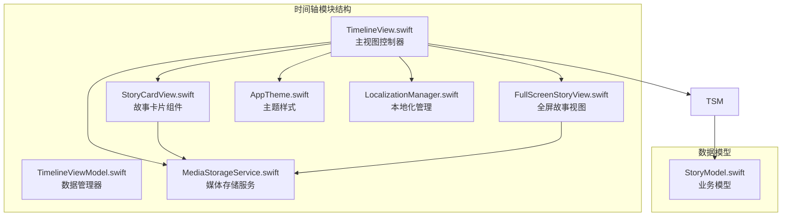
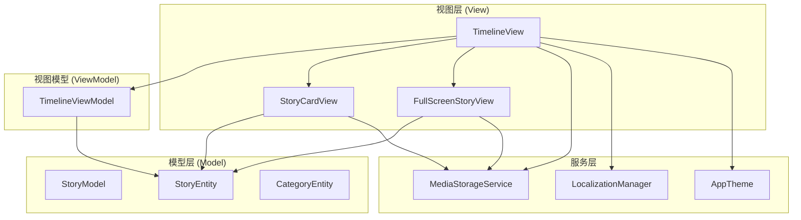
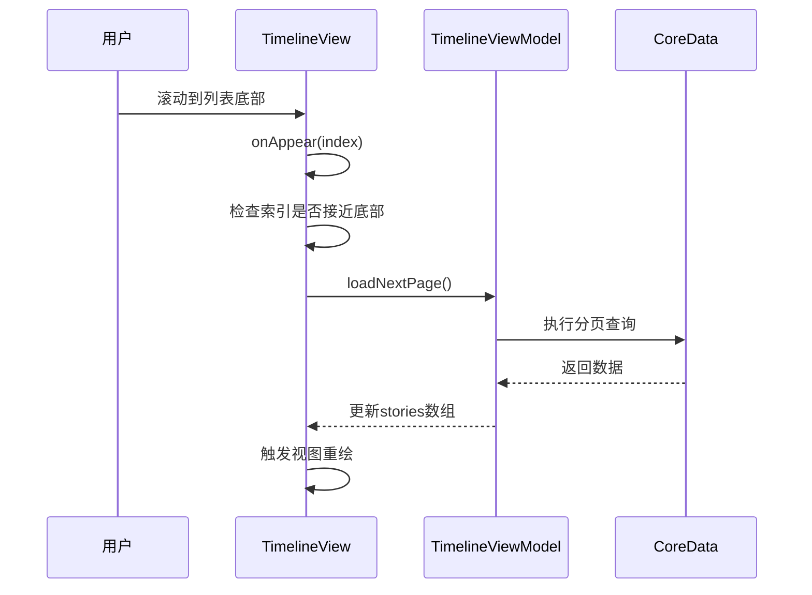
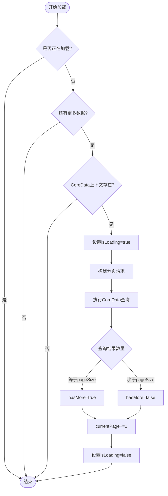
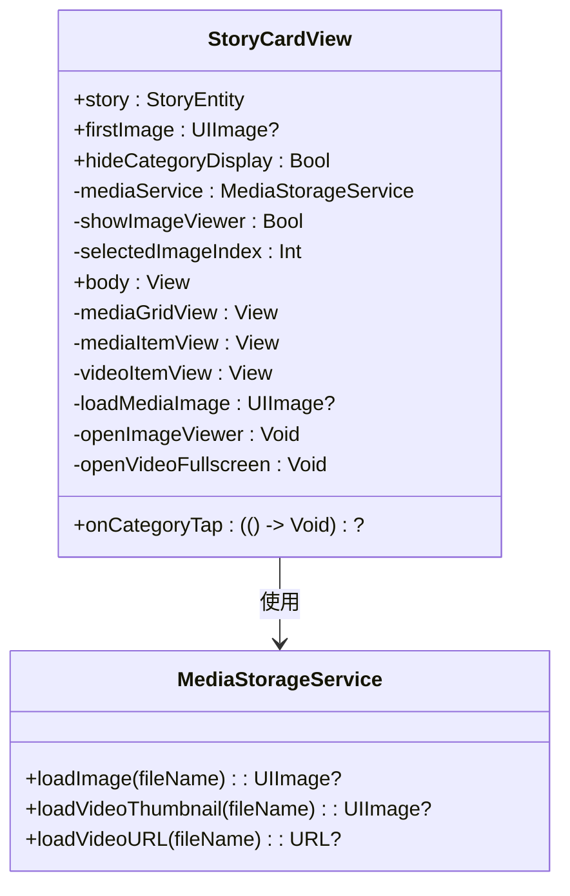
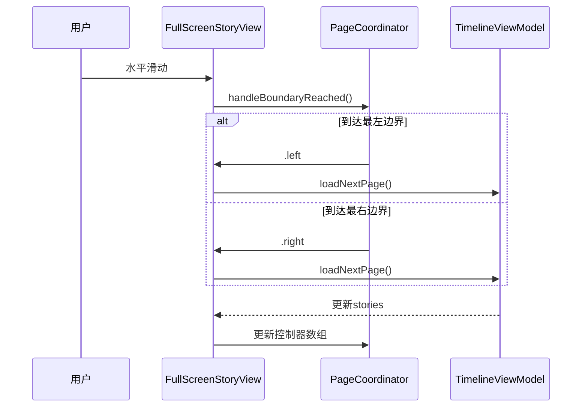
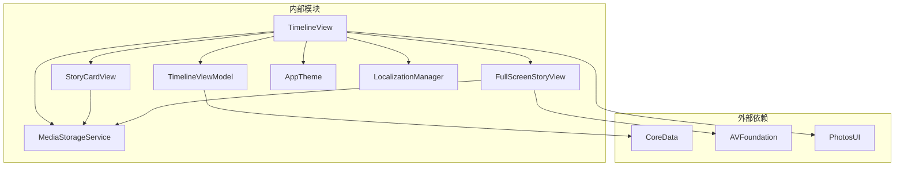

# 时间轴管理模块

<cite>
**本文档引用的文件**
- [TimelineView.swift](file://MyStory/Views/Timeline/TimelineView.swift)
- [TimelineViewModel.swift](file://MyStory/Views/Timeline/TimelineViewModel.swift)
- [StoryCardView.swift](file://MyStory/Components/StoryCardView.swift)
- [FullScreenStoryView.swift](file://MyStory/Views/Timeline/FullScreenStoryView.swift)
- [MediaStorageService.swift](file://MyStory/Services/MediaStorageService.swift)
- [AppTheme.swift](file://MyStory/Components/Theme/AppTheme.swift)
- [LocalizationManager.swift](file://MyStory/Utils/LocalizationManager.swift)
- [StoryModel.swift](file://MyStory/Models/ViewModels/StoryModel.swift)
</cite>

## 目录
1. [简介](#简介)
2. [项目结构](#项目结构)
3. [核心组件](#核心组件)
4. [架构概览](#架构概览)
5. [详细组件分析](#详细组件分析)
6. [依赖关系分析](#依赖关系分析)
7. [性能考虑](#性能考虑)
8. [故障排除指南](#故障排除指南)
9. [结论](#结论)

## 简介

时间轴管理模块是 MyStory 应用中的核心功能模块，负责展示用户的故事内容。该模块实现了瀑布流布局的时间轴展示，采用分页加载机制来处理大量数据，通过组件化设计实现了高度可复用的故事卡片组件。模块采用了 MVVM 架构模式，结合 SwiftUI 的声明式 UI 框架，提供了流畅的用户体验和良好的性能表现。

## 项目结构

时间轴管理模块位于应用的 Views/Timeline 目录下，主要包含以下核心文件：

**图表来源**
- [TimelineView.swift](file://MyStory/Views/Timeline/TimelineView.swift#L1-L304)
- [TimelineViewModel.swift](file://MyStory/Views/Timeline/TimelineViewModel.swift#L1-L43)

**章节来源**
- [TimelineView.swift](file://MyStory/Views/Timeline/TimelineView.swift#L1-L304)
- [TimelineViewModel.swift](file://MyStory/Views/Timeline/TimelineViewModel.swift#L1-L43)

## 核心组件

时间轴管理模块由四个核心组件构成，每个组件都有明确的职责分工：

### TimelineView 主视图
负责整个时间轴界面的展示和用户交互，采用 ScrollView + LazyVStack 的组合实现瀑布流布局。

### TimelineViewModel 数据管理
管理时间轴的数据加载、分页控制和状态管理，基于 ObservableObject 实现响应式数据绑定。

### StoryCardView 故事卡片组件
独立的可复用组件，负责单个故事条目的渲染和交互处理。

### FullScreenStoryView 全屏展示
提供故事的全屏浏览体验，支持图片和视频的缩放查看。

**章节来源**
- [TimelineView.swift](file://MyStory/Views/Timeline/TimelineView.swift#L6-L53)
- [TimelineViewModel.swift](file://MyStory/Views/Timeline/TimelineViewModel.swift#L4-L11)
- [StoryCardView.swift](file://MyStory/Components/StoryCardView.swift#L3-L15)
- [FullScreenStoryView.swift](file://MyStory/Views/Timeline/FullScreenStoryView.swift#L6-L27)

## 架构概览

时间轴管理模块采用 MVVM 架构模式，实现了清晰的关注点分离：

**图表来源**
- [TimelineView.swift](file://MyStory/Views/Timeline/TimelineView.swift#L1-L304)
- [TimelineViewModel.swift](file://MyStory/Views/Timeline/TimelineViewModel.swift#L1-L43)
- [StoryCardView.swift](file://MyStory/Components/StoryCardView.swift#L1-L247)
- [FullScreenStoryView.swift](file://MyStory/Views/Timeline/FullScreenStoryView.swift#L1-L720)

## 详细组件分析

### TimelineView 架构设计

TimelineView 是时间轴模块的主控制器，采用了现代化的 SwiftUI 设计模式：

#### ScrollView + LazyVStack 组合
- 使用 ScrollView 作为根容器，提供垂直滚动能力
- 采用 LazyVStack 实现瀑布流布局，自动处理可视区域外的视图回收
- 通过 padding 设置统一的间距，确保视觉一致性

#### 懒加载策略
- 在每个故事项的 onAppear 事件中检测是否接近列表底部
- 当索引达到倒数第3个元素时触发下一页加载
- 避免一次性加载所有数据，提升内存使用效率

**图表来源**
- [TimelineView.swift](file://MyStory/Views/Timeline/TimelineView.swift#L208-L212)
- [TimelineViewModel.swift](file://MyStory/Views/Timeline/TimelineViewModel.swift#L24-L41)

#### 故事项渲染结构
每个故事项包含三个主要部分：
1. **顶部装饰线** - 简洁的水平分割线
2. **日期头部** - 包含大号日期数字、时间信息和年份显示
3. **故事卡片** - 可点击的导航区域

**章节来源**
- [TimelineView.swift](file://MyStory/Views/Timeline/TimelineView.swift#L56-L78)
- [TimelineView.swift](file://MyStory/Views/Timeline/TimelineView.swift#L80-L102)

### TimelineViewModel 数据管理逻辑

TimelineViewModel 实现了完整的分页加载机制：

#### 分页加载机制
- **页面大小**：默认每页20条记录
- **排序规则**：按时间戳降序排列
- **加载策略**：懒加载，仅在需要时请求新数据
- **状态管理**：使用 @Published 属性实现响应式更新

**图表来源**
- [TimelineViewModel.swift](file://MyStory/Views/Timeline/TimelineViewModel.swift#L24-L41)

#### 数据刷新机制
- 提供 loadFirstPage() 方法重置当前状态并重新加载
- 自动处理加载状态，防止重复请求
- 错误处理：捕获异常并设置 hasMore=false

**章节来源**
- [TimelineViewModel.swift](file://MyStory/Views/Timeline/TimelineViewModel.swift#L17-L22)
- [TimelineViewModel.swift](file://MyStory/Views/Timeline/TimelineViewModel.swift#L24-L41)

### StoryCardView 组件化设计

StoryCardView 是高度可复用的故事展示组件：

#### 媒体内容展示
- **图片网格**：最多显示9张图片，采用3x3网格布局
- **视频缩略图**：当存在视频时优先显示视频缩略图
- **懒加载图片**：使用 MediaStorageService 按需加载媒体文件

#### 交互行为设计
- **分类标签点击**：触发 onCategoryTap 回调，支持导航到分类详情
- **图片点击**：打开图片查看器进行全屏浏览
- **视频点击**：启动全屏视频播放器

**图表来源**
- [StoryCardView.swift](file://MyStory/Components/StoryCardView.swift#L3-L15)
- [MediaStorageService.swift](file://MyStory/Services/MediaStorageService.swift#L71-L123)

#### 响应式设计
- **动态间距**：使用 AppTheme.Spacing 定义统一的间距规范
- **圆角设计**：采用 AppTheme.Radius 统一圆角半径
- **阴影效果**：应用 AppTheme.Shadow 定义阴影样式

**章节来源**
- [StoryCardView.swift](file://MyStory/Components/StoryCardView.swift#L45-L113)
- [StoryCardView.swift](file://MyStory/Components/StoryCardView.swift#L115-L134)

### FullScreenStoryView 全屏展示

FullScreenStoryView 提供了丰富的全屏浏览体验：

#### 页面协调器模式
- **PageCoordinator**：管理页面切换和边界检测
- **UIPageViewController**：实现水平滑动的页面切换
- **边界检测**：当到达第一个或最后一个页面时触发加载更多

**图表来源**
- [FullScreenStoryView.swift](file://MyStory/Views/Timeline/FullScreenStoryView.swift#L77-L98)
- [FullScreenStoryView.swift](file://MyStory/Views/Timeline/FullScreenStoryView.swift#L102-L157)

#### 媒体播放优化
- **视频播放**：使用 AVPlayer 实现视频播放
- **播放状态管理**：确保同一时间只有一个视频在播放
- **资源清理**：页面消失时自动清理播放器资源

**章节来源**
- [FullScreenStoryView.swift](file://MyStory/Views/Timeline/FullScreenStoryView.swift#L102-L157)
- [FullScreenStoryView.swift](file://MyStory/Views/Timeline/FullScreenStoryView.swift#L486-L525)

## 依赖关系分析

时间轴管理模块的依赖关系清晰且层次分明：

**图表来源**
- [TimelineView.swift](file://MyStory/Views/Timeline/TimelineView.swift#L1-L3)
- [TimelineViewModel.swift](file://MyStory/Views/Timeline/TimelineViewModel.swift#L1-L2)
- [FullScreenStoryView.swift](file://MyStory/Views/Timeline/FullScreenStoryView.swift#L1-L3)

### 关键依赖特性

#### CoreData 集成
- 使用 NSFetchRequest 实现高效的数据查询
- 支持分页查询，避免一次性加载大量数据
- 通过 sortDescriptors 实现时间排序

#### 媒体服务集成
- MediaStorageService 提供统一的媒体访问接口
- 支持图片和视频的加密存储
- 实现懒加载和缓存机制

**章节来源**
- [TimelineViewModel.swift](file://MyStory/Views/Timeline/TimelineViewModel.swift#L27-L30)
- [MediaStorageService.swift](file://MyStory/Services/MediaStorageService.swift#L49-L87)

## 性能考虑

时间轴管理模块在多个层面实现了性能优化：

### 内存优化策略
- **懒加载**：使用 LazyVStack 和 onAppear 事件实现按需加载
- **对象池**：复用 StoryCardView 实例，减少内存分配
- **图像缓存**：MediaStorageService 实现媒体文件的缓存机制

### 网络和存储优化
- **分页加载**：默认每页20条记录，避免一次性加载过多数据
- **延迟初始化**：媒体文件仅在需要时才进行解密和解码
- **资源清理**：全屏视图消失时自动释放播放器和图像资源

### UI 渲染优化
- **差异化更新**：使用 @StateObject 管理状态，避免不必要的重渲染
- **主题系统**：AppTheme 提供统一的样式定义，减少样式计算开销
- **手势优化**：合理使用手势识别，避免手势冲突

## 故障排除指南

### 常见问题及解决方案

#### 分页加载失败
**问题现象**：滚动到底部时无法加载更多数据
**可能原因**：
- CoreData 查询失败
- 网络连接问题
- 数据库锁定

**解决步骤**：
1. 检查 hasMore 状态是否被意外设置为 false
2. 验证 CoreData 上下文是否正确设置
3. 查看控制台错误日志

#### 媒体文件加载失败
**问题现象**：故事卡片中的图片或视频无法显示
**可能原因**：
- 文件路径错误
- 加密密钥丢失
- 文件损坏

**解决步骤**：
1. 检查 MediaStorageService 的文件路径生成逻辑
2. 验证加密密钥是否正确存储
3. 重新生成媒体文件

#### 性能问题
**问题现象**：滚动卡顿或内存占用过高
**可能原因**：
- 图像过大未压缩
- 未及时清理资源
- 过多的视图层级

**优化建议**：
1. 实现图像压缩和缓存
2. 及时清理不再使用的视图
3. 减少嵌套视图层级

**章节来源**
- [TimelineViewModel.swift](file://MyStory/Views/Timeline/TimelineViewModel.swift#L36-L39)
- [MediaStorageService.swift](file://MyStory/Services/MediaStorageService.swift#L194-L207)

## 结论

时间轴管理模块展现了现代 iOS 应用开发的最佳实践：

### 设计优势
- **架构清晰**：MVVM 模式实现了良好的关注点分离
- **性能优秀**：懒加载和分页机制确保了流畅的用户体验
- **可维护性强**：组件化设计提高了代码的可复用性和可测试性

### 技术亮点
- **响应式设计**：充分利用 SwiftUI 的声明式语法
- **多媒体支持**：完善的图片和视频处理能力
- **国际化支持**：完整的多语言本地化实现

### 改进建议
- 可以考虑实现增量更新机制，减少数据刷新时的闪烁
- 增加更多的性能监控指标，便于持续优化
- 考虑实现离线缓存策略，提升网络环境不佳时的体验

该模块为 MyStory 应用提供了稳定可靠的时间轴展示功能，为用户创造了一个流畅、美观的故事浏览体验。