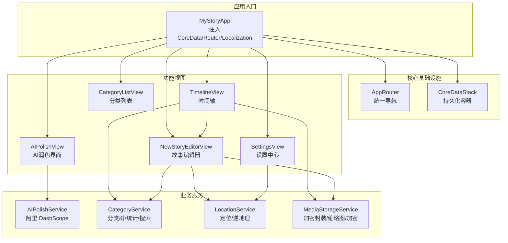
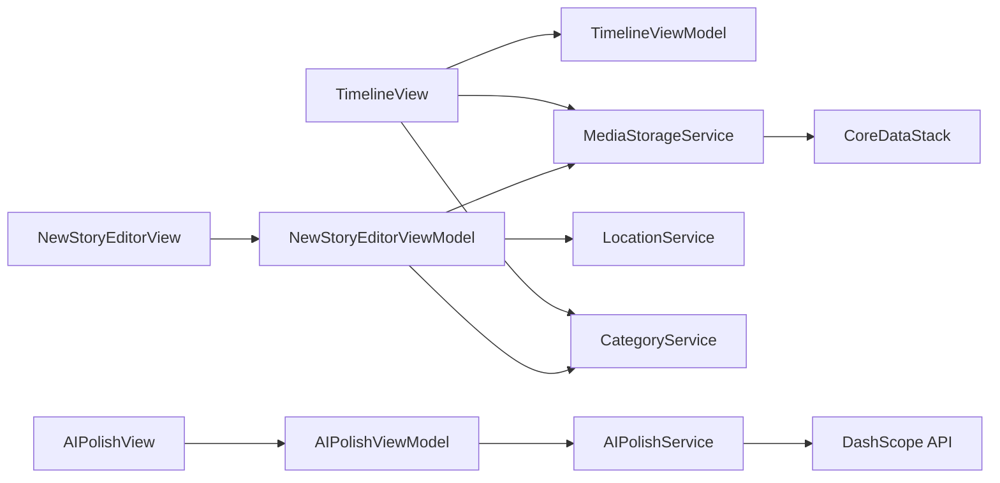
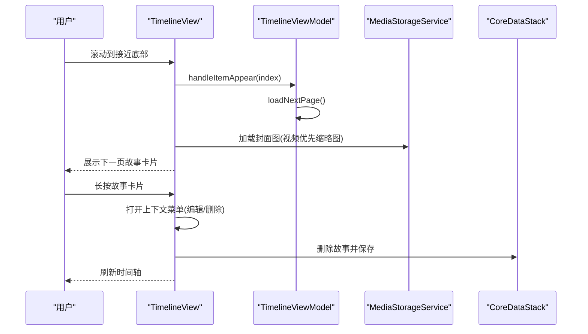
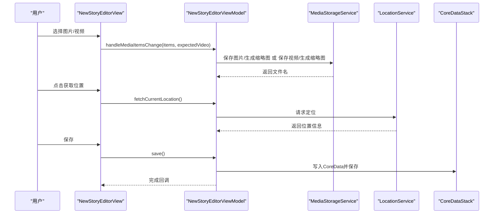
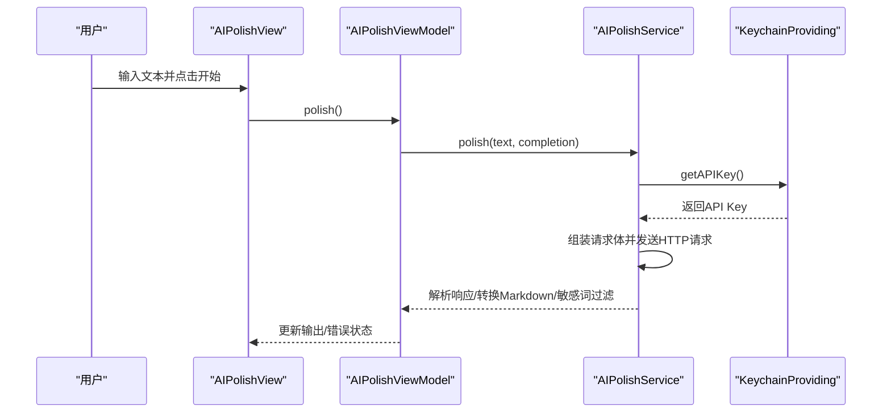
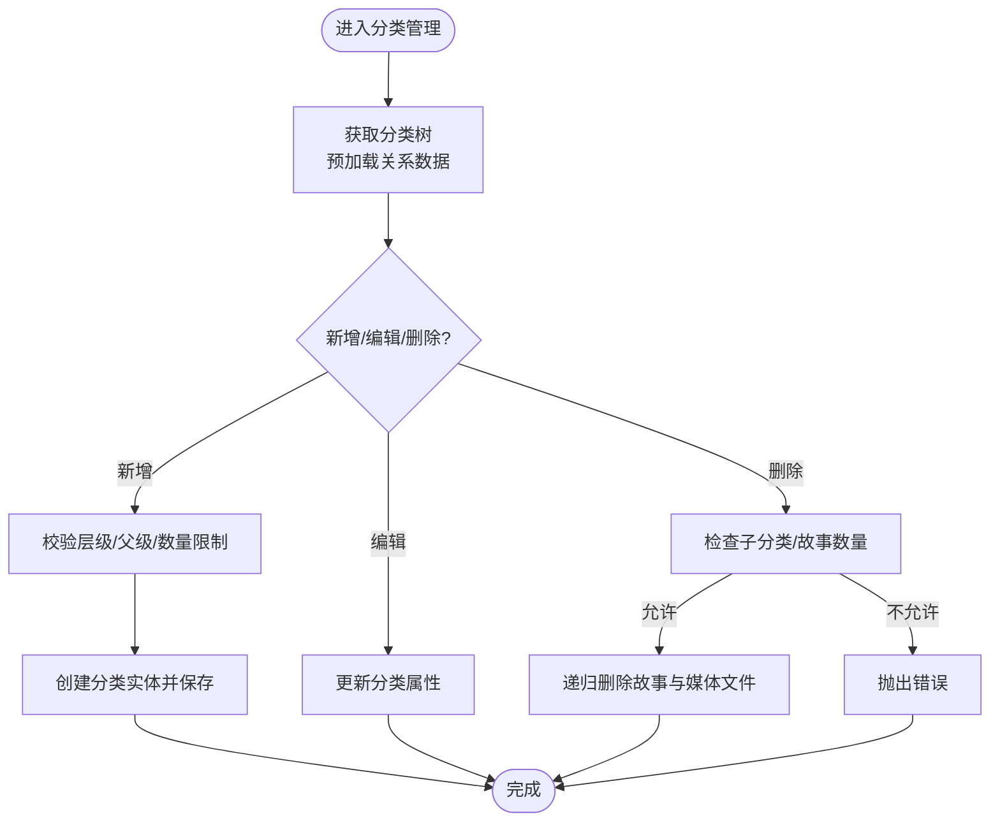
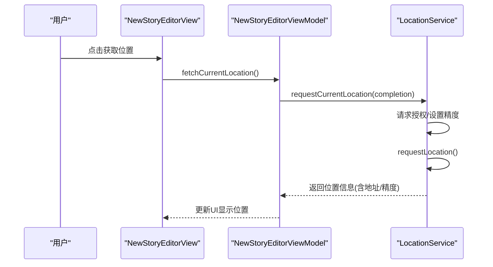
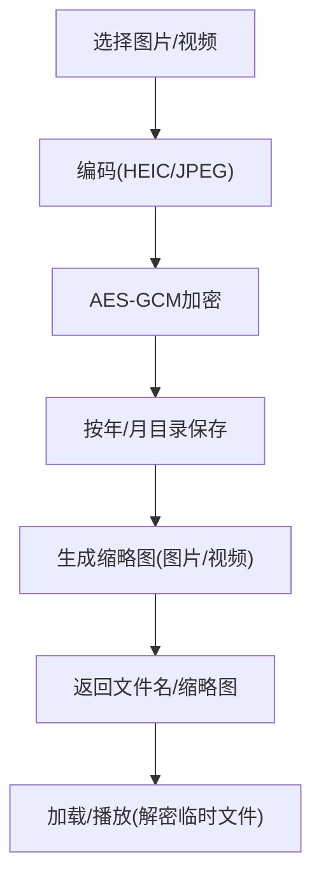
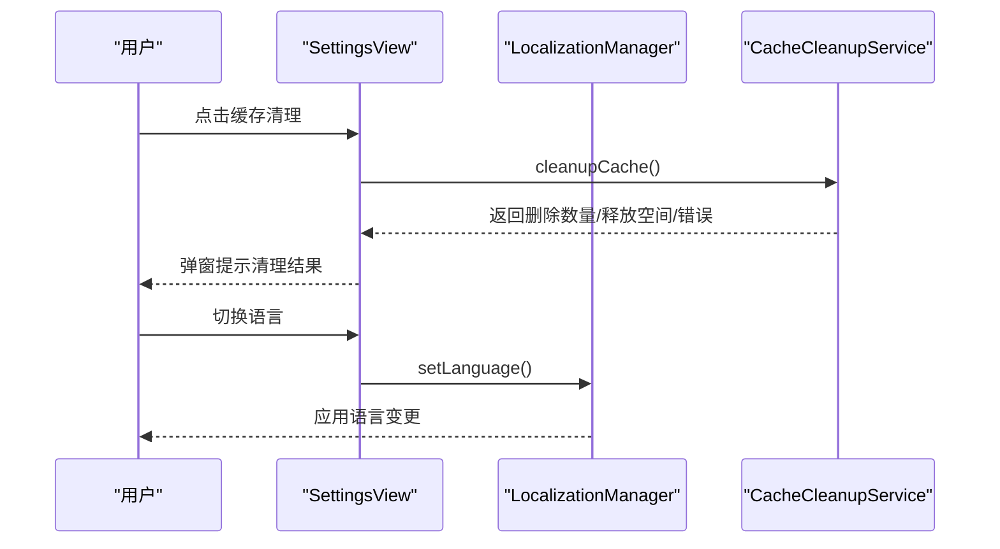
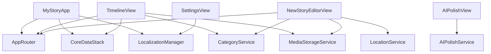

# 核心功能模块

<cite>
**本文档引用的文件**
- [MyStoryApp.swift](file://MyStory/App/MyStoryApp.swift)
- [AppRouter.swift](file://MyStory/Core/Router/AppRouter.swift)
- [TimelineView.swift](file://MyStory/Views/Timeline/TimelineView.swift)
- [NewStoryEditorView.swift](file://MyStory/Views/Editor/NewStoryEditorView.swift)
- [AIPolishView.swift](file://MyStory/Views/Editor/AIPolishView.swift)
- [AIPolishService.swift](file://MyStory/Services/AIService/AIPolishService.swift)
- [CategoryService.swift](file://MyStory/Services/CategoryService/CategoryService.swift)
- [CategoryListView.swift](file://MyStory/Views/Category/CategoryListView.swift)
- [LocationService.swift](file://MyStory/Services/LocationService.swift)
- [MediaStorageService.swift](file://MyStory/Services/MediaStorageService.swift)
- [CoreDataStack.swift](file://MyStory/Core/Storage/CoreDataStack.swift)
- [SettingsView.swift](file://MyStory/Views/Settings/SettingsView.swift)
- [LocalizationManager.swift](file://MyStory/Utils/LocalizationManager.swift)
</cite>

## 目录
1. [简介](#简介)
2. [项目结构](#项目结构)
3. [核心组件](#核心组件)
4. [架构总览](#架构总览)
5. [详细组件分析](#详细组件分析)
6. [依赖关系分析](#依赖关系分析)
7. [性能考量](#性能考量)
8. [故障排查指南](#故障排查指南)
9. [结论](#结论)
10. [附录](#附录)

## 简介
本文件面向开发者与产品人员，系统梳理 MyStory 的核心功能模块，覆盖时间轴管理、故事编辑器、AI 文本润色、分类管理、位置服务、媒体存储、设置系统与路由导航等。文档从架构视角解释模块职责、用户交互流程、技术实现方案、模块间依赖与数据流，并提供可视化图示与扩展点说明，帮助读者快速理解并高效迭代。

## 项目结构
应用采用 SwiftUI + CoreData 的现代 iOS 架构，按功能域划分目录：
- App 层：应用入口与全局环境注入
- Core：路由与存储基础设施
- Services：业务服务层（AI、分类、位置、媒体、迁移等）
- Views/ViewModels：视图与视图模型
- Utils：工具与国际化
- Models：CoreData 实体与视图模型

图表来源
- [MyStoryApp.swift](file://MyStory/App/MyStoryApp.swift#L1-L32)
- [AppRouter.swift](file://MyStory/Core/Router/AppRouter.swift#L1-L123)
- [TimelineView.swift](file://MyStory/Views/Timeline/TimelineView.swift#L1-L304)
- [NewStoryEditorView.swift](file://MyStory/Views/Editor/NewStoryEditorView.swift#L1-L800)
- [AIPolishView.swift](file://MyStory/Views/Editor/AIPolishView.swift#L1-L47)
- [AIPolishService.swift](file://MyStory/Services/AIService/AIPolishService.swift#L1-L77)
- [CategoryService.swift](file://MyStory/Services/CategoryService/CategoryService.swift#L1-L675)
- [LocationService.swift](file://MyStory/Services/LocationService.swift#L1-L55)
- [MediaStorageService.swift](file://MyStory/Services/MediaStorageService.swift#L1-L348)
- [SettingsView.swift](file://MyStory/Views/Settings/SettingsView.swift#L1-L228)

章节来源
- [MyStoryApp.swift](file://MyStory/App/MyStoryApp.swift#L1-L32)
- [AppRouter.swift](file://MyStory/Core/Router/AppRouter.swift#L1-L123)

## 核心组件
- 路由与导航：统一的 AppRouter 管理页面栈、Sheet/全屏展示与返回逻辑
- 时间轴：分页加载故事、上下文菜单、分类跳转、封面图加载
- 故事编辑器：富文本、相册/视频选择、位置采集、分类选择、保存
- AI 文本润色：调用阿里 DashScope，支持增量输出、Markdown 转换与敏感词过滤
- 分类管理：三层分类树、父子约束、数量限制、统计与搜索
- 位置服务：授权请求、逆地理编码、精度展示
- 媒体存储：HEIC/JPEG 编码、缩略图生成、AES-GCM 加密、按年月组织
- 存储与模型：CoreData 模型与关系、预加载策略、批量保存
- 设置系统：语言/主题/字体/数据同步/缓存清理

章节来源
- [AppRouter.swift](file://MyStory/Core/Router/AppRouter.swift#L81-L122)
- [TimelineView.swift](file://MyStory/Views/Timeline/TimelineView.swift#L6-L304)
- [NewStoryEditorView.swift](file://MyStory/Views/Editor/NewStoryEditorView.swift#L8-L800)
- [AIPolishView.swift](file://MyStory/Views/Editor/AIPolishView.swift#L3-L46)
- [AIPolishService.swift](file://MyStory/Services/AIService/AIPolishService.swift#L8-L76)
- [CategoryService.swift](file://MyStory/Services/CategoryService/CategoryService.swift#L22-L42)
- [LocationService.swift](file://MyStory/Services/LocationService.swift#L4-L54)
- [MediaStorageService.swift](file://MyStory/Services/MediaStorageService.swift#L8-L224)
- [CoreDataStack.swift](file://MyStory/Core/Storage/CoreDataStack.swift#L4-L96)
- [SettingsView.swift](file://MyStory/Views/Settings/SettingsView.swift#L10-L227)

## 架构总览
MyStory 采用“视图-视图模型-服务-存储”的分层架构：
- 视图层负责用户交互与状态展示
- 视图模型协调业务逻辑与服务调用
- 服务层封装跨视图的业务能力（AI、分类、位置、媒体）
- 存储层提供 CoreData 持久化与文件系统媒体管理

图表来源
- [TimelineView.swift](file://MyStory/Views/Timeline/TimelineView.swift#L6-L304)
- [NewStoryEditorView.swift](file://MyStory/Views/Editor/NewStoryEditorView.swift#L8-L800)
- [AIPolishView.swift](file://MyStory/Views/Editor/AIPolishView.swift#L3-L46)
- [AIPolishService.swift](file://MyStory/Services/AIService/AIPolishService.swift#L8-L76)
- [CategoryService.swift](file://MyStory/Services/CategoryService/CategoryService.swift#L190-L449)
- [LocationService.swift](file://MyStory/Services/LocationService.swift#L4-L54)
- [MediaStorageService.swift](file://MyStory/Services/MediaStorageService.swift#L8-L224)
- [CoreDataStack.swift](file://MyStory/Core/Storage/CoreDataStack.swift#L4-L96)

## 详细组件分析

### 时间轴管理（Timeline）
- 用户交互：滚动加载、点击故事进入全屏阅读、长按打开上下文菜单（编辑/删除）、点击故事卡片上的分类跳转至分类故事列表
- 技术实现：LazyVStack 渲染，分页加载触发阈值在倒数第三个元素出现时加载下一页；封面图根据媒体类型优先加载缩略图或首张图片
- 与其他模块集成：依赖分类服务获取分类树节点信息，依赖媒体服务加载封面图，依赖 CoreData 上下文进行删除与保存

图表来源
- [TimelineView.swift](file://MyStory/Views/Timeline/TimelineView.swift#L208-L248)
- [MediaStorageService.swift](file://MyStory/Services/MediaStorageService.swift#L71-L87)
- [CoreDataStack.swift](file://MyStory/Core/Storage/CoreDataStack.swift#L86-L91)

章节来源
- [TimelineView.swift](file://MyStory/Views/Timeline/TimelineView.swift#L6-L304)

### 故事编辑器（Editor）
- 用户交互：顶部工具栏（保存/日期/格式），富文本编辑区，媒体网格（图片/视频缩略图），位置信息展示与清空，分类选择
- 技术实现：PhotosPicker 选择图片/视频，异步生成缩略图，视频播放使用临时解密 URL；富文本编辑器配置最小高度与背景色；保存时写入 CoreData 并触发刷新
- 与其他模块集成：依赖媒体服务进行图片/视频保存与缩略图生成；依赖位置服务获取当前位置并逆地理；依赖分类服务进行分类选择；依赖 CoreData 进行持久化

图表来源
- [NewStoryEditorView.swift](file://MyStory/Views/Editor/NewStoryEditorView.swift#L715-L800)
- [MediaStorageService.swift](file://MyStory/Services/MediaStorageService.swift#L89-L123)
- [LocationService.swift](file://MyStory/Services/LocationService.swift#L14-L21)
- [CoreDataStack.swift](file://MyStory/Core/Storage/CoreDataStack.swift#L86-L91)

章节来源
- [NewStoryEditorView.swift](file://MyStory/Views/Editor/NewStoryEditorView.swift#L8-L800)

### AI 文本润色（AI Polish）
- 用户交互：输入框、开始润色按钮、加载指示、错误提示、Markdown 输出展示
- 技术实现：调用阿里 DashScope 接口，支持增量输出；解析多种返回结构；将结果转换为 Markdown 并进行敏感词过滤
- 与其他模块集成：依赖 Keychain 提供 API Key；依赖 MarkdownProcessor 与 SensitiveFilter

图表来源
- [AIPolishView.swift](file://MyStory/Views/Editor/AIPolishView.swift#L10-L45)
- [AIPolishService.swift](file://MyStory/Services/AIService/AIPolishService.swift#L30-L61)

章节来源
- [AIPolishView.swift](file://MyStory/Views/Editor/AIPolishView.swift#L3-L46)
- [AIPolishService.swift](file://MyStory/Services/AIService/AIPolishService.swift#L8-L76)

### 分类管理（Category）
- 用户交互：分类树浏览、新增/修改/删除、统计故事数量、搜索三级分类下的故事
- 技术实现：支持两级内存实现与 CoreData 实现；三层分类树，父子层级校验与数量限制；搜索时预加载关系数据避免 fault；构建分类路径并按匹配分数排序
- 与其他模块集成：与故事实体建立多对多关系；删除分类时可递归删除故事与媒体文件

图表来源
- [CategoryService.swift](file://MyStory/Services/CategoryService/CategoryService.swift#L266-L409)

章节来源
- [CategoryService.swift](file://MyStory/Services/CategoryService/CategoryService.swift#L22-L42)
- [CategoryListView.swift](file://MyStory/Views/Category/CategoryListView.swift#L10-L59)

### 位置服务（Location）
- 用户交互：点击“添加位置”，授权后请求定位，逆地理编码展示详细地址与精度
- 技术实现：CLLocationManager 授权与精度设置；CLGeocoder 逆地理；将经纬度、精度、地址信息封装为 LocationInfo

图表来源
- [NewStoryEditorView.swift](file://MyStory/Views/Editor/NewStoryEditorView.swift#L401-L417)
- [LocationService.swift](file://MyStory/Services/LocationService.swift#L14-L21)

章节来源
- [LocationService.swift](file://MyStory/Services/LocationService.swift#L4-L54)

### 媒体存储（MediaStorage）
- 用户交互：图片/视频选择、缩略图展示、视频播放（临时解密文件）
- 技术实现：HEIC/JPEG 编码、缩略图生成、AES-GCM 加密；按年/月组织文件；图片方向修正；视频封面生成与临时文件管理
- 与其他模块集成：被编辑器与时间轴共同使用，作为故事媒体的统一存储与解密入口

图表来源
- [MediaStorageService.swift](file://MyStory/Services/MediaStorageService.swift#L14-L123)

章节来源
- [MediaStorageService.swift](file://MyStory/Services/MediaStorageService.swift#L8-L224)

### 设置系统（Settings）
- 用户交互：语言/主题/字体/数据同步/隐私政策/缓存清理
- 技术实现：语言切换通过 LocalizationManager；缓存清理在后台执行并反馈结果；数据同步入口统一路由

图表来源
- [SettingsView.swift](file://MyStory/Views/Settings/SettingsView.swift#L192-L226)
- [LocalizationManager.swift](file://MyStory/Utils/LocalizationManager.swift#L31-L74)

章节来源
- [SettingsView.swift](file://MyStory/Views/Settings/SettingsView.swift#L10-L227)
- [LocalizationManager.swift](file://MyStory/Utils/LocalizationManager.swift#L31-L74)

## 依赖关系分析
- 视图层依赖：AppRouter 提供导航；CoreDataStack 提供上下文；LocalizationManager 提供本地化
- 服务层依赖：AIPolishService 依赖 KeychainProviding；CategoryService 依赖 CoreData；MediaStorageService 依赖 Keychain 与文件系统；LocationService 依赖 CoreLocation
- 存储层：CoreDataStack 动态构建模型，定义 Story/Category/Media 实体与关系，启用自动合并策略

图表来源
- [MyStoryApp.swift](file://MyStory/App/MyStoryApp.swift#L6-L24)
- [AppRouter.swift](file://MyStory/Core/Router/AppRouter.swift#L81-L122)
- [CoreDataStack.swift](file://MyStory/Core/Storage/CoreDataStack.swift#L4-L96)
- [LocalizationManager.swift](file://MyStory/Utils/LocalizationManager.swift#L31-L74)

章节来源
- [MyStoryApp.swift](file://MyStory/App/MyStoryApp.swift#L1-L32)
- [CoreDataStack.swift](file://MyStory/Core/Storage/CoreDataStack.swift#L98-L380)

## 性能考量
- CoreData 预加载：分类查询中对 stories/children 关系进行预加载，避免 fault 导致计数与数据为空
- 分页加载：时间轴在接近底部时触发下一页加载，减少一次性渲染压力
- 媒体处理：缩略图生成与视频封面使用 AVAssetImageGenerator 并设置合理 tolerance 与最大尺寸，兼顾速度与质量
- 加密与解密：使用 AES-GCM 对媒体文件进行加密封装，避免明文存储；临时解密文件及时清理
- UI 响应：富文本与媒体选择采用异步处理，避免阻塞主线程

章节来源
- [CategoryService.swift](file://MyStory/Services/CategoryService/CategoryService.swift#L210-L211)
- [TimelineView.swift](file://MyStory/Views/Timeline/TimelineView.swift#L208-L212)
- [MediaStorageService.swift](file://MyStory/Services/MediaStorageService.swift#L153-L192)

## 故障排查指南
- 未配置 API Key：AI 润色会返回未配置通义千问 API Key 错误，需在 Keychain 中配置
- 空响应/解析失败：网络请求无数据或返回结构不符合预期时，回退为原文并记录解析失败
- 分类删除失败：若分类仍有子分类或故事，将抛出相应错误；请先清理子分类或故事
- 位置获取失败：授权拒绝或定位失败时，返回空信息；检查系统定位权限
- 媒体加载失败：检查文件是否存在、解密是否成功、缩略图生成是否异常
- 缓存清理无效果：确认清理任务执行状态与返回结果，查看错误集合

章节来源
- [AIPolishService.swift](file://MyStory/Services/AIService/AIPolishService.swift#L31-L75)
- [CategoryService.swift](file://MyStory/Services/CategoryService/CategoryService.swift#L353-L373)
- [LocationService.swift](file://MyStory/Services/LocationService.swift#L50-L53)
- [MediaStorageService.swift](file://MyStory/Services/MediaStorageService.swift#L71-L87)
- [SettingsView.swift](file://MyStory/Views/Settings/SettingsView.swift#L192-L226)

## 结论
MyStory 的核心模块围绕“时间轴-编辑器-AI-分类-位置-媒体-设置-路由”形成闭环，通过清晰的分层与服务抽象，实现了良好的可维护性与扩展性。建议后续在搜索、分类详情与全文检索方面进一步完善，同时持续优化媒体处理与缓存策略，提升大体量数据场景下的稳定性与性能。

## 附录
- 配置选项与扩展点
  - AI 润色：可通过 KeychainProviding 注入自定义密钥源；请求参数（模型、温度、最大令牌数）可在服务初始化处调整
  - 分类管理：层级与数量限制可按业务需求调整；搜索策略可扩展为全文检索
  - 媒体存储：加密算法与目录结构可扩展；支持更多媒体类型与压缩参数
  - 设置系统：语言/主题/字体/缓存清理均可通过对应管理器扩展
- 最佳实践
  - 使用预加载策略避免 fault 导致的数据为空
  - 异步处理媒体与网络请求，避免主线程阻塞
  - 合理设置 CoreData 合并策略与保存时机，保证一致性