# 设置管理系统

<cite>
**本文档引用的文件**
- [SettingsView.swift](file://MyStory/Views/Settings/SettingsView.swift)
- [ThemeSettingsView.swift](file://MyStory/Views/Settings/ThemeSettingsView.swift)
- [LanguageSettingsView.swift](file://MyStory/Views/Settings/LanguageSettingsView.swift)
- [FontSettingsView.swift](file://MyStory/Views/Settings/FontSettingsView.swift)
- [DataSyncView.swift](file://MyStory/Views/Settings/DataSyncView.swift)
- [AppTheme.swift](file://MyStory/Components/Theme/AppTheme.swift)
- [LocalizationManager.swift](file://MyStory/Utils/LocalizationManager.swift)
- [MigrationSessionManager.swift](file://MyStory/Services/MigrationSessionManager.swift)
- [CacheCleanupService.swift](file://MyStory/Services/CacheCleanupService.swift)
- [SettingEntity+CoreDataProperties.swift](file://MyStory/Models/Entities/SettingEntity+CoreDataProperties.swift)
- [Localizable.strings (英文)](file://MyStory/Resources/Localizable/en.lproj/Localizable.strings)
- [Localizable.strings (简体中文)](file://MyStory/Resources/Localizable/zh-Hans.lproj/Localizable.strings)
</cite>

## 目录
1. [简介](#简介)
2. [项目结构](#项目结构)
3. [核心组件](#核心组件)
4. [架构概览](#架构概览)
5. [详细组件分析](#详细组件分析)
6. [依赖关系分析](#依赖关系分析)
7. [性能考虑](#性能考虑)
8. [故障排除指南](#故障排除指南)
9. [结论](#结论)

## 简介

MyStory 应用的设置管理系统是一个完整的用户体验配置解决方案，提供了全面的个性化选项。该系统采用模块化设计，支持主题切换、多语言支持、字体调整、数据同步等功能。

系统的核心设计理念是提供即时反馈的用户体验，所有设置更改都会立即生效，无需重启应用。通过统一的设置入口，用户可以轻松管理应用的各种配置选项。

## 项目结构

设置管理系统主要由以下几个核心部分组成：

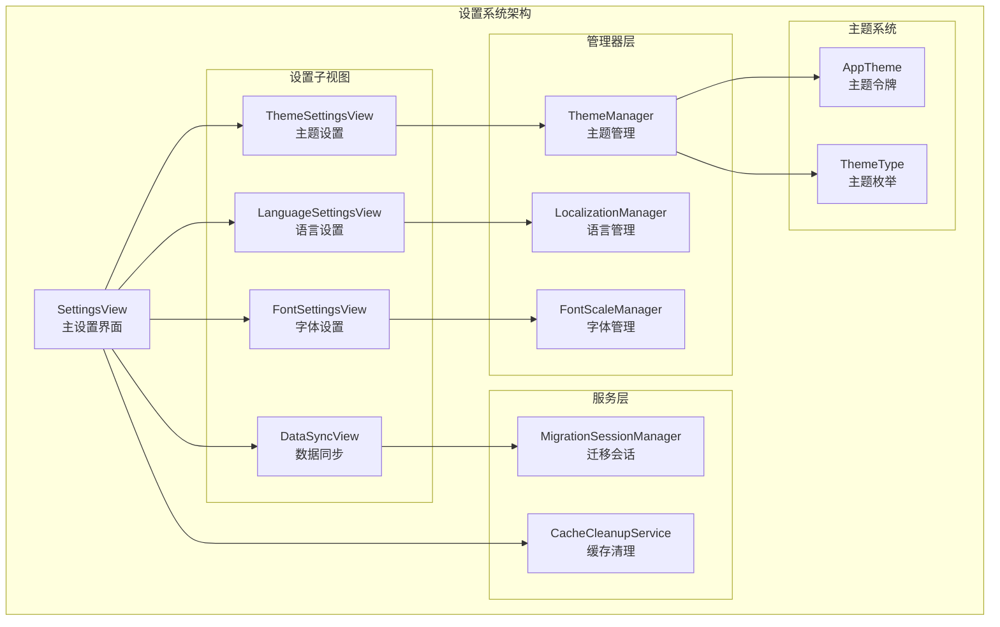

**图表来源**
- [SettingsView.swift](file://MyStory/Views/Settings/SettingsView.swift#L10-L228)
- [ThemeSettingsView.swift](file://MyStory/Views/Settings/ThemeSettingsView.swift#L10-L122)
- [AppTheme.swift](file://MyStory/Components/Theme/AppTheme.swift#L92-L190)

**章节来源**
- [SettingsView.swift](file://MyStory/Views/Settings/SettingsView.swift#L1-L228)
- [AppTheme.swift](file://MyStory/Components/Theme/AppTheme.swift#L1-L509)

## 核心组件

### 设置主界面

SettingsView 作为设置系统的入口点，提供了统一的导航结构和状态管理。该界面采用分组设计，将相关的设置选项组织在不同的 Section 中。

主要功能特性：
- **即时设置应用**：所有设置更改立即生效，无需手动保存
- **状态可视化**：清晰显示当前设置值和状态
- **模态导航**：使用 Sheet 模式打开子设置界面
- **缓存管理**：内置缓存清理功能，支持批量清理临时文件

### 主题管理系统

主题系统采用枚举驱动的设计，支持多种预设主题和动态主题切换。

核心组件：
- **ThemeType**：定义所有可用的主题选项
- **ThemeManager**：管理当前主题状态和持久化
- **AppTheme**：提供主题相关的视觉令牌和样式定义

### 多语言支持系统

语言管理系统实现了完整的国际化支持，包括动态语言切换和本地化资源管理。

关键特性：
- **双语言支持**：简体中文和英语
- **动态切换**：无需重启即可切换语言
- **Bundle 管理**：智能选择对应的本地化资源
- **系统语言检测**：自动适配系统首选语言

### 字体设置系统

字体管理系统提供了灵活的字体大小调节功能，支持实时预览和即时应用。

设计特点：
- **滑块控制**：直观的四档字体大小调节
- **实时预览**：调整时即时显示效果
- **动态字体**：基于系统动态字体的响应式设计
- **无障碍支持**：支持更大的字体以改善可读性

### 数据同步系统

数据同步系统实现了点对点的数据迁移功能，支持设备间的无缝数据传输。

技术实现：
- **MultipeerConnectivity**：基于苹果 Multipeer Connectivity 框架
- **PIN 验证**：6位数字PIN码确保传输安全
- **加密传输**：端到端加密保护数据安全
- **状态管理**：完整的传输状态跟踪和错误处理

**章节来源**
- [SettingsView.swift](file://MyStory/Views/Settings/SettingsView.swift#L26-L188)
- [AppTheme.swift](file://MyStory/Components/Theme/AppTheme.swift#L92-L190)

## 架构概览

设置管理系统采用了清晰的分层架构，确保了良好的可维护性和扩展性：

```mermaid
graph TD
subgraph "表现层"
SettingsView[SettingsView]
ThemeSettingsView[ThemeSettingsView]
LanguageSettingsView[LanguageSettingsView]
FontSettingsView[FontSettingsView]
DataSyncView[DataSyncView]
end
subgraph "业务逻辑层"
ThemeManager[ThemeManager]
LocalizationManager[LocalizationManager]
FontScaleManager[FontScaleManager]
MigrationSessionManager[MigrationSessionManager]
end
subgraph "数据持久化层"
UserDefaults[UserDefaults<br/>本地存储]
CoreData[(CoreData)<br/>设置实体]
Keychain[(Keychain)<br/>敏感信息]
end
subgraph "系统服务层"
FileManager[FileManager<br/>文件系统]
NotificationCenter[NotificationCenter<br/>通知中心]
Bundle[Bundle<br/>资源管理]
end
SettingsView --> ThemeSettingsView
SettingsView --> LanguageSettingsView
SettingsView --> FontSettingsView
SettingsView --> DataSyncView
ThemeSettingsView --> ThemeManager
LanguageSettingsView --> LocalizationManager
FontSettingsView --> FontScaleManager
DataSyncView --> MigrationSessionManager
ThemeManager --> UserDefaults
LocalizationManager --> UserDefaults
FontScaleManager --> UserDefaults
ThemeManager --> CoreData
LocalizationManager --> CoreData
FontScaleManager --> CoreData
LocalizationManager --> Bundle
MigrationSessionManager --> FileManager
MigrationSessionManager --> NotificationCenter
```

**图表来源**
- [SettingsView.swift](file://MyStory/Views/Settings/SettingsView.swift#L10-L228)
- [LocalizationManager.swift](file://MyStory/Utils/LocalizationManager.swift#L31-L107)
- [AppTheme.swift](file://MyStory/Components/Theme/AppTheme.swift#L69-L90)

## 详细组件分析

### SettingsView 组件分析

SettingsView 是设置系统的主控制器，负责协调所有设置子视图的显示和交互。

#### 核心功能流程

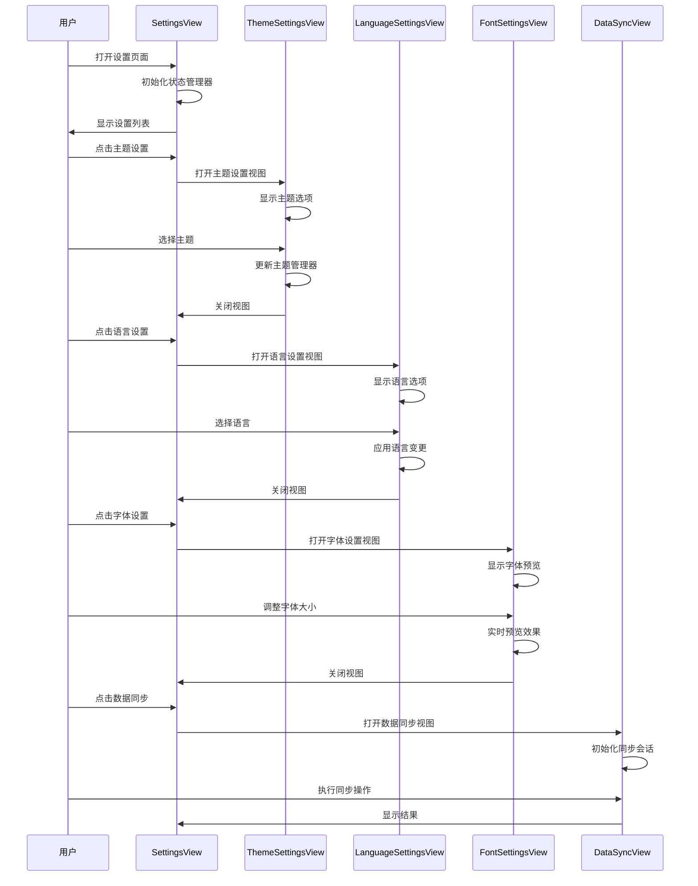

**图表来源**
- [SettingsView.swift](file://MyStory/Views/Settings/SettingsView.swift#L26-L188)
- [ThemeSettingsView.swift](file://MyStory/Views/Settings/ThemeSettingsView.swift#L14-L47)
- [LanguageSettingsView.swift](file://MyStory/Views/Settings/LanguageSettingsView.swift#L19-L64)

#### 缓存清理功能

SettingsView 内置了完整的缓存清理功能，提供了用户友好的清理体验：

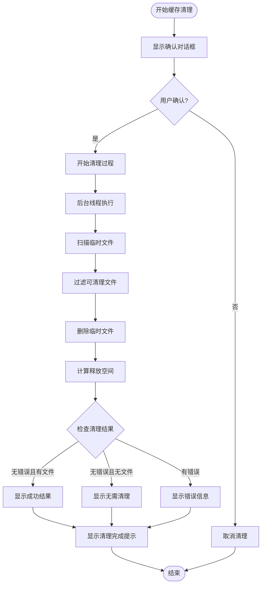

**图表来源**
- [SettingsView.swift](file://MyStory/Views/Settings/SettingsView.swift#L193-L226)
- [CacheCleanupService.swift](file://MyStory/Services/CacheCleanupService.swift#L29-L67)

**章节来源**
- [SettingsView.swift](file://MyStory/Views/Settings/SettingsView.swift#L10-L228)

### ThemeSettingsView 组件分析

ThemeSettingsView 提供了完整的主题切换功能，支持多种预设主题的实时预览和选择。

#### 主题系统架构

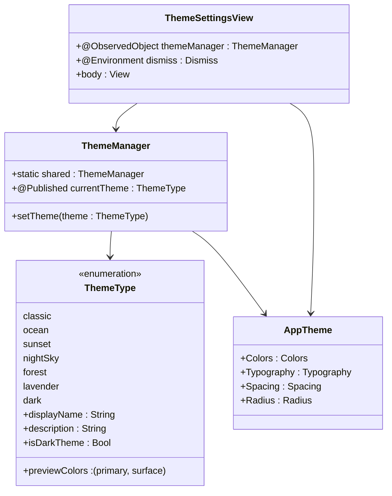

**图表来源**
- [ThemeSettingsView.swift](file://MyStory/Views/Settings/ThemeSettingsView.swift#L10-L48)
- [AppTheme.swift](file://MyStory/Components/Theme/AppTheme.swift#L92-L190)

#### 主题切换流程

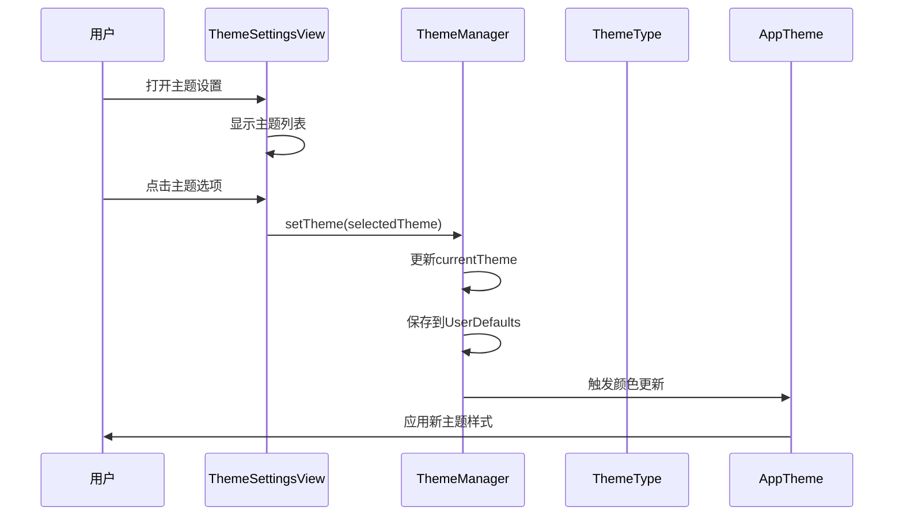

**图表来源**
- [ThemeSettingsView.swift](file://MyStory/Views/Settings/ThemeSettingsView.swift#L24-L28)
- [AppTheme.swift](file://MyStory/Components/Theme/AppTheme.swift#L176-L189)

**章节来源**
- [ThemeSettingsView.swift](file://MyStory/Views/Settings/ThemeSettingsView.swift#L10-L122)
- [AppTheme.swift](file://MyStory/Components/Theme/AppTheme.swift#L92-L190)

### LanguageSettingsView 组件分析

LanguageSettingsView 实现了完整的多语言切换功能，支持简体中文和英语两种语言的动态切换。

#### 语言管理架构

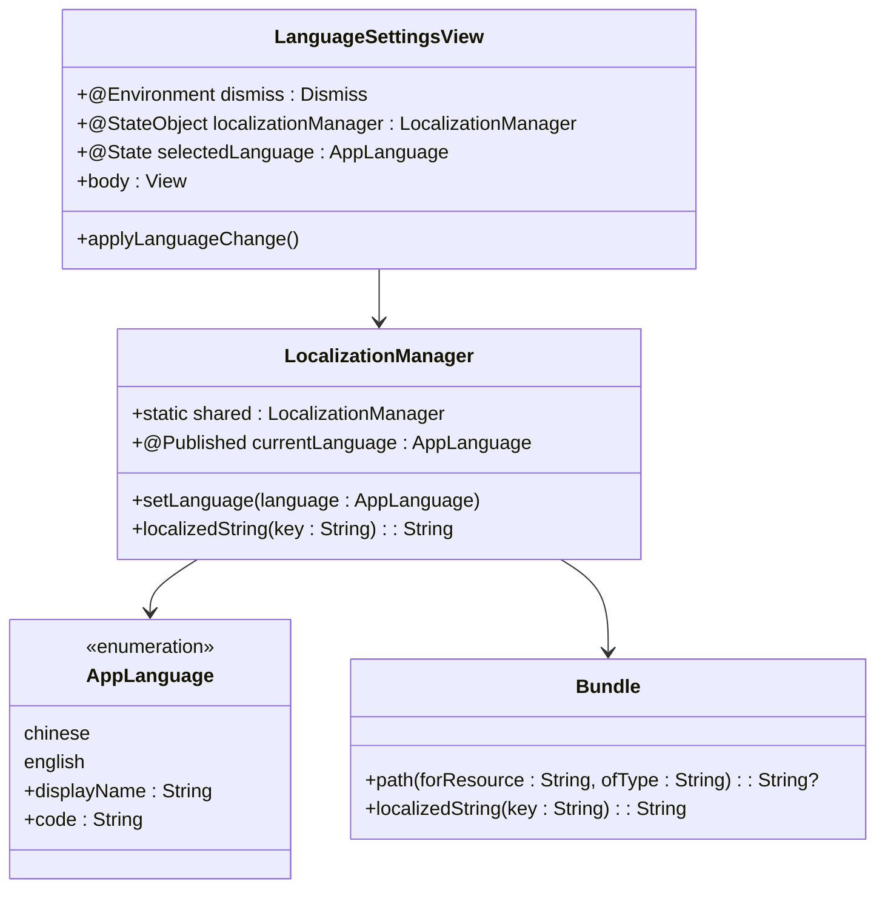

**图表来源**
- [LanguageSettingsView.swift](file://MyStory/Views/Settings/LanguageSettingsView.swift#L10-L64)
- [LocalizationManager.swift](file://MyStory/Utils/LocalizationManager.swift#L31-L107)

#### 语言切换机制

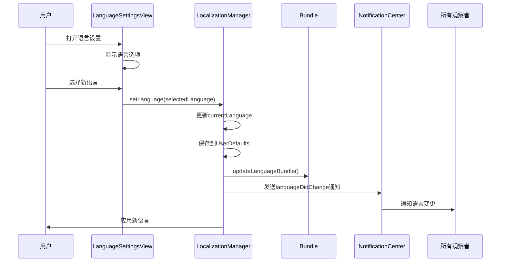

**图表来源**
- [LanguageSettingsView.swift](file://MyStory/Views/Settings/LanguageSettingsView.swift#L61-L64)
- [LocalizationManager.swift](file://MyStory/Utils/LocalizationManager.swift#L71-L82)

**章节来源**
- [LanguageSettingsView.swift](file://MyStory/Views/Settings/LanguageSettingsView.swift#L10-L70)
- [LocalizationManager.swift](file://MyStory/Utils/LocalizationManager.swift#L31-L107)

### FontSettingsView 组件分析

FontSettingsView 提供了高级的字体大小调节功能，支持实时预览和精确控制。

#### 字体管理系统

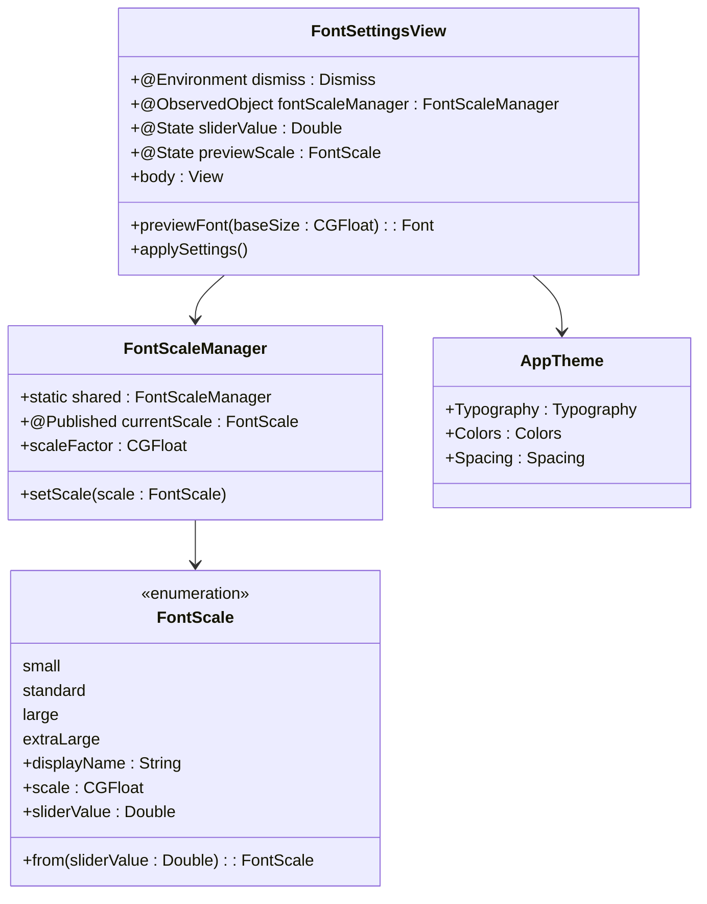

**图表来源**
- [FontSettingsView.swift](file://MyStory/Views/Settings/FontSettingsView.swift#L10-L229)
- [AppTheme.swift](file://MyStory/Components/Theme/AppTheme.swift#L4-L90)

#### 字体预览机制

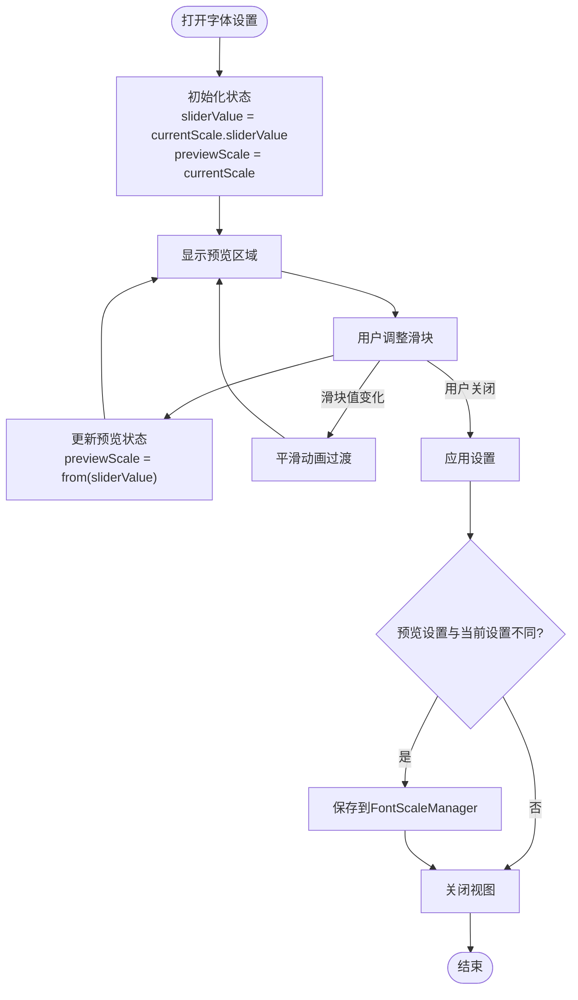

**图表来源**
- [FontSettingsView.swift](file://MyStory/Views/Settings/FontSettingsView.swift#L158-L166)
- [FontSettingsView.swift](file://MyStory/Views/Settings/FontSettingsView.swift#L205-L209)

**章节来源**
- [FontSettingsView.swift](file://MyStory/Views/Settings/FontSettingsView.swift#L10-L215)
- [AppTheme.swift](file://MyStory/Components/Theme/AppTheme.swift#L4-L90)

### DataSyncView 组件分析

DataSyncView 实现了完整的点对点数据同步功能，支持设备间的无缝数据传输。

#### 数据同步架构

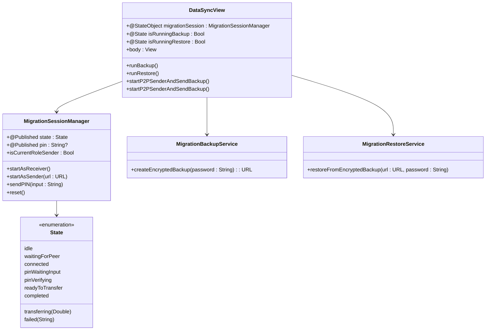

**图表来源**
- [DataSyncView.swift](file://MyStory/Views/Settings/DataSyncView.swift#L10-L76)
- [MigrationSessionManager.swift](file://MyStory/Services/MigrationSessionManager.swift#L5-L50)

#### 数据同步流程

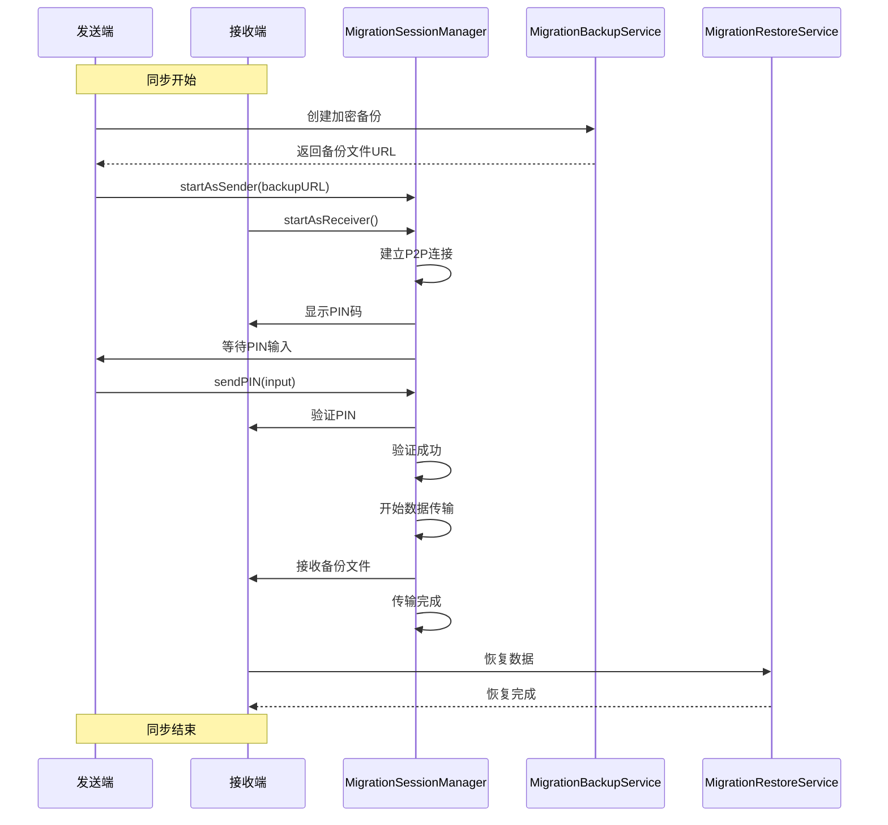

**图表来源**
- [DataSyncView.swift](file://MyStory/Views/Settings/DataSyncView.swift#L462-L477)
- [MigrationSessionManager.swift](file://MyStory/Services/MigrationSessionManager.swift#L63-L106)

#### 错误处理机制

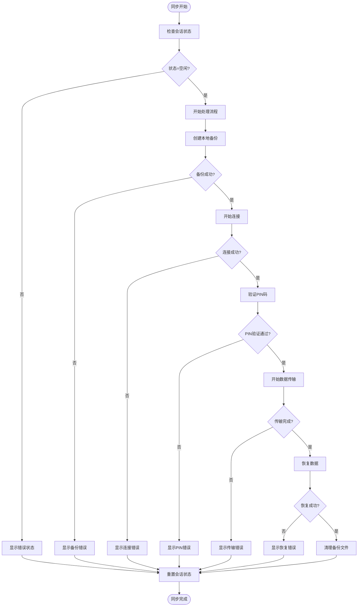

**图表来源**
- [DataSyncView.swift](file://MyStory/Views/Settings/DataSyncView.swift#L330-L364)
- [DataSyncView.swift](file://MyStory/Views/Settings/DataSyncView.swift#L367-L385)

**章节来源**
- [DataSyncView.swift](file://MyStory/Views/Settings/DataSyncView.swift#L10-L559)
- [MigrationSessionManager.swift](file://MyStory/Services/MigrationSessionManager.swift#L5-L374)

## 依赖关系分析

设置管理系统展现了清晰的依赖层次结构，确保了模块间的松耦合和高内聚。

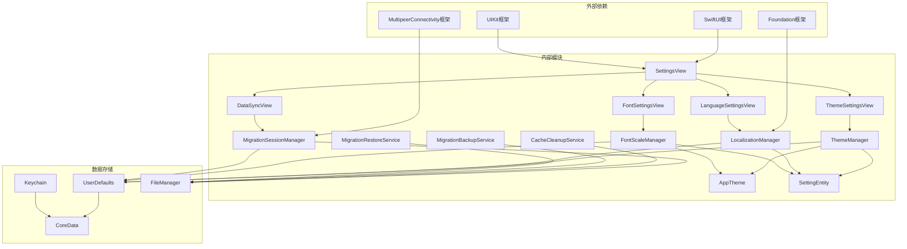

**图表来源**
- [SettingsView.swift](file://MyStory/Views/Settings/SettingsView.swift#L8-L15)
- [LocalizationManager.swift](file://MyStory/Utils/LocalizationManager.swift#L8-L10)
- [AppTheme.swift](file://MyStory/Components/Theme/AppTheme.swift#L1-L2)

**章节来源**
- [SettingsView.swift](file://MyStory/Views/Settings/SettingsView.swift#L8-L15)
- [LocalizationManager.swift](file://MyStory/Utils/LocalizationManager.swift#L8-L10)
- [AppTheme.swift](file://MyStory/Components/Theme/AppTheme.swift#L1-L2)

## 性能考虑

设置管理系统在设计时充分考虑了性能优化，确保了流畅的用户体验。

### 内存管理优化

- **懒加载机制**：所有设置视图采用延迟加载，减少内存占用
- **状态管理**：使用 @StateObject 和 @ObservedObject 确保正确的生命周期管理
- **缓存策略**：主题颜色和字体令牌使用静态缓存，避免重复计算

### 线程安全设计

- **后台任务**：缓存清理和数据同步在后台队列执行，不影响主线程性能
- **状态更新**：所有 UI 更新都在主线程执行，确保线程安全
- **异步操作**：文件操作和网络通信采用异步模式

### 用户体验优化

- **即时反馈**：所有设置更改立即生效，提供即时的视觉反馈
- **动画过渡**：使用 Spring 动画提供流畅的界面切换效果
- **进度指示**：长时间操作显示进度条，提升用户感知

## 故障排除指南

### 常见问题及解决方案

#### 主题切换问题

**问题描述**：主题切换后颜色不更新
**解决步骤**：
1. 检查 ThemeManager.currentTheme 是否正确更新
2. 验证 AppTheme 颜色计算逻辑
3. 确认 UserDefaults 中的主题设置已保存

#### 语言切换失效

**问题描述**：语言切换后部分文本未更新
**解决步骤**：
1. 确认 LocalizationManager.currentLanguage 已更新
2. 检查 Bundle 资源路径是否正确
3. 验证 NotificationCenter 通知是否发送

#### 字体设置不生效

**问题描述**：字体大小调整后无变化
**解决步骤**：
1. 检查 FontScaleManager.currentScale 是否更新
2. 验证 AppTheme.Typography 是否使用动态字体
3. 确认字体缩放因子计算正确

#### 数据同步失败

**问题描述**：设备间数据传输中断
**解决步骤**：
1. 检查 MultipeerConnectivity 权限
2. 验证 WiFi 或蓝牙连接状态
3. 确认 PIN 码验证通过
4. 检查文件传输进度

**章节来源**
- [SettingsView.swift](file://MyStory/Views/Settings/SettingsView.swift#L193-L226)
- [DataSyncView.swift](file://MyStory/Views/Settings/DataSyncView.swift#L367-L385)

## 结论

MyStory 的设置管理系统展现了现代 iOS 应用的最佳实践，通过模块化设计和清晰的架构分离，实现了高度可维护和可扩展的配置管理解决方案。

### 主要优势

1. **用户体验优秀**：即时设置应用和实时预览提供了流畅的用户体验
2. **架构设计合理**：清晰的分层架构确保了良好的可维护性
3. **功能完整性**：涵盖了从基础设置到高级数据同步的完整功能集
4. **性能优化到位**：合理的内存管理和异步处理提升了应用性能

### 技术亮点

- **主题系统**：支持多种主题和动态颜色计算
- **多语言支持**：完整的国际化解决方案
- **字体管理**：灵活的字体大小调节和实时预览
- **数据同步**：安全可靠的点对点数据传输

### 扩展性考虑

系统设计充分考虑了未来的功能扩展需求，通过标准化的接口和清晰的架构，为添加新的设置选项和功能提供了便利的基础。