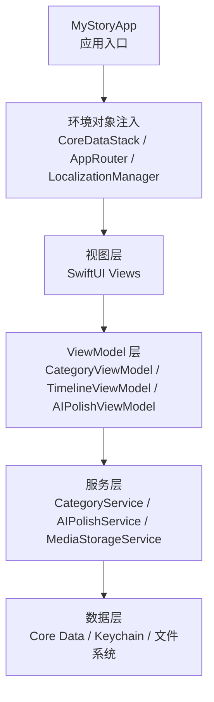
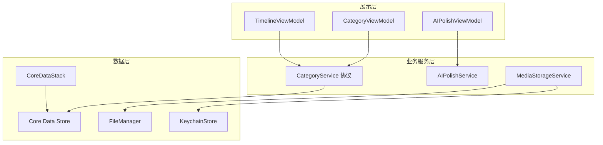
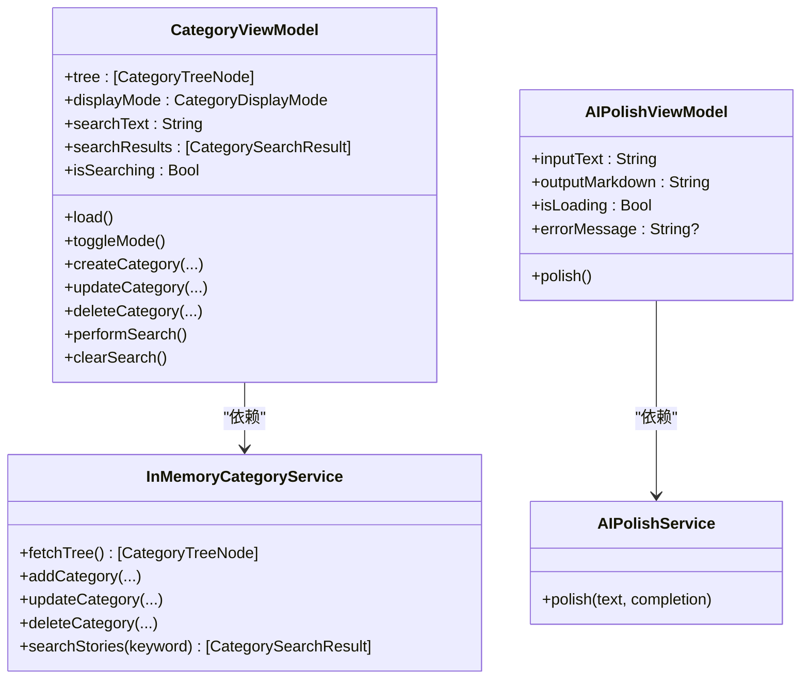
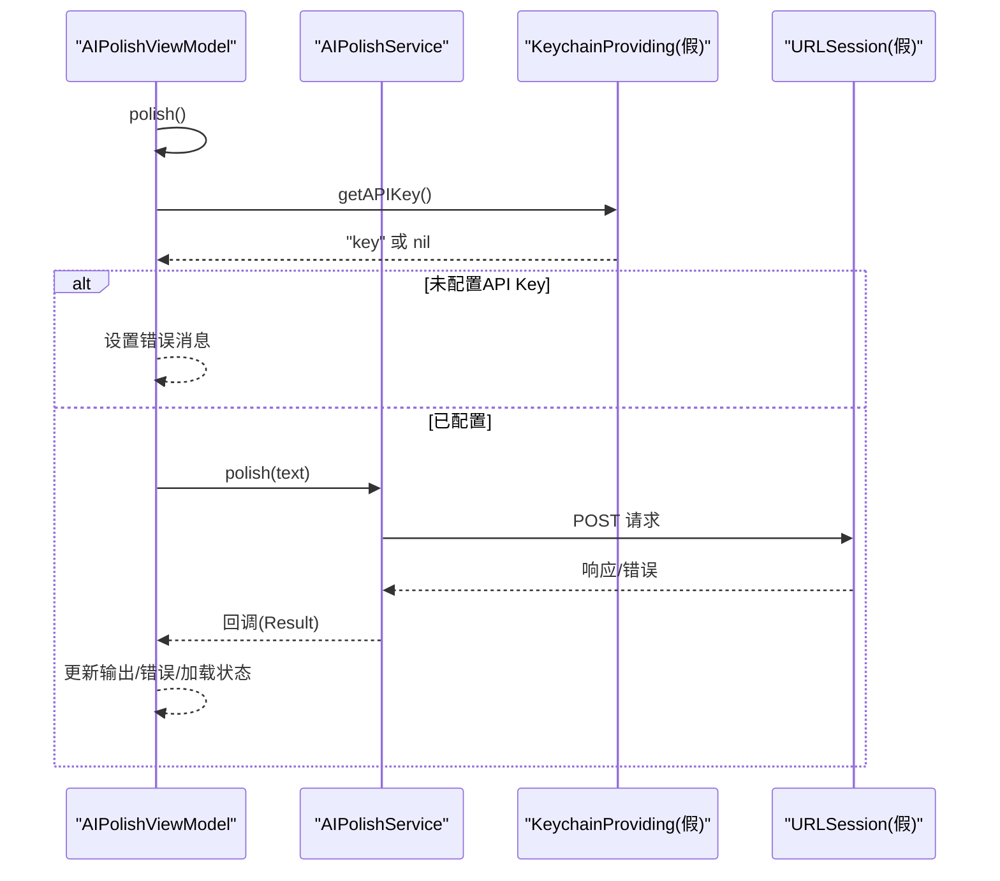
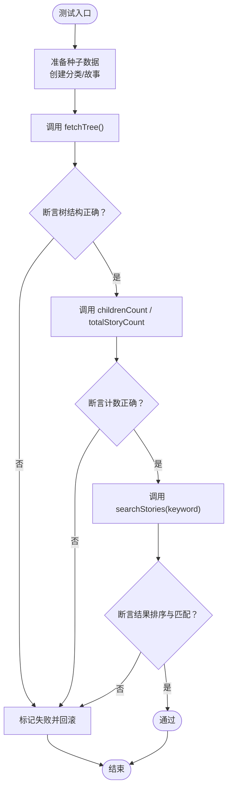
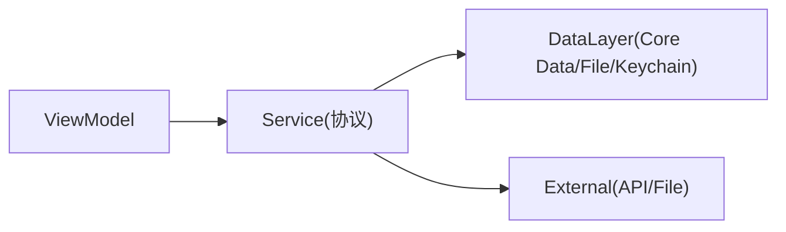

# 测试策略

<cite>
**本文引用的文件**
- [MyStoryApp.swift](file://MyStory/MyStoryApp.swift)
- [CategoryViewModel.swift](file://MyStory/ViewModels/Category/CategoryViewModel.swift)
- [CategoryService.swift](file://MyStory/Services/CategoryService/CategoryService.swift)
- [CoreDataStack.swift](file://MyStory/Core/Storage/CoreDataStack.swift)
- [MediaStorageService.swift](file://MyStory/Services/MediaStorageService.swift)
- [LocalizationManager.swift](file://MyStory/Utils/LocalizationManager.swift)
- [TimelineViewModel.swift](file://MyStory/Views/Timeline/TimelineViewModel.swift)
- [AIPolishService.swift](file://MyStory/Services/AIService/AIPolishService.swift)
- [AIPolishViewModel.swift](file://MyStory/ViewModels/Editor/AIPolishViewModel.swift)
- [AGENTS.md](file://AGENTS.md)
- [Design.md](file://Design.md)
- [ReadMe.md](file://ReadMe.md)
</cite>

## 目录
1. [简介](#简介)
2. [项目结构](#项目结构)
3. [核心组件](#核心组件)
4. [架构总览](#架构总览)
5. [详细组件分析](#详细组件分析)
6. [依赖分析](#依赖分析)
7. [性能考虑](#性能考虑)
8. [故障排查指南](#故障排查指南)
9. [结论](#结论)
10. [附录](#附录)

## 简介
本测试策略文档面向 MyStory 项目，围绕单元测试、集成测试与 UI 测试制定系统化方案。重点覆盖：
- 测试框架与工具链选择（基于现有工程与 Xcode 生态）
- 测试用例设计原则与 Mock 策略
- ViewModel、服务层、数据层的测试方法
- 测试覆盖率目标、性能与压力测试实施方案
- 测试自动化、CI 中的执行与报告生成
- TDD 实践与测试维护策略

## 项目结构
MyStory 采用 MVVM + 路由模式，数据层基于 Core Data，业务服务通过协议抽象，便于测试替身注入。应用入口通过环境对象注入 Core Data 上下文、路由与多语言管理器。

图表来源
- [MyStoryApp.swift](file://MyStory/MyStoryApp.swift#L11-L29)
- [CoreDataStack.swift](file://MyStory/Core/Storage/CoreDataStack.swift#L4-L35)
- [LocalizationManager.swift](file://MyStory/Utils/LocalizationManager.swift#L31-L66)

章节来源
- [MyStoryApp.swift](file://MyStory/MyStoryApp.swift#L11-L29)
- [ReadMe.md](file://ReadMe.md#L14-L66)

## 核心组件
- 视图模型层：负责状态管理与业务流程编排，便于断言状态变化与副作用。
- 服务层：封装业务逻辑与外部依赖（网络、加密、文件系统），通过协议解耦，利于 Mock。
- 数据层：Core Data 持久化、Keychain 加密、媒体文件管理，需隔离真实设备环境进行测试。

章节来源
- [CategoryViewModel.swift](file://MyStory/ViewModels/Category/CategoryViewModel.swift#L18-L103)
- [TimelineViewModel.swift](file://MyStory/Views/Timeline/TimelineViewModel.swift#L4-L43)
- [AIPolishViewModel.swift](file://MyStory/ViewModels/Editor/AIPolishViewModel.swift#L4-L46)
- [CategoryService.swift](file://MyStory/Services/CategoryService/CategoryService.swift#L22-L42)
- [AIPolishService.swift](file://MyStory/Services/AIService/AIPolishService.swift#L8-L77)
- [MediaStorageService.swift](file://MyStory/Services/MediaStorageService.swift#L8-L224)

## 架构总览

图表来源
- [TimelineViewModel.swift](file://MyStory/Views/Timeline/TimelineViewModel.swift#L4-L43)
- [CategoryViewModel.swift](file://MyStory/ViewModels/Category/CategoryViewModel.swift#L18-L103)
- [AIPolishViewModel.swift](file://MyStory/ViewModels/Editor/AIPolishViewModel.swift#L4-L46)
- [CategoryService.swift](file://MyStory/Services/CategoryService/CategoryService.swift#L22-L42)
- [AIPolishService.swift](file://MyStory/Services/AIService/AIPolishService.swift#L8-L77)
- [MediaStorageService.swift](file://MyStory/Services/MediaStorageService.swift#L8-L224)
- [CoreDataStack.swift](file://MyStory/Core/Storage/CoreDataStack.swift#L4-L35)

## 详细组件分析

### ViewModel 测试策略
- 目标：验证状态变化、命令执行、错误提示与边界条件。
- 方法：
  - 使用内存替身服务（InMemoryCategoryService）替代真实 Core Data，保证测试确定性。
  - 对网络服务（AIPolishService）通过 KeychainProviding 协议注入假实现，控制 API Key 与响应。
  - 断言 Published 属性变化、错误消息、加载状态等。
- 关键场景：
  - 分类管理：新增/更新/删除、层级校验、统计计算。
  - 搜索：空输入、非空输入、结果排序与清空。
  - 分页加载：首次加载、下一页、hasMore 控制。
  - AI 润色：速率限制、错误回退、Markdown 与敏感词过滤。

图表来源
- [CategoryViewModel.swift](file://MyStory/ViewModels/Category/CategoryViewModel.swift#L18-L103)
- [CategoryService.swift](file://MyStory/Services/CategoryService/CategoryService.swift#L44-L185)
- [AIPolishViewModel.swift](file://MyStory/ViewModels/Editor/AIPolishViewModel.swift#L4-L46)
- [AIPolishService.swift](file://MyStory/Services/AIService/AIPolishService.swift#L8-L77)

章节来源
- [CategoryViewModel.swift](file://MyStory/ViewModels/Category/CategoryViewModel.swift#L18-L103)
- [AIPolishViewModel.swift](file://MyStory/ViewModels/Editor/AIPolishViewModel.swift#L4-L46)

### 服务层测试策略
- 目标：验证业务规则、异常分支、数据一致性与外部依赖行为。
- 方法：
  - 为 CategoryService 注入内存实现，覆盖层级限制、父子关系校验、统计聚合。
  - 为 AIPolishService 注入 KeychainProviding 假实现，模拟 API Key 缺失、网络错误、解析失败。
  - 为 MediaStorageService 注入假的 KeyManager，控制加密/解密行为，验证文件命名与路径。
- 关键场景：
  - 分类树构建、故事计数、搜索评分与路径构建。
  - AI 润色请求构造、超时与解析兼容、速率限制。
  - 媒体保存/加载、缩略图生成、临时文件清理。

图表来源
- [AIPolishViewModel.swift](file://MyStory/ViewModels/Editor/AIPolishViewModel.swift#L18-L39)
- [AIPolishService.swift](file://MyStory/Services/AIService/AIPolishService.swift#L30-L61)

章节来源
- [CategoryService.swift](file://MyStory/Services/CategoryService/CategoryService.swift#L22-L675)
- [AIPolishService.swift](file://MyStory/Services/AIService/AIPolishService.swift#L8-L77)
- [MediaStorageService.swift](file://MyStory/Services/MediaStorageService.swift#L8-L224)

### 数据层测试策略
- 目标：验证 Core Data 操作、关系加载、预取策略与异常处理。
- 方法：
  - 使用 CoreDataStack 的预览实例，避免真实磁盘 IO。
  - 在测试中显式创建/清理种子数据，确保可重复性。
  - 验证 fetchTree、childrenCount、totalStoryCount、searchStories 的正确性。
- 关键场景：
  - 树节点构建、关系预取、异常对象与循环引用防护。
  - 分页加载、排序、hasMore 与加载状态。

图表来源
- [CoreDataStack.swift](file://MyStory/Core/Storage/CoreDataStack.swift#L37-L84)
- [CategoryService.swift](file://MyStory/Services/CategoryService/CategoryService.swift#L204-L264)
- [TimelineViewModel.swift](file://MyStory/Views/Timeline/TimelineViewModel.swift#L17-L41)

章节来源
- [CoreDataStack.swift](file://MyStory/Core/Storage/CoreDataStack.swift#L4-L35)
- [CategoryService.swift](file://MyStory/Services/CategoryService/CategoryService.swift#L190-L449)

### UI 测试策略
- 目标：验证用户交互、导航、多语言切换与媒体展示。
- 方法：
  - 使用 XCUITest 或 Snapshot 测试（结合现有脚本生态）。
  - 通过环境对象注入替换真实服务，确保 UI 行为可预测。
  - 验证多语言切换后的文本渲染与布局适配。
- 关键场景：
  - 分类列表/树视图交互、搜索结果展示。
  - 时间轴分页滚动、卡片加载与空状态。
  - AI 润色弹窗、输入校验与错误提示。

章节来源
- [LocalizationManager.swift](file://MyStory/Utils/LocalizationManager.swift#L31-L100)
- [Design.md](file://Design.md#L123-L143)

## 依赖分析
- 组件耦合：
  - ViewModel 依赖服务层接口，通过构造函数注入，便于替换。
  - 服务层依赖数据层与外部系统，通过协议隔离。
- 外部依赖：
  - 网络：AIPolishService 依赖 URLSession；通过协议注入假实现。
  - 加密：MediaStorageService 依赖 Keychain 与 CryptoKit；通过 KeychainProviding 与 KeyManager 抽象。
- 循环依赖风险：
  - 通过协议与分层避免直接循环；数据层仅被服务层消费。

图表来源
- [CategoryService.swift](file://MyStory/Services/CategoryService/CategoryService.swift#L22-L42)
- [AIPolishService.swift](file://MyStory/Services/AIService/AIPolishService.swift#L8-L14)
- [MediaStorageService.swift](file://MyStory/Services/MediaStorageService.swift#L8-L12)

章节来源
- [AGENTS.md](file://AGENTS.md#L26-L36)

## 性能考虑
- 单元测试：
  - 使用内存替身，避免磁盘与网络开销；对大数据量场景进行小规模采样。
- 集成测试：
  - Core Data 预览实例用于快速验证；大体量数据建议在专用测试 Target 中进行。
- 性能基准：
  - 分页加载、搜索评分、媒体压缩与缩略图生成可作为独立基准用例。
- 压力测试：
  - 模拟连续请求与弱网环境，验证速率限制与错误回退。

章节来源
- [Design.md](file://Design.md#L1235-L1240)

## 故障排查指南
- 常见问题：
  - Core Data Fault：确保服务层关系预取与异常对象检测。
  - 循环引用：分类路径构建中加入访问集合与层级上限。
  - 网络错误：AI 润色服务解析失败时回退原文。
- 调试建议：
  - 在测试中打印关键路径日志，定位异常对象与索引越界。
  - 使用假实现快速复现网络/加密异常。

章节来源
- [CategoryService.swift](file://MyStory/Services/CategoryService/CategoryService.swift#L587-L673)
- [AIPolishService.swift](file://MyStory/Services/AIService/AIPolishService.swift#L63-L75)

## 结论
通过协议抽象与内存替身，MyStory 的 ViewModel、服务层与数据层均可高效测试。建议以单元测试为主，辅以集成测试与 UI 测试，结合 CI 自动化与覆盖率目标，持续保障质量与可维护性。

## 附录

### 测试框架与工具链
- 测试运行：基于现有 xcodebuild 命令，支持单文件/单用例执行。
- 建议：结合 Xcode 内置 XCTest 与 Snapshot（如适用）完成 UI 截图回归。

章节来源
- [AGENTS.md](file://AGENTS.md#L26-L36)

### 测试用例设计原则
- 单一职责：每个用例聚焦一个行为或边界。
- 可重复：使用内存替身与预设数据。
- 可观测：断言状态变化与副作用，必要时打印日志辅助定位。

### Mock 对象使用策略
- 协议驱动：为网络、加密、存储等外部依赖定义协议，注入假实现。
- 状态可控：通过假实现控制返回值与抛错时机，覆盖正常/异常路径。

### 测试覆盖率与报告
- 覆盖率目标：建议语句/分支覆盖率不低于 80%，关键路径不低于 90%。
- 报告生成：结合 Xcode 与第三方工具（如 xccov）生成报告并接入 CI。

### 测试驱动开发（TDD）实践
- 先写失败用例，再实现最小逻辑，最后重构。
- 遵循“红-绿-重构”循环，保持测试驱动演进。

### 测试维护策略
- 随需求演进同步更新用例；对重构影响较大的模块增加回归用例。
- 定期清理过时用例与冗余断言，保持测试集健康。