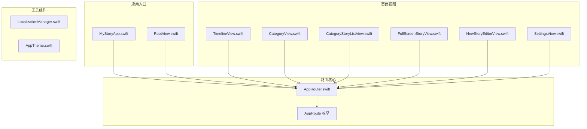
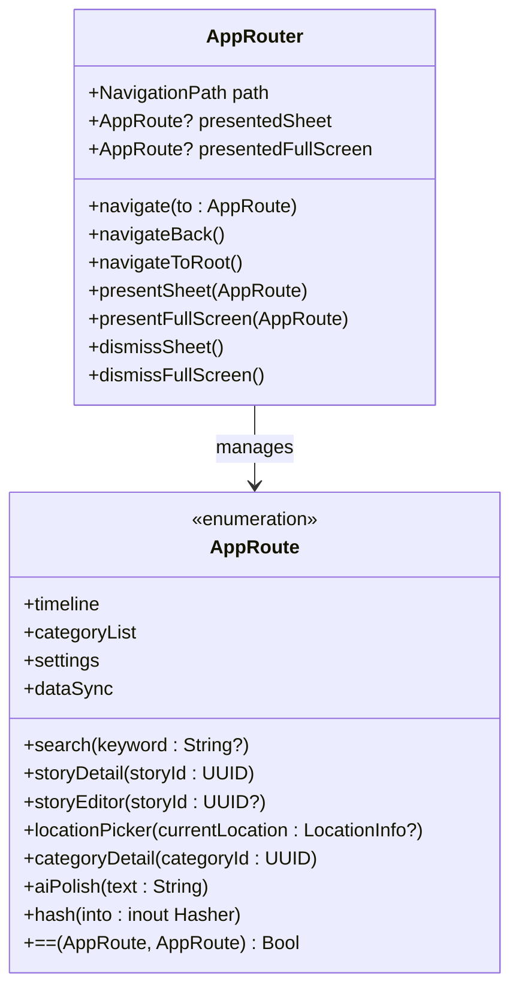
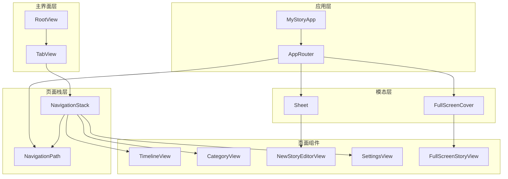
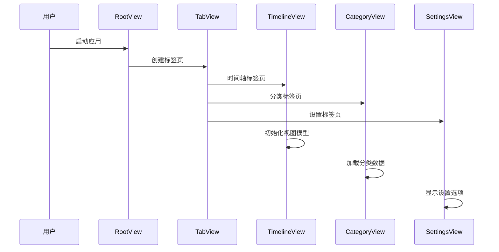
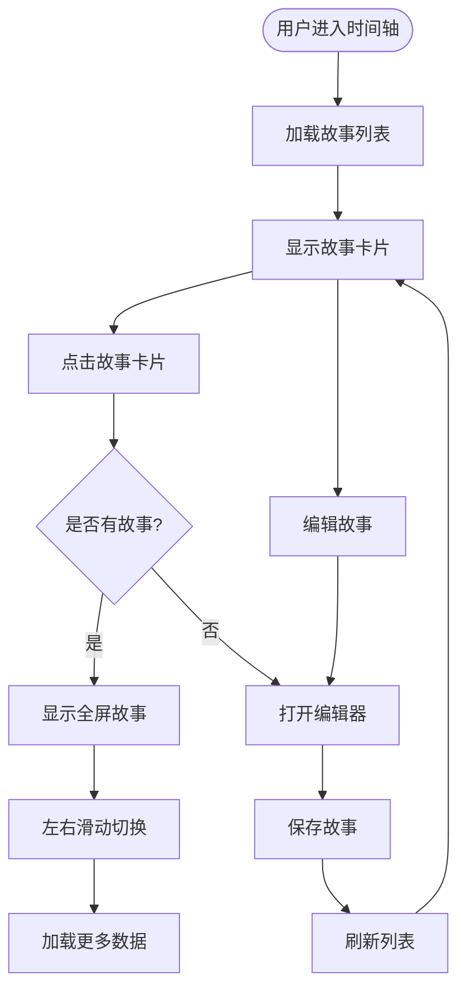
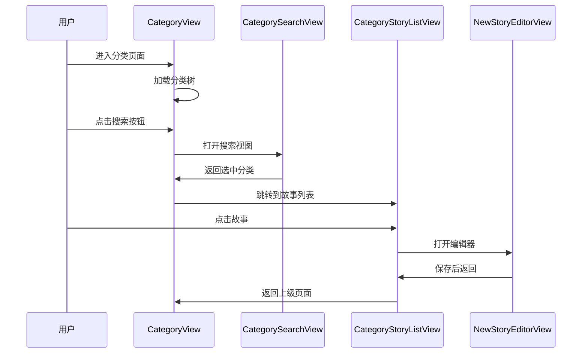
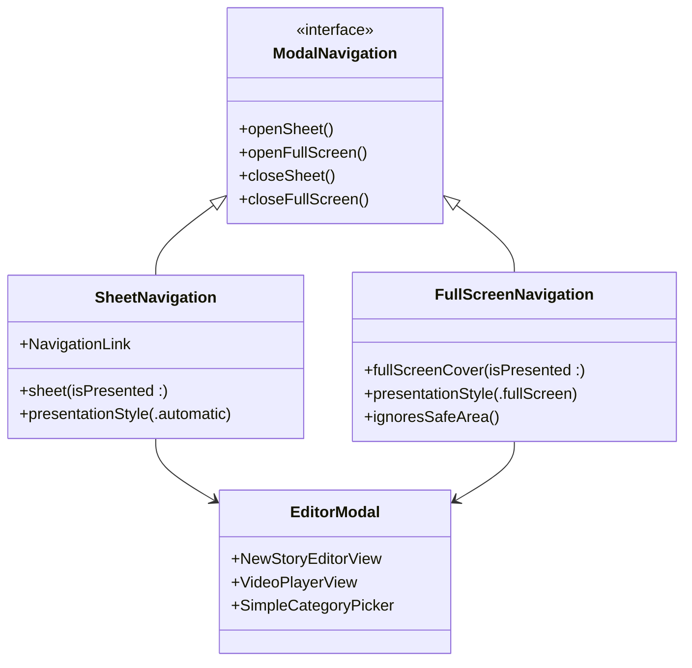
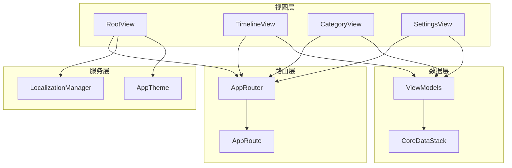
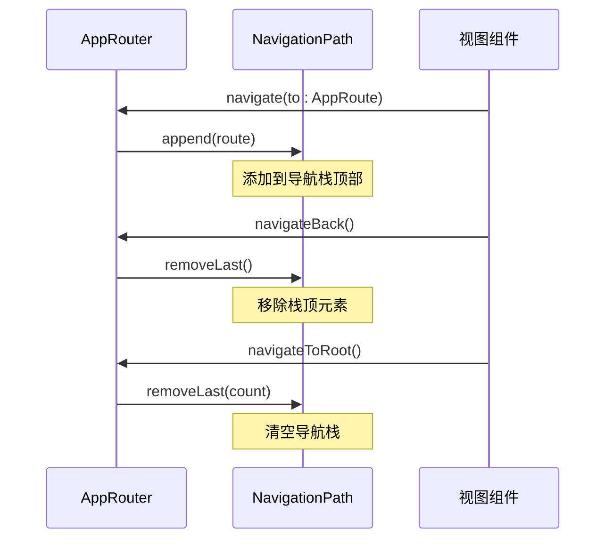

# 路由和导航系统

<cite>
**本文档引用的文件**
- [AppRouter.swift](file://MyStory/Core/Router/AppRouter.swift)
- [MyStoryApp.swift](file://MyStory/App/MyStoryApp.swift)
- [RootView.swift](file://MyStory/Views/RootView.swift)
- [TimelineView.swift](file://MyStory/Views/Timeline/TimelineView.swift)
- [CategoryView.swift](file://MyStory/Views/Category/CategoryView.swift)
- [CategoryStoryListView.swift](file://MyStory/Views/Category/CategoryStoryListView.swift)
- [FullScreenStoryView.swift](file://MyStory/Views/Timeline/FullScreenStoryView.swift)
- [NewStoryEditorView.swift](file://MyStory/Views/Editor/NewStoryEditorView.swift)
- [SettingsView.swift](file://MyStory/Views/Settings/SettingsView.swift)
- [LocalizationManager.swift](file://MyStory/Utils/LocalizationManager.swift)
- [AppTheme.swift](file://MyStory/Components/Theme/AppTheme.swift)
</cite>

## 目录
1. [简介](#简介)
2. [项目结构](#项目结构)
3. [核心组件](#核心组件)
4. [架构概览](#架构概览)
5. [详细组件分析](#详细组件分析)
6. [依赖关系分析](#依赖关系分析)
7. [性能考虑](#性能考虑)
8. [故障排除指南](#故障排除指南)
9. [结论](#结论)

## 简介

MyStory 的路由和导航系统采用统一的 AppRouter 设计，实现了完整的页面导航管理机制。该系统基于 SwiftUI 的 NavigationStack、Sheet 和 FullScreenCover 组件，提供了灵活的页面跳转策略和模态展示方式。

系统的核心设计理念包括：
- 统一的路由枚举管理所有页面类型
- 基于 NavigationPath 的页面栈控制
- Sheet 和 FullScreen 模态的集成
- 多层次导航结构（TabView → NavigationStack → Sheet/FullScreen）

## 项目结构

MyStory 的路由系统主要分布在以下目录结构中：

**图表来源**
- [AppRouter.swift](file://MyStory/Core/Router/AppRouter.swift#L1-L123)
- [MyStoryApp.swift](file://MyStory/App/MyStoryApp.swift#L1-L32)
- [RootView.swift](file://MyStory/Views/RootView.swift#L1-L43)

**章节来源**
- [AppRouter.swift](file://MyStory/Core/Router/AppRouter.swift#L1-L123)
- [MyStoryApp.swift](file://MyStory/App/MyStoryApp.swift#L1-L32)
- [RootView.swift](file://MyStory/Views/RootView.swift#L1-L43)

## 核心组件

### AppRouter - 统一路由管理器

AppRouter 是整个导航系统的核心，负责统一管理所有页面导航和模态展示。

**图表来源**
- [AppRouter.swift](file://MyStory/Core/Router/AppRouter.swift#L81-L122)
- [AppRouter.swift](file://MyStory/Core/Router/AppRouter.swift#L10-L79)

### AppRoute - 路由枚举定义

AppRoute 枚举定义了应用中的所有页面类型，每种路由类型都包含了必要的参数信息：

| 路由类型 | 参数 | 描述 |
|---------|------|------|
| timeline | 无 | 时间轴主页面 |
| search | keyword: String? | 搜索页面，支持关键词参数 |
| storyDetail | storyId: UUID | 故事详情页面 |
| storyEditor | storyId: UUID? | 故事编辑器，支持现有故事编辑 |
| locationPicker | currentLocation: LocationInfo? | 位置选择器 |
| categoryList | 无 | 分类列表页面 |
| categoryDetail | categoryId: UUID | 分类详情页面 |
| settings | 无 | 设置页面 |
| aiPolish | text: String | AI润色页面 |
| dataSync | 无 | 数据同步页面 |

**章节来源**
- [AppRouter.swift](file://MyStory/Core/Router/AppRouter.swift#L10-L79)

## 架构概览

MyStory 采用了多层次的导航架构，结合了 TabView、NavigationStack 和模态展示的组合：

**图表来源**
- [MyStoryApp.swift](file://MyStory/App/MyStoryApp.swift#L9-L26)
- [RootView.swift](file://MyStory/Views/RootView.swift#L11-L35)
- [AppRouter.swift](file://MyStory/Core/Router/AppRouter.swift#L81-L122)

## 详细组件分析

### 根视图导航结构

RootView 实现了应用的主界面导航结构，采用 TabView 作为主导航容器：

**图表来源**
- [RootView.swift](file://MyStory/Views/RootView.swift#L10-L35)

### 时间轴导航流程

TimelineView 实现了复杂的故事浏览和编辑功能，支持多种导航模式：

**图表来源**
- [TimelineView.swift](file://MyStory/Views/Timeline/TimelineView.swift#L23-L53)
- [FullScreenStoryView.swift](file://MyStory/Views/Timeline/FullScreenStoryView.swift#L30-L48)

**章节来源**
- [RootView.swift](file://MyStory/Views/RootView.swift#L10-L35)
- [TimelineView.swift](file://MyStory/Views/Timeline/TimelineView.swift#L23-L53)

### 分类导航系统

CategoryView 实现了多级分类导航，支持卡片视图和列表视图两种显示模式：

**图表来源**
- [CategoryView.swift](file://MyStory/Views/Category/CategoryView.swift#L25-L93)
- [CategoryStoryListView.swift](file://MyStory/Views/Category/CategoryStoryListView.swift#L37-L62)

**章节来源**
- [CategoryView.swift](file://MyStory/Views/Category/CategoryView.swift#L25-L93)
- [CategoryStoryListView.swift](file://MyStory/Views/Category/CategoryStoryListView.swift#L37-L62)

### 模态导航实现

系统支持多种模态导航方式，包括 Sheet 和 FullScreenCover：

**图表来源**
- [NewStoryEditorView.swift](file://MyStory/Views/Editor/NewStoryEditorView.swift#L43-L57)
- [FullScreenStoryView.swift](file://MyStory/Views/Timeline/FullScreenStoryView.swift#L276-L286)

**章节来源**
- [NewStoryEditorView.swift](file://MyStory/Views/Editor/NewStoryEditorView.swift#L43-L57)
- [FullScreenStoryView.swift](file://MyStory/Views/Timeline/FullScreenStoryView.swift#L276-L286)

## 依赖关系分析

### 组件耦合关系

**图表来源**
- [AppRouter.swift](file://MyStory/Core/Router/AppRouter.swift#L81-L122)
- [RootView.swift](file://MyStory/Views/RootView.swift#L4-L8)
- [LocalizationManager.swift](file://MyStory/Utils/LocalizationManager.swift#L31-L43)

### 导航栈管理

AppRouter 通过 NavigationPath 实现了完整的页面栈管理：

**图表来源**
- [AppRouter.swift](file://MyStory/Core/Router/AppRouter.swift#L86-L101)

**章节来源**
- [AppRouter.swift](file://MyStory/Core/Router/AppRouter.swift#L86-L101)

## 性能考虑

### 导航性能优化

1. **懒加载机制**：使用 LazyVStack 和 LazyVGrid 实现列表的懒加载
2. **内存管理**：及时释放视频播放器资源和图片缓存
3. **状态管理**：使用 @StateObject 确保视图模型的正确生命周期管理

### 模态导航优化

1. **Sheet 优化**：使用 .presentationDetents 配置 Sheet 的高度
2. **FullScreen 优化**：合理使用 .ignoresSafeArea() 避免布局问题
3. **资源管理**：模态关闭时及时释放相关资源

## 故障排除指南

### 常见导航问题

1. **页面无法返回**：检查 NavigationPath 是否正确维护
2. **模态显示异常**：确认 @State 变量的绑定是否正确
3. **数据丢失**：确保在模态关闭时正确保存数据

### 调试技巧

1. 使用 Xcode 的 View Debugger 查看视图层次结构
2. 在 AppRouter 中添加日志输出跟踪导航状态
3. 检查 @EnvironmentObject 的注入是否正确

**章节来源**
- [AppRouter.swift](file://MyStory/Core/Router/AppRouter.swift#L81-L122)

## 结论

MyStory 的路由和导航系统设计精良，实现了以下关键特性：

1. **统一性**：通过 AppRouter 和 AppRoute 提供统一的导航接口
2. **灵活性**：支持多种导航模式（TabView、NavigationStack、Sheet、FullScreen）
3. **可扩展性**：易于添加新的页面类型和导航逻辑
4. **用户体验**：提供流畅的页面切换和模态展示体验

该系统为 MyStory 提供了坚实的基础，支持未来功能的扩展和维护。建议在后续开发中继续遵循现有的设计模式，确保系统的整体一致性和可维护性。