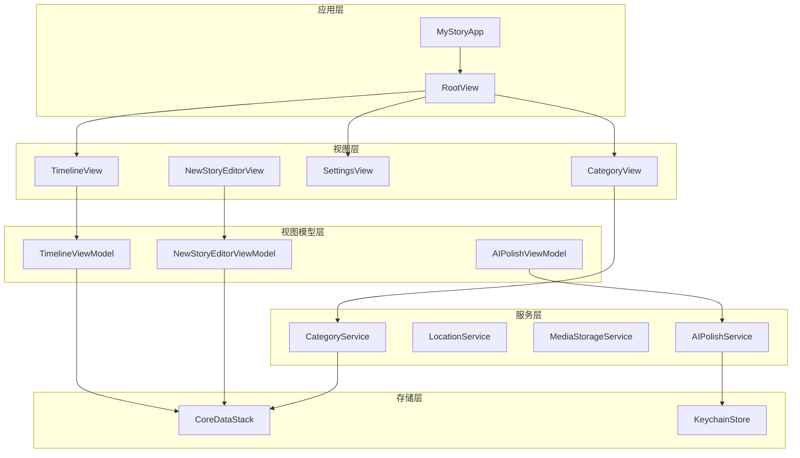
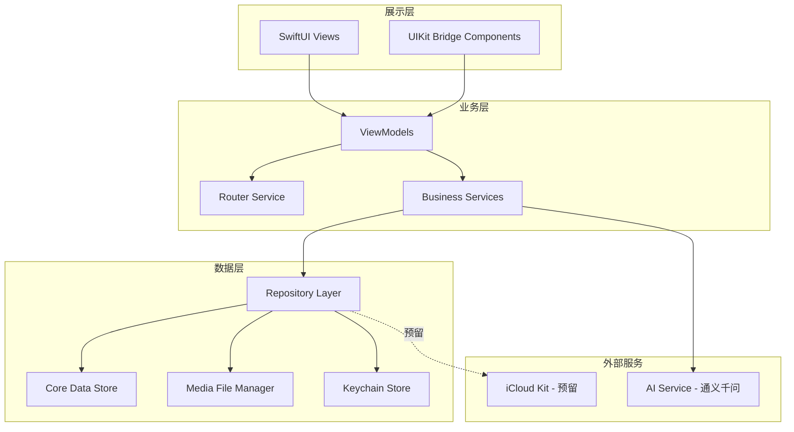
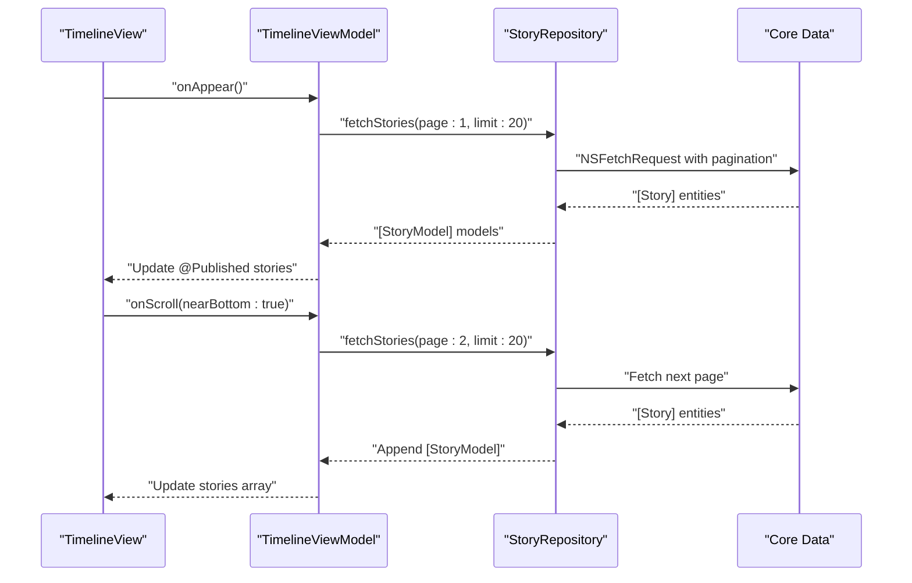
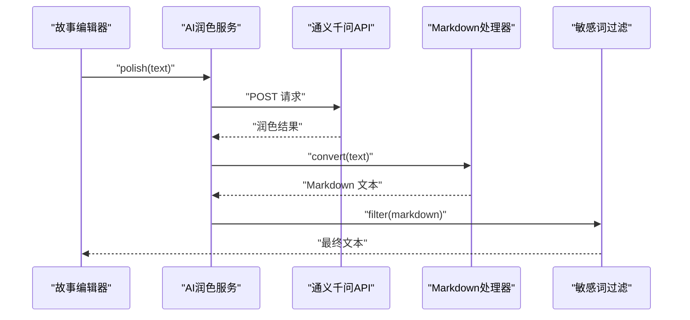
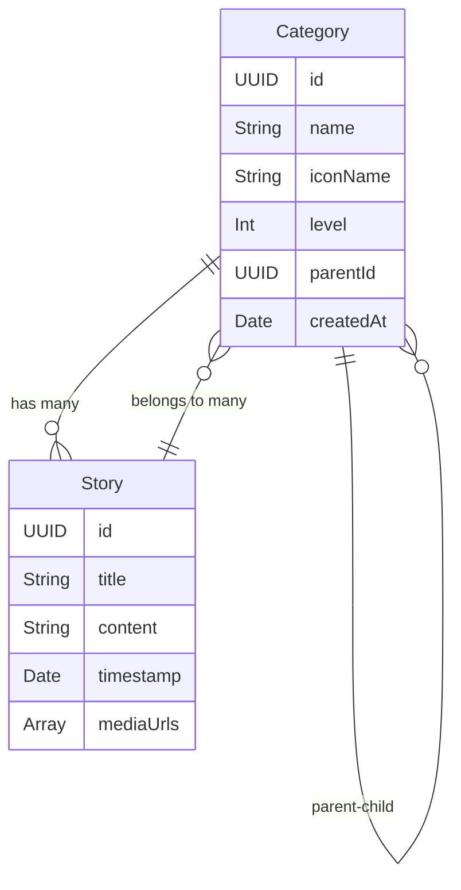
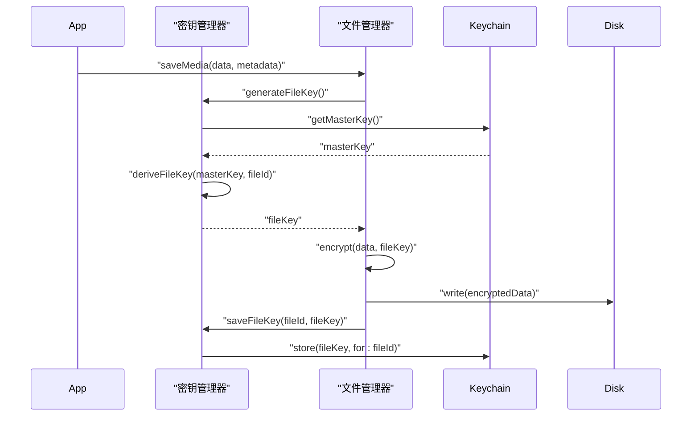
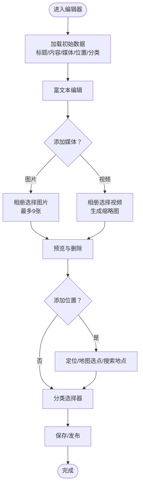

# 项目概述

<cite>
**本文档引用的文件**
- [ReadMe.md](file://ReadMe.md)
- [Design.md](file://Design.md)
- [StorageDesign.md](file://StorageDesign.md)
- [MyStoryApp.swift](file://MyStory/MyStoryApp.swift)
- [TimelineView.swift](file://MyStory/Views/Timeline/TimelineView.swift)
- [AIPolishService.swift](file://MyStory/Services/AIService/AIPolishService.swift)
- [AIPolishViewModel.swift](file://MyStory/ViewModels/Editor/AIPolishViewModel.swift)
- [CoreDataStack.swift](file://MyStory/Core/Storage/CoreDataStack.swift)
- [AppTheme.swift](file://MyStory/Components/Theme/AppTheme.swift)
- [LocalizationManager.swift](file://MyStory/Utils/LocalizationManager.swift)
- [RootView.swift](file://MyStory/Views/RootView.swift)
- [NewStoryEditorView.swift](file://MyStory/Views/Editor/NewStoryEditorView.swift)
</cite>

## 目录
1. [简介](#简介)
2. [项目结构](#项目结构)
3. [核心组件](#核心组件)
4. [架构总览](#架构总览)
5. [详细组件分析](#详细组件分析)
6. [依赖关系分析](#依赖关系分析)
7. [性能考量](#性能考量)
8. [故障排查指南](#故障排查指南)
9. [结论](#结论)
10. [附录](#附录)

## 简介
MyStory 是一款面向 iOS 平台的个人故事记录应用，采用时间轴叙事方式，集成 AI 内容增强能力，帮助用户以多媒体形式记录、整理与回顾生活点滴。应用通过“时间轴 + 分类 + 媒体”的组合，提供自然的时间线回忆体验，并借助通义千问 API 提供智能文本润色，提升表达质量与阅读体验。

- 核心价值主张
  - 时间轴叙事：以时间为线索，直观呈现生活轨迹
  - AI 内容增强：智能文本润色，提升表达质量
  - 多媒体支持：图片、视频无缝融合
  - 灵活分类：三级分类体系，精细化内容管理
  - 安全存储：本地加密存储，预留云同步能力

- 目标用户群体
  - 希望记录与回顾个人生活的人群
  - 注重内容表达质量与阅读体验的用户
  - 需要按主题/场景组织内容的用户
  - 对隐私与数据安全有较高要求的用户

- 主要功能特性
  - 时间轴展示与滚动加载
  - 故事编辑器（文本、图片、视频、位置、分类）
  - AI 润色（通义千问 API）
  - 多语言与主题系统
  - 本地存储与缓存策略

- 技术架构与设计理念
  - 技术栈：SwiftUI + MVVM + Core Data + UIKit 混合开发
  - 架构模式：MVVM + 路由架构，关注点分离
  - 设计理念：时间轴优先、离线优先、隐私优先、可扩展性

- 创新点
  - 时间轴双模式：瀑布流（默认）与一屏一故事（全屏沉浸式）
  - AI 润色与 Markdown 转换、敏感词过滤一体化处理
  - 三级分类树形结构，支持故事线（Level 3）作为时间轴
  - 本地加密存储与缓存策略，兼顾性能与隐私

- 当前版本与状态
  - 版本：1.0.0
  - 构建日期：2025-11-21
  - 阶段：第一阶段核心框架搭建完成，第二阶段功能逐步推进中

**章节来源**
- file://ReadMe.md#L1-L156
- file://Design.md#L3-L22

## 项目结构
项目采用按层与按功能混合的组织方式，核心目录包括：
- App：应用入口与场景配置
- Core：核心基础设施（路由、存储）
- Models：数据模型与 Core Data 实体
- Services：业务服务（AI、位置、媒体、分类等）
- Views：视图层（时间轴、编辑器、分类、设置等）
- Components：通用组件（主题、字体、富文本编辑器等）
- Utils：工具类（本地化、Markdown、敏感词过滤等）
- Resources：资源文件（Assets、多语言、字体）



**图表来源**
- [MyStoryApp.swift](file://MyStory/MyStoryApp.swift#L1-L32)
- [RootView.swift](file://MyStory/Views/RootView.swift#L1-L43)
- [TimelineView.swift](file://MyStory/Views/Timeline/TimelineView.swift#L1-L304)
- [NewStoryEditorView.swift](file://MyStory/Views/Editor/NewStoryEditorView.swift#L1-L1057)
- [AIPolishService.swift](file://MyStory/Services/AIService/AIPolishService.swift#L1-L77)
- [CoreDataStack.swift](file://MyStory/Core/Storage/CoreDataStack.swift#L1-L382)

**章节来源**
- file://ReadMe.md#L14-L66

## 核心组件
- 应用入口与环境注入
  - 应用入口负责注入 Core Data 上下文、路由与本地化管理器，统一提供环境对象给子视图
- 核心视图
  - RootView：TabView 主导航，包含时间轴、分类、设置三个主页面
  - TimelineView：时间轴展示，支持滚动加载与上下文菜单
  - NewStoryEditorView：故事编辑器，支持文本、图片、视频、位置、分类选择
- 视图模型
  - TimelineViewModel：时间轴数据加载与分页
  - AIPolishViewModel：AI 润色流程控制与速率限制
- 服务与存储
  - AIPolishService：通义千问 API 调用、请求封装与响应解析
  - CoreDataStack：Core Data 容器与上下文管理
  - AppTheme：主题与字体缩放管理
  - LocalizationManager：多语言切换与本地化字符串获取

**章节来源**
- file://MyStory/MyStoryApp.swift#L1-L32
- file://MyStory/Views/RootView.swift#L1-L43
- file://MyStory/Views/Timeline/TimelineView.swift#L1-L304
- file://MyStory/Views/Editor/NewStoryEditorView.swift#L1-L1057
- file://MyStory/ViewModels/Editor/AIPolishViewModel.swift#L1-L46
- file://MyStory/Services/AIService/AIPolishService.swift#L1-L77
- file://MyStory/Core/Storage/CoreDataStack.swift#L1-L382
- file://MyStory/Components/Theme/AppTheme.swift#L1-L328
- file://MyStory/Utils/LocalizationManager.swift#L1-L107

## 架构总览
应用采用 MVVM + 路由架构，展示层（SwiftUI/UIKit）与业务逻辑分离，ViewModel 通过服务层调用数据仓库与外部服务，数据层采用 Core Data 本地持久化，辅以 Keychain 存储敏感配置。



**图表来源**
- [Design.md](file://Design.md#L23-L62)

**章节来源**
- file://Design.md#L23-L87

## 详细组件分析

### 时间轴组件分析
- 时间轴展示模式
  - 瀑布流模式（默认）：LazyVStack + 自定义 Layout，卡片尺寸随媒体数量动态调整
  - 一屏一故事模式：全屏沉浸式展示，支持手势切换与视差效果
- 数据加载策略
  - 分页加载：每次加载 20 条，滚动接近底部时触发下一页
  - 预加载机制：提前 3 个卡片触发下一页数据加载
- 故事卡片组成
  - 时间戳、位置标签、媒体缩略图、分类标签、文本摘要、互动区域（预留）
- 搜索与过滤
  - 支持标题、内容、位置、分类的复合搜索，具备防抖、分词索引、结果高亮、搜索历史等功能



**图表来源**
- [Design.md](file://Design.md#L123-L143)
- [TimelineView.swift](file://MyStory/Views/Timeline/TimelineView.swift#L1-L304)

**章节来源**
- file://Design.md#L91-L218
- file://MyStory/Views/Timeline/TimelineView.swift#L1-L304

### AI 润色组件分析
- 服务架构
  - 编辑器 → AI 润色服务 → 通义千问 API → Markdown 处理器 → 敏感词过滤 → 最终文本
- API 集成方案
  - 认证机制：Keychain 存储 API Key，Authorization Bearer Token
  - 请求处理：超时 30 秒，失败重试，解析兼容多种返回结构
  - 速率限制：本地限流器，单用户每分钟最多 5 次请求
- Markdown 转换与敏感词过滤
  - Markdown 转换规则与渲染效果
  - 敏感词过滤策略与更新机制



**图表来源**
- [Design.md](file://Design.md#L219-L270)
- [AIPolishService.swift](file://MyStory/Services/AIService/AIPolishService.swift#L1-L77)
- [AIPolishViewModel.swift](file://MyStory/ViewModels/Editor/AIPolishViewModel.swift#L1-L46)

**章节来源**
- file://Design.md#L219-L270
- file://MyStory/Services/AIService/AIPolishService.swift#L1-L77
- file://MyStory/ViewModels/Editor/AIPolishViewModel.swift#L1-L46

### 分类与故事管理分析
- 三级分类体系
  - Level 1（主分类）：最多 10 个
  - Level 2（子分类）：每个主分类最多 20 个
  - Level 3（细分类/故事线）：每个子分类最多 30 个
- 多对多关系
  - 一个故事可属于多个分类，一个分类可包含多个故事
- 分类选择器
  - 支持多选、面包屑导航、快速搜索与层级导航



**图表来源**
- [StorageDesign.md](file://StorageDesign.md#L277-L299)

**章节来源**
- file://StorageDesign.md#L18-L377

### 存储与缓存分析
- Core Data 架构
  - 实体设计：StoryEntity、CategoryEntity、MediaEntity
  - 关系映射：多对多、自引用父子关系
  - 数据迁移：轻量级迁移、自动备份与失败回滚
- 媒体文件存储
  - 存储路径：Documents/Media/Images、Videos
  - 压缩策略：HEIC/HEVC、缩略图与封面
  - 加密存储：AES-256-GCM，Keychain 管理主密钥
- 缓存策略
  - 图片缓存：内存 + 磁盘（LRU 淘汰），内存警告分级处理



**图表来源**
- [Design.md](file://Design.md#L430-L448)
- [CoreDataStack.swift](file://MyStory/Core/Storage/CoreDataStack.swift#L1-L382)

**章节来源**
- file://Design.md#L359-L483
- file://MyStory/Core/Storage/CoreDataStack.swift#L1-L382

### 编辑器与多媒体分析
- 编辑器功能
  - 文本编辑：富文本编辑器，支持加粗、斜体、下划线、缩进、时间戳插入等
  - 媒体管理：图片网格（最多 9 张）、视频缩略图、视频播放
  - 位置选择：当前定位、地图选点、搜索地点、历史位置
  - 分类选择：底部抽屉式分类选择器，支持多选与面包屑导航
- 媒体加载与展示
  - 图片与视频异步加载，占位图与缩略图优化加载体验
  - 视频封面生成与播放器集成



**图表来源**
- [NewStoryEditorView.swift](file://MyStory/Views/Editor/NewStoryEditorView.swift#L1-L1057)

**章节来源**
- file://MyStory/Views/Editor/NewStoryEditorView.swift#L1-L1057

### 主题与多语言系统
- 主题系统
  - 支持经典、海洋、日落三种主题，颜色与背景随主题动态切换
  - 字体缩放管理：小/标准/大/超大，支持滑杆调节与持久化
- 多语言系统
  - 支持中文（简体）与英文，动态切换语言并发送通知
  - 本地化字符串与日期格式随语言自动调整

**章节来源**
- file://MyStory/Components/Theme/AppTheme.swift#L1-L328
- file://MyStory/Utils/LocalizationManager.swift#L1-L107

## 依赖关系分析
- 组件耦合与内聚
  - 视图与视图模型通过环境对象与绑定解耦，便于测试与复用
  - 服务层与数据层通过协议抽象，便于替换与扩展
- 外部依赖
  - 通义千问 API：通过 URLSession 异步请求，Keychain 存储 API Key
  - Core Data：本地持久化，支持轻量级迁移
  - UIKit 桥接：在需要时使用 UIKit 组件（如视频播放器）
- 路由与导航
  - AppRouter 统一路由管理，支持 NavigationStack、Sheet、FullScreenCover

```mermaid
graph LR
TimelineView --> TimelineViewModel
TimelineViewModel --> CoreDataStack
TimelineViewModel --> StoryRepository
StoryRepository --> Core Data
NewStoryEditorView --> NewStoryEditorViewModel
NewStoryEditorViewModel --> MediaStorageService
NewStoryEditorViewModel --> LocationService
AIPolishView --> AIPolishViewModel
AIPolishViewModel --> AIPolishService
AIPolishService --> KeychainStore
```

**图表来源**
- [TimelineView.swift](file://MyStory/Views/Timeline/TimelineView.swift#L1-L304)
- [NewStoryEditorView.swift](file://MyStory/Views/Editor/NewStoryEditorView.swift#L1-L1057)
- [AIPolishService.swift](file://MyStory/Services/AIService/AIPolishService.swift#L1-L77)
- [CoreDataStack.swift](file://MyStory/Core/Storage/CoreDataStack.swift#L1-L382)

**章节来源**
- file://MyStory/Views/Timeline/TimelineView.swift#L1-L304
- file://MyStory/Views/Editor/NewStoryEditorView.swift#L1-L1057
- file://MyStory/Services/AIService/AIPolishService.swift#L1-L77
- file://MyStory/Core/Storage/CoreDataStack.swift#L1-L382

## 性能考量
- 时间轴滚动优化
  - 分页加载与预加载机制减少卡顿
  - 媒体缩略图异步加载与占位图提升首帧体验
- 缓存策略
  - LRU 淘汰与内存警告分级处理，保障内存压力下的稳定性
- 网络与 AI 请求
  - 速率限制与超时控制，避免频繁失败与资源浪费
- 存储与加密
  - 媒体压缩与加密存储平衡空间占用与隐私安全

[本节为通用指导，无需列出具体文件来源]

## 故障排查指南
- 无法加载故事
  - 检查 Core Data 数据库是否正常加载与迁移
  - 查看分页加载逻辑与滚动触发条件
- AI 润色失败
  - 确认 API Key 是否正确存储于 Keychain
  - 检查网络状态与超时设置，确认解析逻辑是否回退原文
- 媒体加载异常
  - 检查媒体文件路径与缩略图生成逻辑
  - 确认视频播放器 URL 与权限
- 主题与字体切换无效
  - 确认主题与字体缩放的观察对象是否正确更新
  - 检查 Bundle 切换与通知广播

**章节来源**
- file://MyStory/Core/Storage/CoreDataStack.swift#L27-L34
- file://MyStory/Services/AIService/AIPolishService.swift#L30-L61
- file://MyStory/Views/Editor/NewStoryEditorView.swift#L771-L780
- file://MyStory/Components/Theme/AppTheme.swift#L135-L152
- file://MyStory/Utils/LocalizationManager.swift#L70-L82

## 结论
MyStory 通过时间轴叙事与多媒体记录，结合 AI 内容增强与本地安全存储，为用户提供自然、高效、私密的个人故事管理体验。项目采用清晰的 MVVM + 路由架构，具备良好的可扩展性与可维护性，当前已完成第一阶段核心框架，后续将持续完善编辑器、搜索与云同步等能力。

[本节为总结性内容，无需列出具体文件来源]

## 附录
- 版本信息
  - 当前版本：1.0.0
  - 构建日期：2025-11-21
- 开发规范
  - 命名规范：PascalCase 文件与类名，camelCase 变量与常量
  - 代码风格：SwiftUI 声明式编程，MVVM 分离关注点，环境对象传递依赖

**章节来源**
- file://ReadMe.md#L153-L156
- file://ReadMe.md#L123-L136