# MyStory - 个人故事记录应用设计文档

## 一、项目概述

### 1.1 项目定位
MyStory 是一款面向iOS平台的个人故事记录应用，采用时间轴叙事方式，集成AI内容增强能力，帮助用户以多媒体形式记录、整理和回顾生活点滴。

### 1.2 核心价值
- **时间轴叙事**：以时间为主线，直观展示生活轨迹
- **AI内容增强**：智能文本润色，提升表达质量
- **多媒体支持**：图片、视频无缝融合
- **灵活分类**：三级分类体系，精细化内容管理
- **安全存储**：本地加密存储，预留云同步能力

### 1.3 技术栈
- **开发语言**：Swift 5.9+
- **UI框架**：SwiftUI + UIKit混合开发
- **架构模式**：MVVM + 路由架构
- **本地存储**：Core Data
- **AI服务**：阿里通义千问API
- **最低支持版本**：iOS 16.0+

## 二、系统架构设计

### 2.1 整体架构

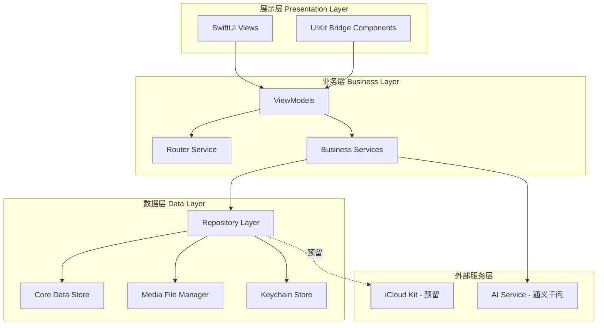

### 2.2 模块划分

| 模块名称 | 职责描述 | 核心组件 |
|---------|---------|---------|
| 时间轴模块 | 故事时间轴展示、滚动加载、模式切换、关键词搜索 | TimelineView, StoryCardView, TimelineViewModel, SearchBar |
| 故事编辑模块 | 故事创建、编辑、多媒体管理、位置选择 | StoryEditorView, MediaPickerView, LocationPickerView, EditorViewModel |
| AI润色模块 | 文本智能优化、Markdown转换 | AIPolishService, TextProcessingService |
| 分类管理模块 | 三级分类管理、卡片/列表模式 | CategoryView, CategoryTreeView, CategoryViewModel |
| 存储管理模块 | 本地数据持久化、媒体文件管理 | CoreDataManager, MediaStorageService |
| 搜索模块 | 关键词搜索、搜索历史、结果展示 | SearchService, SearchViewModel, SearchResultView |
| 位置服务模块 | 位置获取、地址解析、地点选择 | LocationService, GeocodingService |
| 设置模块 | 个性化配置、语言切换、主题设置 | SettingsView, PreferencesManager |
| 路由模块 | 页面导航、深度链接 | AppRouter, NavigationCoordinator |

### 2.3 MVVM架构层次

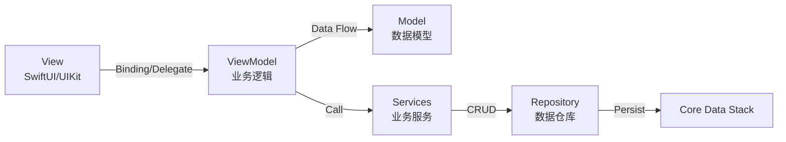

## 三、核心功能设计

### 3.1 时间轴故事管理

#### 3.1.1 时间轴展示模式

**瀑布流模式（默认）**
- 布局策略：采用SwiftUI LazyVStack + 自定义Layout实现瀑布流效果
- 卡片尺寸：根据图片数量动态调整
  - 单图：占满屏幕宽度，高度自适应
  - 2-3张图：采用网格布局，每行2列
  - 4+张图：类似微信九宫格，最多展示9张
- 加载策略：分页加载，每次加载20条故事
- 滚动优化：使用预加载机制，提前3个卡片触发下一页数据加载

**一屏一故事模式**
- 布局策略：采用UIKit TabView配合PageViewController实现滑动效果
- 交互方式：垂直滑动切换故事，支持手势回弹
- 媒体展示：全屏沉浸式展示，文本悬浮在底部
- 切换动画：平滑过渡，支持视差效果

#### 3.1.2 故事卡片组成

| 元素 | 说明 | 展示规则 |
|-----|------|---------|
| 时间戳 | 故事创建时间 | 格式：相对时间（今天/昨天）或绝对日期（yyyy年MM月dd日） |
| 位置标签 | 故事发生地点 | 显示在时间戳下方，带定位图标，点击可查看地图 |
| 媒体缩略图 | 图片/视频预览 | 使用异步加载，显示占位符（200x200模糊图） |
| 分类标签 | 所属分类 | 最多显示2个，多余显示"+N" |
| 文本摘要 | 故事内容前100字 | 支持Markdown渲染，超出省略，搜索关键词高亮 |
| 互动区域 | 点赞、评论预留 | 当前版本不实现 |

#### 3.1.3 数据加载策略

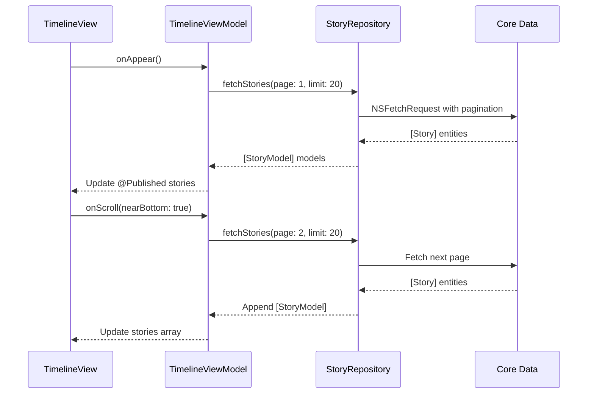

#### 3.1.4 关键词搜索功能

**搜索入口**

- 位置：主页面(分类管理页面)顶部导航栏
- 样式：搜索框默认收起，点击搜索图标展开
- 占位符："搜索标题、内容、位置..."

**搜索范围**

| 搜索字段 | 权重 | 说明 |
|---------|------|------|
| 故事标题 | 高 | 完全匹配优先，部分匹配次之 |
| 故事内容 | 中 | 支持全文搜索，分词匹配 |
| 位置信息 | 中 | 匹配城市、地标名称 |
| 分类名称 | 低 | 匹配所属分类 |

**搜索策略**

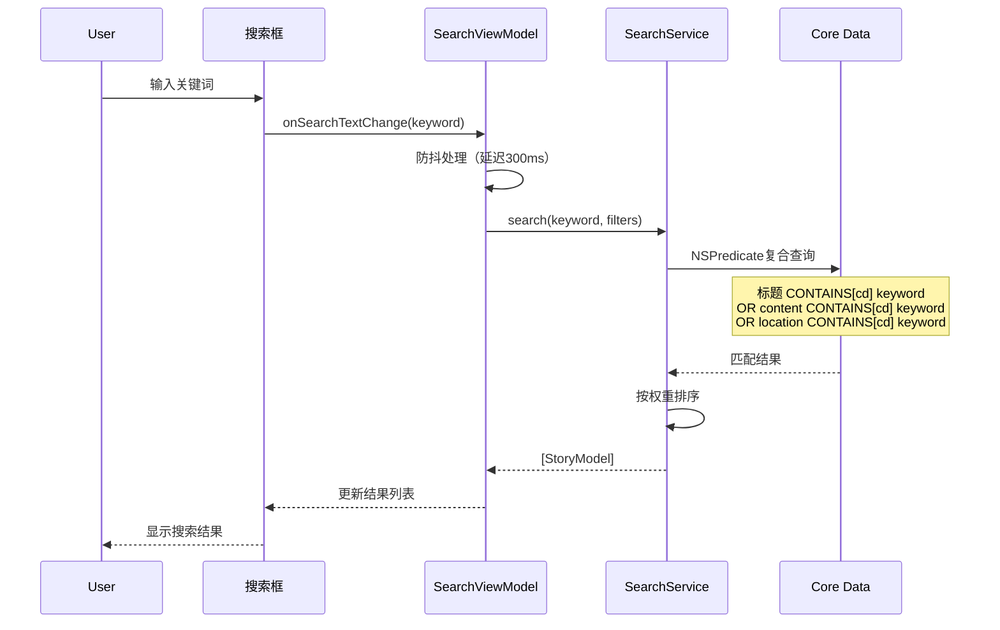

**搜索优化**

| 优化项 | 实现方式 | 效果 |
|-------|---------|------|
| 防抖处理 | 输入停止300ms后触发搜索 | 减少无效查询 |
| 分词索引 | plainTextContent字段全文索引 | 提升搜索速度 |
| 结果高亮 | 匹配文本背景高亮显示 | 增强可读性 |
| 搜索历史 | 本地存储最近10条搜索记录 | 快速重复搜索 |
| 热门搜索 | 统计高频关键词（预留） | 搜索建议 |

**搜索结果展示**

- 布局：与时间轴一致的卡片布局
- 排序：默认按相关性排序，支持切换为时间排序
- 高亮：关键词在标题和摘要中以不同颜色高亮
- 空状态：无结果时显示"未找到相关故事"，提供清除搜索按钮
- 统计：顶部显示"找到N个结果"

**搜索历史管理**

- 存储位置：UserDefaults
- 存储结构：Array<String>，最多保留10条
- 展示位置：点击搜索框时，下方显示历史记录
- 操作：点击历史记录直接搜索，左滑删除单条，提供清空全部按钮

**搜索过滤器（可选）**

| 过滤维度 | 选项 | 说明 |
|---------|------|------|
| 时间范围 | 全部/近一周/近一月/近一年/自定义 | 筛选指定时间段 |
| 分类 | 全部分类/指定分类 | 在某分类下搜索 |
| 媒体类型 | 全部/仅图片/仅视频/仅文本 | 按媒体类型过滤 |
| 有位置 | 全部/仅有位置信息 | 筛选带位置的故事 |

### 3.2 AI文本润色模块

#### 3.2.1 服务架构

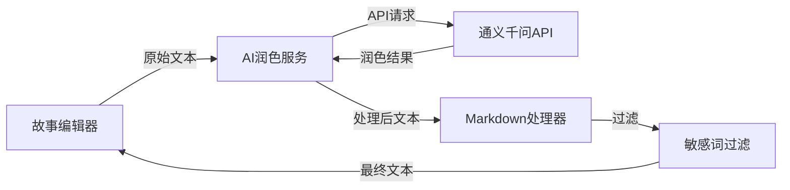

#### 3.2.2 API集成方案

**认证机制**
- 存储方式：API Key存储在Keychain中
- 请求头：使用Authorization Bearer Token
- 安全策略：API Key不硬编码，支持用户自行配置

**请求处理流程**

| 步骤 | 操作 | 异常处理 |
|-----|------|---------|
| 1. 文本预处理 | 去除空白字符，检查长度（最大10000字） | 超长文本分段处理 |
| 2. 构建请求 | 封装为通义千问API格式 | 参数校验失败提示用户 |
| 3. 发送请求 | URLSession异步请求，超时时间30s | 网络错误重试3次 |
| 4. 响应解析 | JSON解析为PolishResult模型 | 解析失败返回原文 |
| 5. 后处理 | Markdown转换 + 敏感词过滤 | 过滤失败记录日志 |

**速率限制处理**
- 策略：本地限流器，单用户每分钟最多5次请求
- 排队机制：超出限制的请求进入队列等待
- 用户提示：显示剩余请求次数和重置时间

#### 3.2.3 Markdown转换规则

| 原始格式 | Markdown语法 | 渲染效果 |
|---------|-------------|---------|
| 标题 | # 一级标题<br/>## 二级标题 | 粗体 + 大号字体 |
| 加粗 | **文本** | 粗体显示 |
| 斜体 | *文本* | 斜体显示 |
| 列表 | - 列表项 | 带项目符号 |
| 引用 | > 引用内容 | 灰色背景 + 左侧竖线 |

#### 3.2.4 敏感词过滤机制

- 词库来源：内置本地敏感词库（JSON格式）
- 过滤策略：匹配后替换为"***"
- 更新机制：预留远程更新接口（当前使用本地静态词库）

### 3.3 分类管理系统

#### 3.3.1 三级分类树形结构

**数据模型关系**

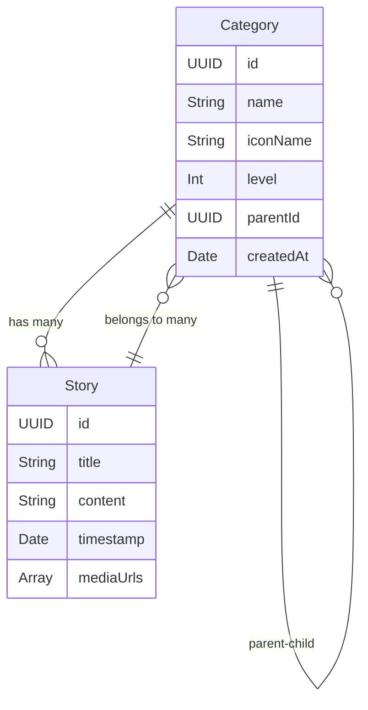

**层级规则**

| 层级 | 名称 | 示例 | 约束 |
|-----|------|------|------|
| Level 1 | 主分类 | 生活、工作、旅行 | 最多10个 |
| Level 2 | 子分类 | 育儿、美食、健康 | 每个主分类最多20个 |
| Level 3 | 细分类 | 大宝成长、二宝日常 | 每个子分类最多30个 |

#### 3.3.2 展示模式设计

**卡片模式**

卡片布局：采用Grid布局，每行2列，卡片宽度为（屏幕宽度 - 间距）/ 2

卡片内容组成：

| 区域 | 内容 | 样式 |
|-----|------|------|
| 顶部图标区 | SF Symbols图标 | 60x60，主题色填充 |
| 中部文本区 | 分类名称 | 16pt粗体，居中对齐 |
| 底部统计区 | 故事数量 | 12pt灰色，"共N个故事" |
| 预览区 | 最新故事缩略图 | 模糊背景，圆角12pt |

加载效果：缩略图采用渐进式加载，先显示模糊占位符，再平滑过渡到清晰图

**列表模式**

列表项结构：

| 元素 | 位置 | 说明 |
|-----|------|------|
| 展开/收起图标 | 左侧 | 有子分类时显示 |
| 分类图标 | 左侧偏右 | SF Symbols，32x32 |
| 分类名称 | 中间 | 14pt常规字体 |
| 故事数量 | 右侧 | 12pt灰色数字 |
| 导航箭头 | 最右侧 | 点击进入故事列表 |

交互行为：
- 点击展开/收起图标：切换子分类显示状态
- 点击分类名称或导航箭头：进入该分类的故事列表
- 支持左滑删除（仅允许删除无故事的分类）

#### 3.3.3 分类与故事的关联关系

**多对多关系实现**

采用Core Data的Many-to-Many关系：
- Story实体包含categories关系（to-many）
- Category实体包含stories关系（to-many）
- 中间表由Core Data自动管理

**分类选择器设计**

- 展示形式：底部抽屉（Sheet）形式
- 选择逻辑：支持多选，已选分类显示勾选标记
- 层级导航：面包屑导航显示当前路径（如：生活 > 育儿 > 大宝成长）
- 快速搜索：顶部搜索框，支持拼音模糊搜索

### 3.4 本地存储方案

#### 3.4.1 Core Data架构

**实体设计**

| 实体名称 | 用途 | 核心属性 |
|---------|------|---------|
| StoryEntity | 故事主体数据 | id, title, content, timestamp, mediaIds, syncStatus |
| CategoryEntity | 分类数据 | id, name, level, parentId, iconName, sortOrder |
| MediaEntity | 媒体文件元数据 | id, type, fileName, fileSize, duration, encryptionKey |
| SettingEntity | 用户设置 | key, value, type |

**关系映射**

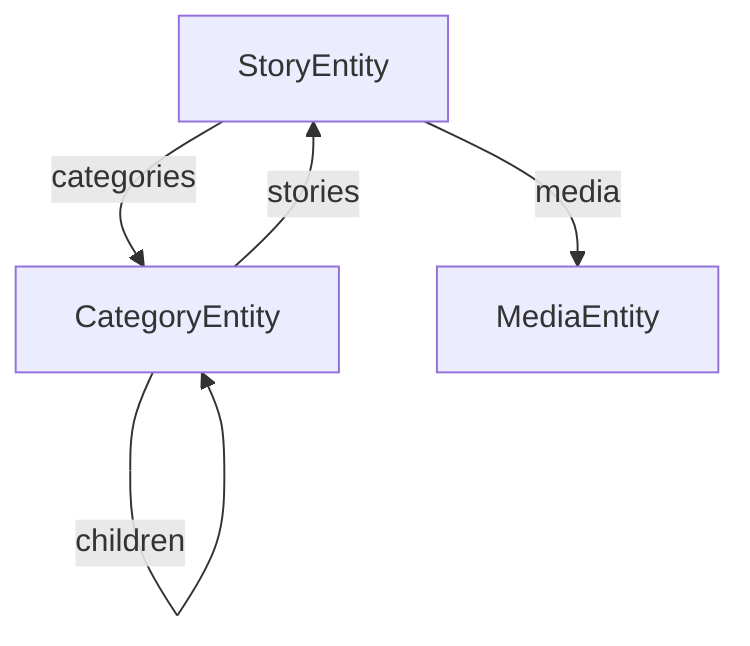

**数据迁移策略**

- 版本管理：使用Core Data轻量级迁移（Lightweight Migration）
- 迁移触发：App启动时自动检测数据模型版本
- 备份机制：迁移前自动备份当前数据库文件
- 失败回滚：迁移失败时恢复备份文件

#### 3.4.2 媒体文件存储

**存储路径规划**

```
Documents/
├── Media/
│   ├── Images/
│   │   ├── {year}/
│   │   │   ├── {month}/
│   │   │   │   ├── {uuid}.heic (加密)
│   │   │   │   └── {uuid}_thumb.heic (缩略图)
│   └── Videos/
│       ├── {year}/
│       │   ├── {month}/
│       │   │   ├── {uuid}.hevc (加密)
│       │   │   └── {uuid}_thumb.jpg (视频封面)
└── Temp/ (临时文件，定期清理)
```

**压缩策略**

| 媒体类型 | 格式 | 压缩参数 | 预期压缩率 |
|---------|------|---------|-----------|
| 图片 | HEIC | 质量0.8 | 原始大小的30-50% |
| 缩略图 | HEIC | 质量0.6，最大边长800px | 原始大小的10% |
| 视频 | HEVC | H.265编码，1080p@30fps | 原始大小的40-60% |
| 视频封面 | JPEG | 质量0.7 | 视频大小的1% |

**加密存储方案**

加密算法：AES-256-GCM

密钥管理：
- 主密钥：存储在Keychain中，使用设备TouchID/FaceID保护
- 文件密钥：每个文件独立密钥，由主密钥派生
- 密钥派生：使用PBKDF2算法，迭代10000次

加密流程：

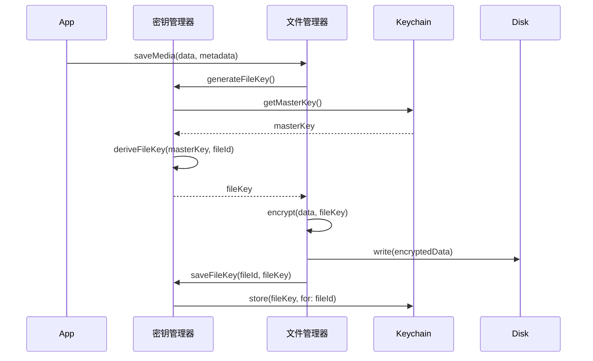

解密流程：读取时从Keychain获取文件密钥，使用AES-256-GCM解密

#### 3.4.3 缓存策略

**图片缓存（LRU淘汰策略）**

缓存层级：
- 内存缓存：NSCache，最大容量100MB
- 磁盘缓存：临时目录，最大容量500MB
- 原始文件：加密存储在Documents

LRU实现：
- 数据结构：双向链表 + 哈希表
- 淘汰时机：缓存满时淘汰最久未使用项
- 优先级：正在显示的图片优先级最高

**内存警告处理**


处理策略：

| 警告级别 | 操作 | 说明 |
|---------|------|------|
| didReceiveMemoryWarning | 清空磁盘缓存 + 释放50%内存缓存 | 保留当前屏幕可见资源 |
| 连续两次警告 | 清空所有缓存 | 仅保留正在显示的图片 |
| 极端情况 | 暂停后台任务 | 停止预加载和后台上传 |

#### 3.4.4 iCloud同步预留接口

**数据同步模型**

| 实体 | 同步策略 | 冲突解决 |
|-----|---------|---------|
| StoryEntity | 增量同步 | 以最新修改时间为准 |
| CategoryEntity | 全量同步 | 服务端优先 |
| MediaEntity | 延迟同步 | 仅同步元数据，文件按需下载 |

**接口设计**

预留协议定义：

- CloudSyncable协议：定义可同步对象需实现的方法
  - 方法：toCloudRecord() - 转换为CKRecord
  - 方法：fromCloudRecord() - 从CKRecord解析
  - 属性：syncStatus - 同步状态枚举

- CloudSyncService服务：
  - 方法：uploadChanges() - 上传本地变更
  - 方法：downloadChanges() - 下载远程变更
  - 方法：resolveConflicts() - 解决冲突
  - 方法：enableSync() - 启用同步
  - 方法：disableSync() - 禁用同步

**同步状态管理**

| 状态 | 说明 | 界面提示 |
|-----|------|---------|
| notSynced | 未同步 | 显示云朵图标 |
| syncing | 同步中 | 显示加载动画 |
| synced | 已同步 | 显示勾选图标 |
| conflict | 冲突 | 显示警告图标 |
| failed | 失败 | 显示错误提示 |

### 3.5 自适应UI与个性化设置

#### 3.5.1 多语言支持

**支持语言**
- 中文（简体）- zh-Hans
- 英文 - en

**实现方案**
- 本地化文件：使用Localizable.strings和Localizable.stringsdict
- 动态切换：通过UserDefaults存储语言偏好，App内实时切换
- 日期格式：根据语言自动调整日期显示格式
- 布局适配：英文文本长度适配，避免截断

**翻译覆盖范围**

| 类别 | 示例 | 说明 |
|-----|------|------|
| 界面文本 | 按钮、标签、提示 | 所有用户可见文本 |
| 错误信息 | 网络错误、验证失败 | 友好的错误提示 |
| 时间表达 | 刚刚、昨天、3天前 | 相对时间本地化 |
| 分类名称 | 预置分类 | 可翻译的默认分类 |

#### 3.5.2 主题系统

**主题模式**

| 模式 | 说明 | 跟随规则 |
|-----|------|---------|
| 浅色模式 | 白色背景 + 深色文本 | - |
| 深色模式 | 深色背景 + 浅色文本 | - |
| 跟随系统 | 自动切换 | 根据iOS系统设置 |

**色彩定义**

采用SwiftUI的Color Asset方式管理主题色：
- 主色调：可配置品牌色（默认蓝色）
- 辅助色：成功、警告、错误状态色
- 语义化颜色：背景色、文本色、边框色等自动适配深浅模式

#### 3.5.3 个性化设置项

| 设置项 | 类型 | 默认值 | 说明 |
|-------|------|--------|------|
| 语言 | 枚举 | 跟随系统 | 中文/英文/自动 |
| 主题 | 枚举 | 跟随系统 | 浅色/深色/自动 |
| 时间轴默认模式 | 枚举 | 瀑布流 | 瀑布流/一屏一故事 |
| 图片质量 | 枚举 | 高 | 高/中/低 |
| 自动播放视频 | 布尔 | false | Wi-Fi下自动播放 |
| 草稿自动保存间隔 | 数值 | 30秒 | 10-120秒 |
| 通义千问API Key | 字符串 | 空 | 用户自行配置 |
| 缓存大小限制 | 数值 | 500MB | 100MB-2GB |

#### 3.5.4 离线优先交互设计

**草稿自动保存机制**

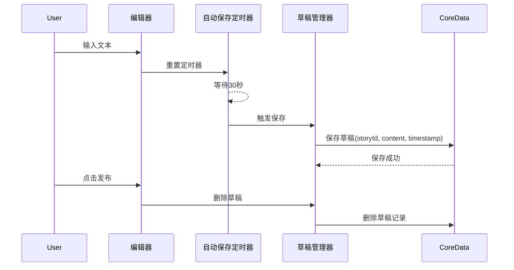

**离线数据处理**

| 场景 | 处理策略 | 用户体验 |
|-----|---------|---------|
| 创建故事 | 立即保存本地，标记为未同步 | 无需等待，即时完成 |
| 编辑故事 | 本地修改，同步状态标记为待上传 | 编辑即时生效 |
| AI润色 | 检测网络，无网络提示用户 | 显示"需要网络连接"提示 |
| 媒体上传 | 队列排队，网络恢复后自动上传 | 后台静默上传 |

**网络状态监听**

- 监听框架：使用Network框架实时监听网络状态
- 状态变化：WiFi/蜂窝/无网络切换时触发事件
- 界面提示：顶部横幅提示网络状态变化
- 自动重试：网络恢复后自动重试失败任务

### 3.6 位置服务功能

#### 3.6.1 位置选择设计

**功能入口**

- 位置：故事编辑页面，标题下方独立区域
- 展示样式：默认显示"添加位置"按钮，选择后显示位置信息卡片
- 卡片内容：定位图标 + 地点名称 + 详细地址（省略显示），点击可重新选择或删除

**位置获取方式**

| 方式 | 说明 | 适用场景 |
|-----|------|----------|
| 当前定位 | 使用CoreLocation获取GPS坐标 | 实时记录当前位置 |
| 地图选点 | MapKit地图界面手动选点 | 精确指定位置 |
| 搜索地点 | 搜索地标、商户、地址 | 快速输入已知地点 |
| 历史位置 | 从最近使用的位置选择 | 常用地点快速选择 |

**位置选择流程**

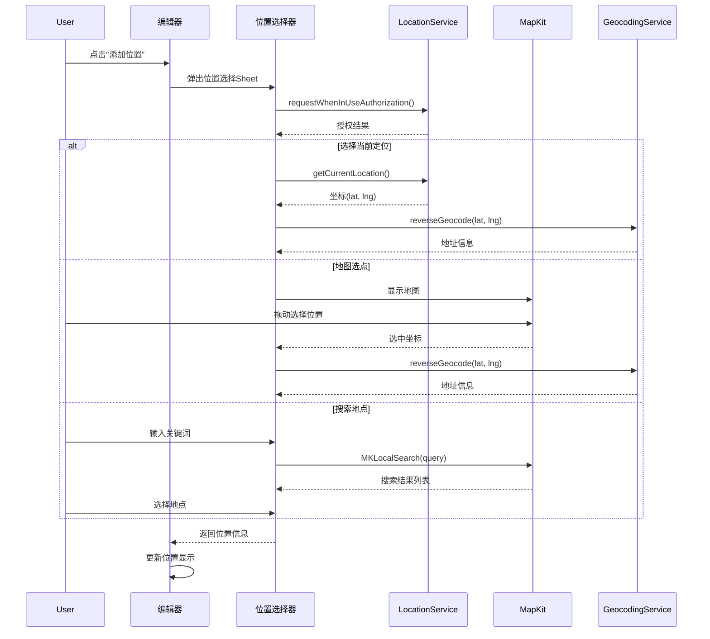

**位置权限处理**

| 权限状态 | 处理策略 | 用户提示 |
|---------|---------|----------|
| notDetermined | 自动请求权限 | 系统弹窗 |
| authorizedWhenInUse | 正常使用 | - |
| authorizedAlways | 正常使用 | - |
| denied | 禁用当前定位，允许手动选择 | "定位权限未开启，可手动选择位置" |
| restricted | 禁用当前定位 | "定位服务不可用" |

**位置数据结构**

位置信息包含以下字段：

| 字段 | 类型 | 说明 | 示例 |
|-----|------|------|------|
| latitude | Double | 纬度 | 39.9042 |
| longitude | Double | 经度 | 116.4074 |
| name | String | 地点名称 | 天安门广场 |
| address | String | 详细地址 | 北京市东城区天安门广场 |
| city | String | 城市 | 北京市 |
| country | String | 国家 | 中国 |

**地理编码服务**

- 正向编码：地址文本 → 坐标（用于地址搜索）
- 反向编码：坐标 → 地址文本（用于当前定位和地图选点）
- 服务提供商：使用Apple MapKit的CLGeocoder
- 语言：根据系统语言返回本地化地址

#### 3.6.2 位置展示与交互

**故事卡片中的位置显示**

- 显示位置：时间戳下方，独立一行
- 显示内容：定位图标（SF Symbols: mappin.circle.fill）+ 地点名称或城市
- 显示规则：
  - 有地点名称：显示地点名称（如"天安门广场"）
  - 仅有地址：显示城市名（如"北京市"）
  - 最大宽度：超出省略，显示"..."
- 交互：点击位置可跳转到地图查看详情（预留）

**位置历史记录**

- 存储策略：记录最近使用的20个位置
- 排序规则：按使用频次和最近使用时间综合排序
- 展示位置：位置选择器的"最近使用"标签页
- 数据持久化：存储在UserDefaults中

**搜索中的位置过滤**

- 支持按位置搜索：输入"北京"可筛选出所有发生在北京的故事
- 模糊匹配：匹配地点名称、详细地址、城市字段
- 结果展示：位置信息在搜索结果中高亮显示

#### 3.6.3 隐私与安全

**位置隐私保护**

| 措施 | 说明 |
|-----|------|
| 精度控制 | 位置信息精确到地点级别，不暴露精确坐标 |
| 本地存储 | 位置数据仅本地存储，不上传服务器 |
| 权限最小化 | 仅请求使用期间定位权限（WhenInUse） |
| 用户可控 | 用户可随时删除或修改位置信息 |

**位置信息使用说明**

在首次请求位置权限时，在Info.plist中添加说明：
- NSLocationWhenInUseUsageDescription: "需要获取您的位置，以便为故事添加地点信息"

### 3.7 路由与导航架构

#### 3.7.1 路由设计

**路由枚举定义**

| 路由 | 参数 | 目标页面 |
|-----|------|---------|
| timeline | 无 | 时间轴首页 |
| search | keyword: String? | 搜索页 |
| storyDetail | storyId: UUID | 故事详情页 |
| storyEditor | storyId: UUID? | 故事编辑页（新建/编辑） |
| locationPicker | currentLocation: LocationInfo? | 位置选择页 |
| categoryList | 无 | 分类列表页 |
| categoryDetail | categoryId: UUID | 分类详情（该分类下的故事） |
| settings | 无 | 设置页 |
| aiPolish | text: String | AI润色页 |

**导航模式**

- 主导航：TabView（时间轴、分类、设置）
- 二级导航：NavigationStack（页面栈）
- 模态导航：Sheet/FullScreenCover（编辑器、选择器）

#### 3.7.2 深度链接预留

**URL Scheme设计**

格式：`mystory://action/parameters`

| 深度链接 | 说明 | 示例 |
|---------|------|------|
| mystory://story/{storyId} | 打开指定故事 | mystory://story/123e4567-e89b-12d3 |
| mystory://search?keyword={keyword} | 搜索关键词 | mystory://search?keyword=旅行 |
| mystory://category/{categoryId} | 打开指定分类 | mystory://category/abc123 |
| mystory://new-story | 创建新故事 | mystory://new-story |

**处理流程**

应用启动或从后台唤醒时，解析URL并导航到对应页面。

## 四、数据模型设计

### 4.1 核心数据模型

#### 4.1.1 Story（故事）

| 字段名 | 类型 | 约束 | 说明 |
|-------|------|------|------|
| id | UUID | 主键，非空 | 唯一标识 |
| title | String | 最大255字符 | 故事标题 |
| content | String | - | 故事正文（支持Markdown） |
| plainTextContent | String | - | 纯文本内容（用于搜索） |
| timestamp | Date | 非空，索引 | 故事发生时间 |
| createdAt | Date | 非空 | 创建时间 |
| updatedAt | Date | 非空 | 最后修改时间 |
| locationName | String | 可选 | 地点名称 |
| locationAddress | String | 可选 | 详细地址 |
| locationCity | String | 可选，索引 | 城市（用于搜索） |
| latitude | Double | 可选 | 纬度 |
| longitude | Double | 可选 | 经度 |
| mood | String | 可选 | 心情标签（预留） |
| syncStatus | Int16 | 默认0 | 同步状态：0-未同步，1-已同步，2-冲突 |
| isDeleted | Bool | 默认false | 软删除标记 |
| categories | Relationship | to-many | 关联的分类 |
| media | Relationship | to-many | 关联的媒体文件 |

#### 4.1.2 Category（分类）

| 字段名 | 类型 | 约束 | 说明 |
|-------|------|------|------|
| id | UUID | 主键，非空 | 唯一标识 |
| name | String | 非空，最大50字符 | 分类名称 |
| nameEn | String | 可选 | 英文名称 |
| iconName | String | 非空 | SF Symbols图标名 |
| colorHex | String | 默认#007AFF | 分类主题色 |
| level | Int16 | 1-3 | 分类层级 |
| sortOrder | Int32 | 默认0 | 排序权重 |
| createdAt | Date | 非空 | 创建时间 |
| parent | Relationship | to-one | 父分类（可选） |
| children | Relationship | to-many | 子分类集合 |
| stories | Relationship | to-many | 关联的故事 |

#### 4.1.3 Media（媒体）

| 字段名 | 类型 | 约束 | 说明 |
|-------|------|------|------|
| id | UUID | 主键，非空 | 唯一标识 |
| type | String | 非空 | 类型：image/video |
| fileName | String | 非空 | 文件名（加密后） |
| originalFileName | String | 可选 | 原始文件名 |
| fileSize | Int64 | 非空 | 文件大小（字节） |
| width | Int32 | 可选 | 宽度（图片/视频） |
| height | Int32 | 可选 | 高度（图片/视频） |
| duration | Double | 可选 | 时长（视频，秒） |
| thumbnailFileName | String | 可选 | 缩略图文件名 |
| encryptionKeyId | String | 非空 | 加密密钥ID |
| createdAt | Date | 非空 | 创建时间 |
| story | Relationship | to-one | 所属故事 |

#### 4.1.4 Setting（设置）

| 字段名 | 类型 | 约束 | 说明 |
|-------|------|------|------|
| key | String | 主键，非空 | 设置项键名 |
| value | String | 非空 | 设置值（JSON字符串） |
| type | String | 非空 | 值类型：string/int/bool/json |
| updatedAt | Date | 非空 | 更新时间 |

### 4.2 业务模型（ViewModel层使用）

#### 4.2.1 StoryModel

用于UI展示的轻量级模型，从StoryEntity转换而来：

| 字段 | 类型 | 说明 |
|-----|------|------|
| id | UUID | 故事ID |
| title | String | 标题 |
| contentPreview | String | 内容摘要（前100字） |
| displayTime | String | 格式化后的时间（如"刚刚"、"昨天"） |
| locationDisplay | String? | 位置显示文本（地点名称或城市） |
| thumbnails | [URL] | 缩略图URL数组（最多9张） |
| categoryTags | [CategoryTag] | 分类标签数组 |
| mediaCount | Int | 媒体总数 |
| hasVideo | Bool | 是否包含视频 |
| hasLocation | Bool | 是否有位置信息 |

#### 4.2.2 CategoryTreeNode

用于分类树形展示：

| 字段 | 类型 | 说明 |
|-----|------|------|
| category | CategoryModel | 分类基本信息 |
| children | [CategoryTreeNode] | 子分类节点 |
| isExpanded | Bool | 是否展开（列表模式） |
| storyCount | Int | 故事总数（含子分类） |

#### 4.2.3 SearchHistoryItem

用于搜索历史记录：

| 字段 | 类型 | 说明 |
|-----|------|------|
| keyword | String | 搜索关键词 |
| timestamp | Date | 搜索时间 |
| resultCount | Int | 结果数量 |

#### 4.2.4 LocationInfo

用于位置信息展示：

| 字段 | 类型 | 说明 |
|-----|------|------|
| latitude | Double | 纬度 |
| longitude | Double | 经度 |
| name | String? | 地点名称 |
| address | String? | 详细地址 |
| city | String? | 城市 |
| country | String? | 国家 |
| displayText | String | 用于展示的文本 |
| useFrequency | Int | 使用频次（用于历史排序） |

## 五、性能优化方案

### 5.1 滚动性能优化（目标：60 FPS）

#### 5.1.1 优化策略

| 策略 | 实现方式 | 预期效果 |
|-----|---------|---------|
| 懒加载 | 使用LazyVStack代替VStack | 仅渲染可见区域，减少内存占用 |
| 图片异步加载 | AsyncImage + 占位符 | 避免主线程阻塞 |
| 预加载 | 提前3个卡片加载下一页 | 滚动流畅无卡顿 |
| 视图复用 | 组件化设计，复用StoryCard | 减少视图创建开销 |
| 圆角优化 | 使用cornerRadius代替mask | 减少离屏渲染 |
| 阴影优化 | 预渲染阴影路径 | 避免实时计算 |

#### 5.1.2 性能监控

使用Instruments工具监控关键指标：

| 指标 | 监控工具 | 达标标准 |
|-----|---------|---------|
| FPS | Time Profiler | ≥ 58 FPS（滚动时） |
| 内存占用 | Allocations | ≤ 150MB（1000条故事） |
| CPU占用 | CPU Profiler | ≤ 40%（滚动时） |
| 启动时间 | App Launch | ≤ 1.5s（冷启动） |

#### 5.1.3 大数据集优化

**1000+故事测试场景**

- 数据分页：每页20条，避免一次性加载
- 索引优化：为timestamp、createdAt字段添加Core Data索引
- 批量处理：使用NSBatchFetchRequest批量查询
- 后台队列：数据转换在后台队列完成

**性能基准**

| 操作 | 1000条数据 | 5000条数据 | 优化手段 |
|-----|-----------|-----------|------|
| 首次加载20条 | <200ms | <300ms | 索引 + 分页 |
| 滚动加载下一页 | <150ms | <200ms | 预加载 + 缓存 |
| 搜索 | <500ms | <1s | 全文索引 + 分词 |
| 分类筛选 | <100ms | <150ms | 关系查询优化 |
| 位置搜索 | <300ms | <500ms | locationCity字段索引 |

### 5.2 AI润色响应优化（目标：<2s）

#### 5.2.1 优化策略

| 策略 | 说明 | 预期提升 |
|-----|------|---------|
| 流式响应 | 使用SSE逐字返回，边接收边显示 | 感知延迟降低50% |
| 本地缓存 | 相同文本缓存结果，避免重复请求 | 命中率20%时节省20%请求 |
| 请求压缩 | Gzip压缩请求体 | 传输时间减少30% |
| 超时重试 | 30s超时，失败重试最多3次 | 成功率提升至99% |
| 文本分段 | 超长文本（>5000字）分段处理 | 单段响应<2s |

#### 5.2.2 用户体验优化

- 加载状态：显示"AI正在思考..."动画
- 进度提示：流式显示已接收内容百分比
- 取消机制：用户可随时取消请求
- 失败提示：清晰的错误信息和重试按钮

### 5.3 媒体加载优化

#### 5.3.1 图片加载策略

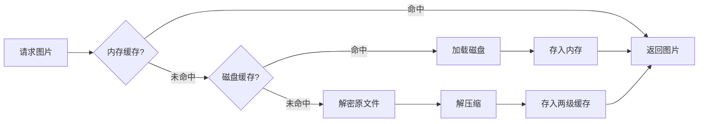

#### 5.3.2 缩略图生成策略

| 时机 | 操作 | 说明 |
|-----|------|------|
| 媒体导入时 | 异步生成缩略图 | 后台队列处理，不阻塞UI |
| 首次显示时 | 检查缩略图是否存在 | 不存在则临时生成 |
| 空闲时间 | 批量预生成缺失缩略图 | 提升后续浏览体验 |

### 5.4 内存管理

#### 5.4.1 内存警告响应策略

| 警告级别 | 响应动作 | 执行时间 |
|---------|---------|---------|
| 第一次警告 | 清空磁盘缓存 | <100ms |
| 第二次警告 | 清空50%内存缓存 | <50ms |
| 第三次警告 | 仅保留可见资源 | <30ms |
| 持续警告 | 暂停后台任务 | 立即 |

#### 5.4.2 资源释放规则

- 屏幕外图片：立即从内存缓存移除
- 后台视图：暂停视频播放，释放解码器
- 大对象：使用autoreleasepool及时释放
- 定时任务：内存紧张时暂停非关键定时器

## 六、技术实现要点

### 6.1 SwiftUI与UIKit混合开发

#### 6.1.1 混合开发场景

| 场景 | 使用框架 | 原因 |
|-----|---------|------|
| 时间轴主界面 | SwiftUI | 声明式UI，开发效率高 |
| 一屏一故事滑动 | UIKit (UIPageViewController) | 更精细的手势控制 |
| 媒体选择器 | UIKit (PHPickerViewController) | 系统组件 |
| 图片编辑 | UIKit | 需要复杂手势处理 |
| 设置页面 | SwiftUI | 表单类UI适合SwiftUI |

#### 6.1.2 桥接方式

**UIKit包装为SwiftUI**

使用UIViewControllerRepresentable协议包装UIKit控制器，供SwiftUI使用

**SwiftUI嵌入UIKit**

使用UIHostingController将SwiftUI视图嵌入UIKit层级

### 6.2 Core Data最佳实践

#### 6.2.1 多线程访问

**线程策略**

| 上下文类型 | 线程 | 用途 |
|-----------|------|------|
| MainContext | 主线程 | UI绑定，读取数据 |
| BackgroundContext | 后台线程 | 批量写入、导入导出 |
| PrivateContext | 临时线程 | 一次性操作 |

**并发规则**

- 每个线程使用独立的NSManagedObjectContext
- 使用perform/performAndWait执行操作
- 通过NotificationCenter同步上下文变更

#### 6.2.2 性能优化

| 优化项 | 实现方式 | 效果 |
|-------|---------|------|
| 批量插入 | NSBatchInsertRequest | 速度提升10倍 |
| 批量更新 | NSBatchUpdateRequest | 避免对象实例化 |
| Faulting | 延迟加载关系数据 | 减少内存占用 |
| Prefetching | 预取关系对象 | 减少数据库查询次数 |
| 索引 | 为查询字段添加索引 | 查询速度提升5-10倍 |

### 6.3 阿里通义千问API集成

#### 6.3.1 API调用流程

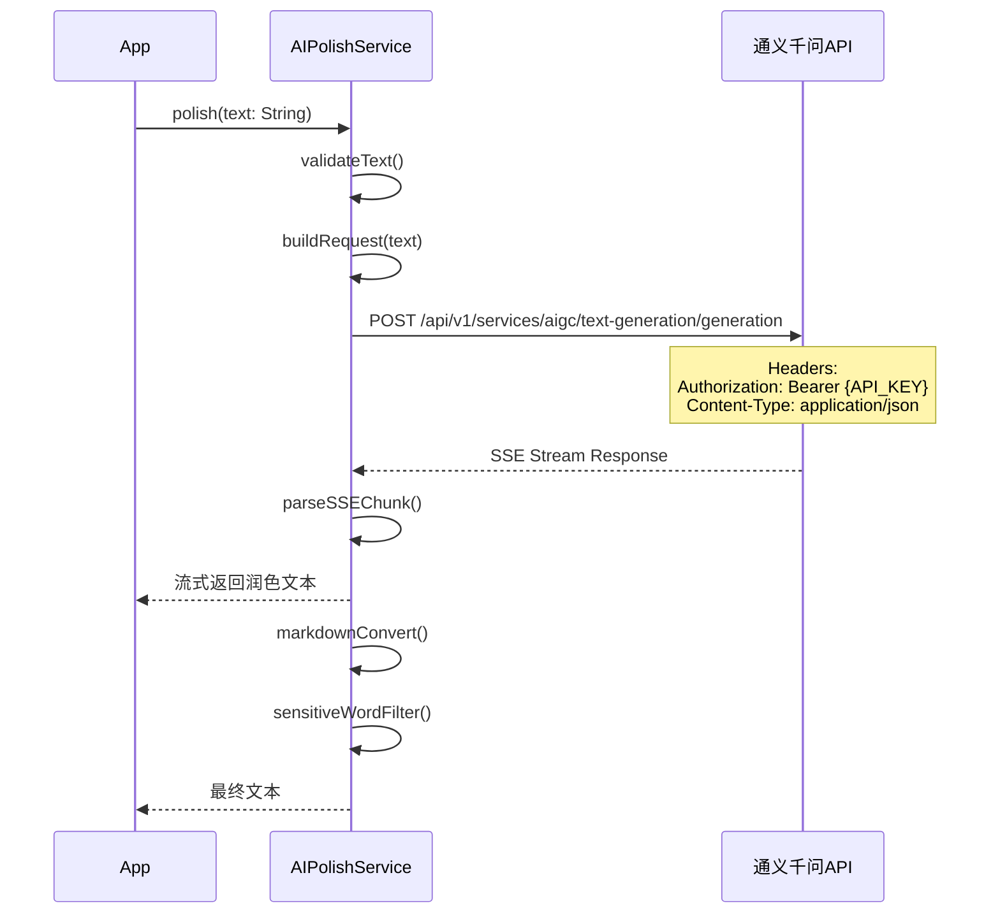

#### 6.3.2 请求参数配置

| 参数 | 值 | 说明 |
|-----|-----|------|
| model | qwen-plus | 使用通义千问Plus模型 |
| input.messages | [{"role":"user","content":"..."}] | 用户输入 |
| parameters.result_format | message | 返回格式 |
| parameters.incremental_output | true | 启用流式输出 |
| parameters.max_tokens | 2000 | 最大生成长度 |
| parameters.temperature | 0.7 | 创造性控制 |

#### 6.3.3 错误处理

| 错误码 | 说明 | 处理策略 |
|-------|------|---------|
| 400 | 请求参数错误 | 提示用户检查输入 |
| 401 | API Key无效 | 引导用户配置API Key |
| 429 | 速率限制 | 排队等待或提示用户稍后重试 |
| 500 | 服务器错误 | 重试3次，失败后提示 |
| 网络超时 | 超过30s | 取消请求，提示用户 |

### 6.4 安全与隐私

#### 6.4.1 数据加密

**敏感数据存储**

| 数据类型 | 存储位置 | 加密方式 |
|---------|---------|---------|
| API Key | Keychain | 系统Keychain，kSecAttrAccessibleWhenUnlocked |
| 用户凭证 | Keychain | 同上 |
| 媒体文件 | Documents | AES-256-GCM文件级加密 |
| 数据库 | Documents | Core Data启用加密存储（预留） |

**数据传输**

- 所有网络请求使用HTTPS
- 证书固定（Certificate Pinning）防止中间人攻击
- API请求添加时间戳防重放

#### 6.4.2 隐私合规

**权限申请**

| 权限 | 用途 | 申请时机 |
|-----|------|---------|
| 相册访问 | 选择照片/视频 | 首次点击添加媒体时 |
| 相机访问 | 拍摄照片/视频 | 首次点击拍摄时 |
| 定位权限 | 记录故事地点（可选） | 用户主动开启时 |
| 通知权限 | 草稿提醒（可选） | 首次启动后弹窗询问 |

**隐私说明**

- 提供隐私政策页面
- 数据本地存储，不上传第三方服务器
- AI润色时明确告知会发送文本到通义千问API
- 用户可随时删除所有数据

## 七、扩展性设计

### 7.1 FFmpeg集成预留

**集成方式**

使用预编译的FFmpeg静态库（ffmpeg-kit-ios）

**预留接口**

- VideoEditorService协议：定义视频编辑能力
  - 方法：trimVideo(url, start, end) - 裁剪视频
  - 方法：mergeVideos([urls]) - 合并视频
  - 方法：addWatermark(video, image) - 添加水印
  - 方法：extractAudio(video) - 提取音频

**AI视频编辑能力**

预留AI视频编辑服务接口：
- 智能剪辑：根据关键帧自动生成精彩片段
- 字幕生成：语音识别 + 自动字幕
- 特效添加：滤镜、转场效果

### 7.2 社交功能预留

**数据模型扩展**

| 实体 | 新增字段 | 用途 |
|-----|---------|------|
| StoryEntity | likeCount, commentCount | 互动统计 |
| CommentEntity（新增） | id, content, userId, storyId | 评论数据 |
| UserEntity（新增） | id, nickname, avatar | 用户信息 |

**接口预留**

- SocialService协议：
  - 方法：likeStory(storyId) - 点赞
  - 方法：commentStory(storyId, content) - 评论
  - 方法：shareStory(storyId, platform) - 分享

### 7.3 数据导出与备份

**导出格式**

| 格式 | 内容 | 用途 |
|-----|------|------|
| JSON | 所有文本数据 + 媒体文件路径 | 数据迁移 |
| PDF | 故事内容 + 内嵌图片 | 打印、存档 |
| HTML | 网页格式故事集 | 浏览器查看 |

**导出服务**

- ExportService协议：
  - 方法：exportToJSON(storyIds) - 导出为JSON
  - 方法：exportToPDF(storyIds) - 导出为PDF
  - 方法：exportToHTML(storyIds) - 导出为HTML
  - 方法：backupToiCloud() - 备份到iCloud Drive

## 八、测试验证计划

### 8.1 性能测试

#### 8.1.1 滚动性能测试

**测试场景**

| 数据量 | 测试动作 | 验收标准 |
|-------|---------|---------|
| 100条故事 | 快速滚动10次 | FPS ≥ 58 |
| 500条故事 | 快速滚动10次 | FPS ≥ 58 |
| 1000条故事 | 快速滚动10次 | FPS ≥ 58 |
| 5000条故事 | 快速滚动10次 | FPS ≥ 55 |

**测试工具**

- Xcode Instruments - Time Profiler
- 自定义FPS监控器（显示实时FPS）

#### 8.1.2 AI润色响应测试

**测试用例**

| 文本长度 | 网络条件 | 验收标准 |
|---------|---------|---------|
| 100字 | WiFi | 首字响应 <500ms，总时长 <1s |
| 500字 | WiFi | 首字响应 <800ms，总时长 <2s |
| 1000字 | WiFi | 首字响应 <1s，总时长 <2s |
| 1000字 | 4G | 首字响应 <1.5s，总时长 <3s |

**压力测试**

- 连续10次请求，验证速率限制是否生效
- 模拟API超时，验证重试机制
- 模拟弱网环境（Network Link Conditioner）

### 8.2 功能测试

#### 8.2.1 核心功能测试用例

| 功能模块 | 测试用例 | 预期结果 |
|---------|---------|---------|
| 时间轴展示 | 创建100条不同日期的故事，检查排序 | 按时间倒序正确显示 |
| 瓷布流布局 | 混合1-9张图片的故事，检查布局 | 图片排列符合设计规则 |
| 一屏一故事 | 滑动切换20个故事 | 流畅无卡顿，正确加载 |
| 分类树 | 创建三级分类，添加故事 | 层级关系正确，统计准确 |
| 关键词搜索 | 搜索标题、内容、位置关键词 | 返回匹配结果，关键词高亮 |
| 位置选择 | 使用当前定位、地图选点、搜索地点 | 位置信息正确保存和显示 |
| AI润色 | 输入500字文本 | 返回润色结果，格式正确 |
| 媒体加密 | 保存10张图片，退出重进 | 正常显示，文件确认加密 |
| 草稿保存 | 编辑中杀掉App | 重启后草稿恢复 |
| 多语言 | 切换中英文 | 界面文本正确翻译 |

#### 8.2.2 边界测试

| 测试项 | 边界值 | 验证点 |
|-------|--------|--------|
| 故事标题 | 255字符 | 接受，超出截断提示 |
| 故事正文 | 50000字 | 正常保存，AI润色分段处理 |
| 媒体数量 | 单个故事100张图 | 正常保存，缩略图展示最多9张 |
| 分类层级 | 超过3级 | 阻止创建，提示最大3级 |
| 缓存大小 | 超过限制 | 自动清理，LRU淘汰 |
| 搜索关键词 | 空字符串 | 不发起搜索，显示提示 |
| 位置权限拒绝 | 允许手动选择 | 禁用当前定位，地图选点正常 |

### 8.3 兼容性测试

#### 8.3.1 设备兼容

| 设备类型 | 测试设备 | 关注点 |
|---------|---------|--------|
| 小屏设备 | iPhone SE 3 | 布局适配，文本可读性 |
| 标准设备 | iPhone 14 | 标准体验 |
| 大屏设备 | iPhone 14 Pro Max | 充分利用屏幕空间 |
| 平板设备 | iPad Air | 横竖屏适配（预留） |

#### 8.3.2 系统版本兼容

| iOS版本 | 测试内容 | 验收标准 |
|---------|---------|---------|
| iOS 16.0 | 全功能测试 | 所有功能正常 |
| iOS 16.6 | 全功能测试 | 所有功能正常 |
| iOS 17.0 | 全功能测试 | 所有功能正常 |
| iOS 17.2+ | 新特性适配 | 利用新API优化体验 |

### 8.4 安全测试

| 测试项 | 验证方法 | 预期结果 |
|-------|---------|---------|
| 文件加密 | 使用十六进制编辑器查看媒体文件 | 无法直接查看原图 |
| Keychain安全 | 检查API Key存储 | 无法从备份中提取 |
| 数据隔离 | 沙盒外访问尝试 | 访问被拒绝 |
| 敏感词过滤 | 输入测试敏感词库 | 正确过滤替换 |

## 九、开发里程碑

### 9.1 第一阶段：核心框架搭建（预计2周）

**交付物**
- Xcode工程初始化，配置MVVM架构
- Core Data数据模型定义
- 路由框架搭建
- 基础UI组件库（颜色、字体、通用组件）

**验收标准**
- 项目编译通过
- 数据模型测试通过
- 页面间导航正常

### 9.2 第二阶段：时间轴与故事管理（预计3周）

**交付物**
- 瓷布流时间轴实现
- 一屏一故事模式实现
- 故事创建、编辑、删除功能
- 媒体选择与展示
- 位置选择功能（当前定位、地图选点、搜索地点）
- 本地存储完整实现

**验收标准**
- 1000条故事滚动FPS ≥ 58
- 媒体正常加密存储
- 草稿自动保存生效
- 位置信息正确保存和显示

### 9.3 第三阶段：分类系统与AI功能（预计2周）

**交付物**
- 三级分类管理
- 卡片/列表模式切换
- 阿里通义千问API集成
- AI文本润色功能
- Markdown渲染
- 敏感词过滤

**验收标准**
- 分类树正确展示
- AI润色响应 <2s
- Markdown格式正确渲染

### 9.4 第四阶段：搜索与设置优化（预计1.5周）

**交付物**
- 关键词搜索功能
- 搜索历史管理
- 搜索结果高亮显示
- 多语言支持
- 主题切换
- 个性化设置项
- 性能优化
- 内存管理优化

**验收标准**
- 搜索响应时间 <500ms（1000条数据）
- 中英文切换正常
- 内存警告正确处理
- 所有设置项生效

### 9.5 第五阶段：测试与完善（预计1周）

**交付物**
- 完整测试用例执行
- Bug修复
- 用户体验优化
- 文档完善

**验收标准**
- 所有测试用例通过
- 无关键Bug
- 用户体验流畅

## 十、风险评估与应对

### 10.1 技术风险

| 风险项 | 风险等级 | 应对措施 |
|-------|---------|---------|
| 大数据集性能不达标 | 中 | 提前进行1000+数据压测，必要时优化算法 |
| 通义千问API不稳定 | 中 | 实现降级方案，API失败时提示用户 |
| 加密性能影响体验 | 低 | 使用异步加密，优化算法选择 |
| SwiftUI兼容性问题 | 低 | 关键功能保留UIKit备选方案 |

### 10.2 业务风险

| 风险项 | 风险等级 | 应对措施 |
|-------|---------|---------|
| 需求变更频繁 | 中 | 模块化设计，预留扩展接口 |
| 用户数据丢失 | 高 | 实现数据备份导出，iCloud同步预留 |
| 隐私合规问题 | 中 | 严格遵循苹果隐私规范，提供清晰隐私政策 |

### 10.3 资源风险

| 风险项 | 风险等级 | 应对措施 |
|-------|---------|---------|
| 开发时间不足 | 中 | 分阶段交付，优先核心功能 |
| 第三方依赖变更 | 低 | 锁定依赖版本，关注官方更新 |

## 十一、关键决策记录

### 11.1 技术选型决策

| 决策项 | 选择方案 | 理由 |
|-------|---------|------|
| AI服务商 | 阿里通义千问 | 国内访问稳定，中文优化好，价格合理 |
| 架构模式 | MVVM + Router | 职责清晰，便于测试，路由集中管理 |
| 存储方案 | Core Data | 苹果原生，关系型数据支持好，性能优异 |
| 加密算法 | AES-256-GCM | 安全性高，iOS原生支持，性能优 |
| 最低系统版本 | iOS 16+ | 平衡新特性与用户覆盖率 |

### 11.2 功能优先级决策

| 阶段 | 功能 | 优先级 | 说明 |
|-----|------|--------|------|
| MVP | 时间轴展示、故事编辑、本地存储、位置选择 | P0 | 核心价值 |
| V1.0 | AI润色、分类管理、关键词搜索、多语言 | P0 | 差异化功能 |
| V1.1 | iCloud同步、数据导出 | P1 | 增强功能 |
| V2.0 | 社交功能、AI视频编辑 | P2 | 未来扩展 |

### 11.3 用户体验决策

| 决策点 | 选择 | 理由 |
|-------|------|------|
| 默认时间轴模式 | 瀑布流 | 信息密度高，适合快速浏览 |
| 登录方式 | 暂不实现 | 聚焦核心功能，降低使用门槛 |
| 云同步 | 预留接口 | 避免首版复杂度过高 |
| 离线优先 | 是 | 确保随时可用，体验流畅 |

## 十二、附录

### 12.1 术语表

| 术语 | 英文 | 说明 |
|-----|------|------|
| 时间轴 | Timeline | 按时间顺序展示故事的主界面 |
| 瀑布流 | Waterfall | 不等高卡片流式布局 |
| 一屏一故事 | Full-Screen Story | 类似短视频的全屏沉浸式展示 |
| 三级分类 | Three-Level Category | 主分类-子分类-细分类的层级结构 |
| LRU | Least Recently Used | 最近最少使用淘汰算法 |
| SSE | Server-Sent Events | 服务器推送事件，用于流式响应 |
| HEIC | High Efficiency Image Container | 高效图像格式 |
| HEVC | High Efficiency Video Coding | H.265视频编码 |

### 12.2 参考资源

| 类型 | 资源 | 用途 |
|-----|------|------|
| 官方文档 | Apple Developer Documentation | SwiftUI、Core Data参考 |
| 官方文档 | 阿里云通义千问API文档 | AI接口集成 |
| 设计规范 | Apple Human Interface Guidelines | UI/UX设计规范 |
| 开源库 | ffmpeg-kit-ios | 视频编辑能力（预留） |
| 工具 | SF Symbols | 系统图标库 |

### 12.3 开发规范

**命名规范**

| 类型 | 规范 | 示例 |
|-----|------|------|
| 文件名 | PascalCase | TimelineView.swift |
| 类名 | PascalCase | StoryViewModel |
| 协议名 | PascalCase + able/Delegate | Syncable, RouterDelegate |
| 变量名 | camelCase | storyList, currentIndex |
| 常量 | camelCase | maxCacheSize |
| 枚举 | PascalCase | DisplayMode, SyncStatus |

**代码组织**

```
MyStory/
├── App/
│   ├── MyStoryApp.swift (入口)
│   └── AppDelegate.swift (生命周期)
├── Core/
│   ├── Router/ (路由)
│   ├── Network/ (网络层)
│   └── Storage/ (存储层)
├── Models/
│   ├── Entities/ (Core Data实体)
│   └── ViewModels/ (业务模型)
├── Services/
│   ├── AIService/
│   ├── MediaService/
│   ├── LocationService/
│   ├── SearchService/
│   └── CategoryService/
├── Views/
│   ├── Timeline/
│   ├── Search/
│   ├── Editor/
│   ├── Category/
│   └── Settings/
├── Components/ (通用组件)
├── Resources/
│   ├── Assets.xcassets
│   ├── Localizable/ (多语言)
│   └── Fonts/
└── Utils/ (工具类)
```

**注释规范**

- 所有公开接口必须添加文档注释
- 复杂逻辑添加行内注释说明
- 使用// MARK:分隔代码段
