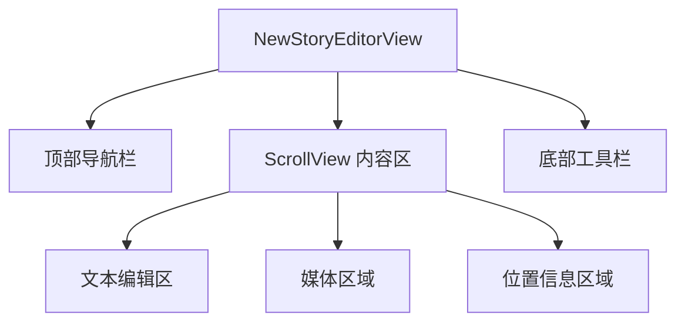

## NewStoryEditorView 实现方案

### 1. 目标与约束
- **目标**：在不修改现有 `StoryEditorView` 的前提下，新建 `NewStoryEditorView`，在功能上完全替代旧编辑器，并新增媒体选择面板、底部工具栏、Markdown 文本增强等能力。
- **文件位置**：`MyStory/Views/Editor/NewStoryEditorView.swift`（后续视情况增加 `NewStoryEditorViewModel`，可以与 View 放在同文件或单独文件）。
- **架构约束**（参考 `Rule.md`）：
  - 采用 **MVVM** 架构：视图负责展示与事件绑定，业务逻辑和状态集中在 ViewModel。
  - 禁止硬编码颜色与间距，统一从 `AppTheme` 获取主题 Token。
  - 尽量复用项目已有组件和服务：`VideoPlayerView`、`MediaStorageService`、`LocationService`、`SimpleCategoryPicker` 等。

---

### 2. 整体 UI 布局结构



- **根布局**：
  - 使用 `ZStack` 包裹整体页面，背景色为 `AppTheme.Colors.background`。
  - 内部 `VStack(spacing: 0)`：
    1. 自定义顶部导航栏 `topBar`。
    2. `ScrollView` 内容区，包含文本编辑、媒体展示、位置展示。
    3. 贴底的 `bottomToolbar`，支持安全区适配。

- **顶部导航栏 (`topBar`)**：
  - 左：关闭按钮（`xmark`），调用环境 `dismiss()`。
  - 中：日期信息区，使用 `VStack(spacing: 2)`：
    - 上行：当天日期（如 `12月20日`），字体 `AppTheme.Typography.title2`。
    - 下行：`周六 10:44 今天`，字体 `AppTheme.Typography.footnote`，颜色 `AppTheme.Colors.textSecondary`。
  - 右：保存按钮（`checkmark` 图标或 `Text("保存")`），绑定 `viewModel.save()`；根据 `viewModel.canSave` 控制 `disabled` 和透明度。
  - 底部一条分割线：高度 1pt，颜色 `AppTheme.Colors.border`。

- **内容区 (`ScrollView`)**：
  - 使用 `ScrollView(.vertical, showsIndicators: false)`，内部 `VStack(alignment: .leading, spacing: AppTheme.Spacing.l)`。
  - 子区域顺序：
    1. 文本编辑区 `textEditorSection`。
    2. 媒体区域 `mediaSection`（图片九宫格 / 视频缩略图）。
    3. 位置区域 `locationSection`。
  - 整体左右 `padding(.horizontal, AppTheme.Spacing.l)`，顶部适当留白 `padding(.top, AppTheme.Spacing.l)`。

- **底部工具栏 (`bottomToolbar`)**：
  - 使用 `VStack(spacing: 0)` 包裹：
    - 分割线：`Rectangle().frame(height: 0.5)` + `AppTheme.Colors.border`。
    - `HStack(spacing: AppTheme.Spacing.l)` 水平排列工具按钮，居中对齐。
  - 工具栏背景为 `AppTheme.Colors.surface`，上下 `padding(AppTheme.Spacing.s)`，左右 `padding(AppTheme.Spacing.l)`。
  - 使用 `.padding(.bottom, safeAreaInsets.bottom)` 适配底部安全区。

---

### 3. ViewModel 设计（NewStoryEditorViewModel）

#### 3.1 属性设计

```swift
final class NewStoryEditorViewModel: ObservableObject {
    // 依赖
    private let context: NSManagedObjectContext
    private let coreData: CoreDataStack
    private let mediaService: MediaStorageService
    private let locationService: LocationService

    private let existingStory: StoryEntity?
    private let initialCategory: CategoryEntity?

    // 基础编辑状态
    @Published var title: String = ""
    @Published var content: String = ""

    // 媒体状态
    @Published var images: [UIImage] = []
    @Published var videoURLs: [URL] = []
    @Published var videoThumbnails: [UIImage] = []
    @Published var videoFileName: String? = nil

    // 分类 单选
    @Published var selectedCategoryId: UUID? = nil

    // 位置
    @Published var locationInfo: LocationInfo? = nil

    // UI 辅助
    @Published var isSaving: Bool = false
    @Published var isShowingVideoPlayer: Bool = false
    @Published var currentPlayingVideoURL: URL? = nil

    // 撤销/重做栈（针对 content）
    private var undoStack: [String] = []
    private var redoStack: [String] = []

    var canSave: Bool { !title.isEmpty || !content.isEmpty }
    var canUndo: Bool { !undoStack.isEmpty }
    var canRedo: Bool { !redoStack.isEmpty }

    // 初始化
    init(existingStory: StoryEntity?,
         category: CategoryEntity?,
         context: NSManagedObjectContext,
         coreData: CoreDataStack,
         mediaService: MediaStorageService = MediaStorageService(),
         locationService: LocationService = LocationService()) {
        // 保存依赖 & 初始数据加载
    }
}
```

#### 3.2 初始化逻辑

- 从 `existingStory` 初始化：
  - `title`、`content`。
  - `locationInfo`：根据 `story.latitude/longitude/locationName/locationCity` 构造 `LocationInfo`。
  - 媒体：
    - 将 `story.media`（`Set<MediaEntity>`）拆分为图片和视频：
      - 图片：使用 `mediaService.loadImage(fileName:)` 加载缩略图或原图，填充到 `images`。
      - 视频：加载首个视频 `MediaEntity`，使用 `mediaService.loadVideoURL(fileName:)` 得到本地 URL，保存到 `videoURLs`，并加载 `thumbnailFileName` 生成 `videoThumbnails`。
  - 分类：
    - 从 `story.categories` 或 `categorySet`（按实际 Core Data 字段名）读取，取第一个分类的 `id` 赋给 `selectedCategoryId`。

- 从 `category` 初始化：
  - 若 `selectedCategoryId` 为空且传入了 `category`，则使用 `category.id` 作为初始值。

- 无分类时：
  - 在保存前调用 `fetchDefaultCategory()` 自动保证至少关联一个 `Default` 三级分类。

#### 3.3 文本编辑 & 撤销/重做

- **变更监听**：
  - 在 `NewStoryEditorView` 中对 `content` 使用 `onChange`，在用户停止输入一小段时间（可用简单实现：每次变更直接入栈，栈长度限制 20）时，将旧内容压入 `undoStack`，清空 `redoStack`。

- **撤销 (`undo()`)**：
  - 若 `undoStack` 不为空：
    - 将当前 `content` push 到 `redoStack`。
    - 从 `undoStack` pop 出最后一个值赋给 `content`。

- **重做 (`redo()`)**：
  - 若 `redoStack` 不为空：
    - 将当前 `content` push 回 `undoStack`。
    - 从 `redoStack` pop 出最后一个值赋给 `content`。

> 第一版以「段落级」撤销为主，不做精细光标追踪，满足底部撤销/重做按钮的基本需求。

---

### 4. 媒体选择与展示逻辑

#### 4.1 视图状态（View 层）

```swift
@State private var mediaPickerItems: [PhotosPickerItem] = []
@State private var showMediaSourceSheet: Bool = false

enum MediaPickType {
    case image
    case video
}

@State private var currentMediaPickType: MediaPickType? = nil
```

#### 4.2 媒体区域点击行为

- 判定规则：
  1. `images.isEmpty && videoURLs.isEmpty && videoFileName == nil`
     - 触发：`showMediaSourceSheet = true`，展示包含「图库」「视频」两个选项的面板（遵守“未选媒体时弹出图库/视频选择面板”规范）。
  2. 已有图片（`!images.isEmpty` 且无视频）：
     - 直接设置 `currentMediaPickType = .image`，打开图片 PHPicker。
  3. 已有视频（`!videoURLs.isEmpty || videoFileName != nil`）：
     - 直接设置 `currentMediaPickType = .video`，打开视频 PHPicker（只允许选择 1 个）。

#### 4.3 媒体来源选择面板（图库/视频）

- 使用 `.sheet` 或 `.confirmationDialog` 实现下方弹出的圆角卡片：
  - 上半部分：
    - 左侧：图标 `photo.on.rectangle` + 文本「图库」，点击设置 `currentMediaPickType = .image` 并开启图片 PHPicker。
    - 右侧：图标 `video` + 文本「视频」，点击设置 `currentMediaPickType = .video` 并开启视频 PHPicker。
  - （下半部分“录音/心情”暂不实现功能，可不展示或为未来预留）。

#### 4.4 PHPicker 调用

- 在 `NewStoryEditorView` 中声明：

```swift
PhotosPicker(
    selection: $mediaPickerItems,
    maxSelectionCount: currentMediaPickType == .video ? 1 : 9,
    matching: currentMediaPickType == .video ? .videos : .images
) {
    // 按需求决定是否显示选择按钮，或隐藏只靠媒体区域触发
}
.onChange(of: mediaPickerItems) { items in
    viewModel.handleMediaItemsChange(items: items, expectedType: currentMediaPickType)
    mediaPickerItems.removeAll()
}
```

- `handleMediaItemsChange` 逻辑（ViewModel）：
  - 若 `expectedType == .video`：
    - 清空 `images`。
    - 对每个 item 使用 `VideoTransferable` 方式加载 URL，调用 `handleVideoLoad(url:)`。
  - 若 `expectedType == .image`：
    - 清空 `videoURLs`、`videoThumbnails`、`videoFileName`。
    - 对每个 item 加载 `Data` → `UIImage`，调用 `handleImageLoad(image:)`。
  - 内部沿用 `StoryEditorView` 中相关实现，包括 `generateVideoThumbnailAsync`、Loading 指示等。

#### 4.5 媒体展示

- **图片九宫格**：
  - 使用 `LazyVGrid(columns: 3 列)`：

```swift
let columns = [
    GridItem(.flexible(), spacing: AppTheme.Spacing.s),
    GridItem(.flexible(), spacing: AppTheme.Spacing.s),
    GridItem(.flexible(), spacing: AppTheme.Spacing.s)
]

LazyVGrid(columns: columns, spacing: AppTheme.Spacing.s) {
    ForEach(Array(viewModel.images.enumerated()), id: \ .offset) { index, image in
        ZStack(alignment: .topTrailing) {
            Image(uiImage: image)
                .resizable()
                .scaledToFill()
                .frame(width: itemSize, height: itemSize)
                .clipShape(RoundedRectangle(cornerRadius: AppTheme.Radius.m))

            Button(action: { viewModel.removeImage(at: index) }) {
                Image(systemName: "xmark.circle.fill")
                    .foregroundColor(.white)
                    .background(Circle().fill(Color.black.opacity(0.6)))
            }
            .padding(AppTheme.Spacing.xs)
        }
    }
}
```

  - `itemSize` 根据屏幕宽度和两侧/列间距计算。
  - 使用 `clipShape + RoundedRectangle` 避免圆角裁剪问题，并遵循以往经验防止布局溢出（宽度、height 限制顺序参考 `StoryCardView` 经验）。

- **视频缩略图单行展示**（遵守“视频缩略图九宫格占行规则”）：

```swift
if let thumbnail = viewModel.videoThumbnails.first {
    ZStack(alignment: .topTrailing) {
        Button(action: { viewModel.playVideo() }) {
            ZStack {
                Image(uiImage: thumbnail)
                    .resizable()
                    .scaledToFill()
                    .frame(maxWidth: .infinity)
                    .aspectRatio(1, contentMode: .fill)
                    .clipShape(RoundedRectangle(cornerRadius: AppTheme.Radius.m))

                Circle()
                    .fill(Color.black.opacity(0.6))
                    .frame(width: 40, height: 40)

                Image(systemName: "play.fill")
                    .foregroundColor(.white)
            }
        }
        .buttonStyle(.plain)

        Button(action: { viewModel.deleteVideo() }) {
            Image(systemName: "xmark.circle.fill")
                .foregroundColor(.white)
                .background(Circle().fill(Color.black.opacity(0.6)))
        }
        .padding(AppTheme.Spacing.xs)
    }
}
```

- 视频播放：
  - `viewModel.playVideo()` 内部根据 `videoFileName` 或 `videoURLs.first` 设置 `currentPlayingVideoURL` 并将 `isShowingVideoPlayer = true`。
  - `NewStoryEditorView` 使用 `.fullScreenCover(isPresented: $viewModel.isShowingVideoPlayer)` 包装 `VideoPlayerView(videoURL: url)`，保证页面切换时停止播放（复用现有实现经验）。

---

### 5. 底部工具栏功能实现

工具栏按钮从左到右：

1. **添加分类**（`folder.fill`）
2. **撤销**（`arrow.uturn.left`）
3. **重做**（`arrow.uturn.right`）
4. **日历：插入时间戳**（`calendar`）
5. **文本样式**（`textformat`）
6. **列表**（`list.bullet`）

#### 5.1 添加分类

- 点击后展示 `SimpleCategoryPicker`：
  - 需要将其从多选改造为单选行为：
    - 对外暴露 `Binding<UUID?>` 或在 `NewStoryEditorView` 中将 `UUID?` 转为单元素 `Set<UUID>` 传入，再在回调中反向更新。
  - 选择完成时更新 `viewModel.selectedCategoryId`。
- 遵守“分类选择器单选限制”规范，不允许多选。

#### 5.2 撤销 / 重做

- 撤销按钮：
  - `Button(action: viewModel.undo)`，根据 `viewModel.canUndo` 设置 `disabled` 和图标颜色（不可用时使用 `AppTheme.Colors.textSecondary.opacity(0.4)` 等）。
- 重做按钮：
  - `Button(action: viewModel.redo)`，逻辑同上，根据 `canRedo` 控制状态。

#### 5.3 插入时间戳（calendar）

- 规范：
  - 时间戳独占一行，格式：`[yyyy-MM-dd HH:mm]`。
  - 前面不添加任何符号（如 `•`），后面换行，便于继续输入内容。
- `viewModel.insertTimestamp()` 实现：
  1. 获取当前 `content`。
  2. 若字符串非空且末尾不为 `\n`，先追加一个 `\n`。
  3. 生成字符串：`"[2025-12-20 11:04]\n"`（使用 `DateFormatter` 实际生成当前时间）。
  4. 追加到 `content` 尾部。
  5. 将插入前的内容 push 到 `undoStack`，清空 `redoStack`。

#### 5.4 文本样式（Markdown）

- 使用 Markdown 语法，提供一个简单的样式选择面板（`confirmationDialog` 或自定义弹出）：
  - 「粗体」：在末尾追加一行 `**粗体文本**` 并换行。
  - 「斜体」：在末尾追加一行 `_斜体文本_` 并换行。
  - 未来可扩展「标题」：追加 `# 标题`。
- `viewModel.insertBoldTemplate()` / `insertItalicTemplate()`：
  - 与插入时间戳类似，先根据末尾是否为换行决定是否补 `\n`，再写入模板行。

#### 5.5 列表按钮（Markdown 待办项）

- 规范：
  - 首次点击「列表」按钮时，在当前光标所在段落之后**另起新行**插入待办项 `- [ ]`，并将光标置于该行末尾。
  - 为简化实现，当前版本不精确控制光标位置，只在文本末尾进行插入，但逻辑上仍遵循“另起一行”的格式要求：
    1. 若 `content` 非空且末尾不为 `\n`，先追加 `\n`。
    2. 再追加 `"- [ ] \n"`。
- `viewModel.insertTodoItem()`：
  - 实现如上步骤，同时维护撤销栈。

> 后续若需要真正按光标位置插入，可考虑将 `UITextView` 嵌入 SwiftUI 或自定义 `UIViewRepresentable`，此版本先实现格式规范。

---

### 6. 位置信息处理

- 仅保留位置元数据，移除天气、设备、字数等字段。

#### 6.1 UI 展示

- 当 `viewModel.locationInfo != nil`：

```swift
HStack {
    Label(viewModel.locationDisplayText, systemImage: "mappin.circle.fill")
        .foregroundColor(AppTheme.Colors.primary)
        .font(AppTheme.Typography.subheadline)

    Spacer()

    Button(action: { viewModel.clearLocation() }) {
        Image(systemName: "xmark.circle.fill")
            .foregroundColor(.secondary)
    }
}
```

- 当 `locationInfo == nil`：

```swift
Button {
    viewModel.fetchCurrentLocation()
} label: {
    Label("story.addLocation".localized, systemImage: "mappin.circle")
}
.font(AppTheme.Typography.subheadline)
.foregroundColor(AppTheme.Colors.primary)
```

- `locationDisplayText`：优先显示 `city`，否则使用 `name`，再否则用「story.locationSelected」本地化字符串。

#### 6.2 ViewModel 中的位置处理

- `fetchCurrentLocation()`：
  - 调用 `locationService.requestCurrentLocation { [weak self] info in self?.locationInfo = info }`。

- `clearLocation()`：
  - 将 `locationInfo = nil`。

- 保存时 `updateStoryLocation(_:)`：
  - 若 `locationInfo == nil`，可选择清空或保留原值（视需求而定）；
  - 若不为空，将 `name`、`city`、`latitude`、`longitude` 写入 `StoryEntity`。

---

### 7. 保存流程与 Core Data 交互

#### 7.1 保存入口

- 顶部右侧保存按钮触发：

```swift
Button(action: viewModel.save) { /* 图标或文本 */ }
.disabled(!viewModel.canSave)
```

- `save()` 内部流程：
  1. 避免重复点击：若 `isSaving` 为 `true` 直接返回。
  2. `isSaving = true`。
  3. 获取或创建 `StoryEntity`：`let story = getOrCreateStory()`。
  4. 更新基础信息：`updateStoryBasicInfo(story)`。
  5. 更新位置信息：`updateStoryLocation(story)`。
  6. 更新分类关联：`updateStoryCategories(story)`（保证单选，必要时创建默认三级分类）。
  7. 媒体保存：
     - 对新建故事：遍历 `images` & `videoURLs` 调用 `saveImage`、`saveVideo` 新增 `MediaEntity`；
     - 对已有故事：可复用原逻辑（如目前只新增不删除）。
  8. 调用 `coreData.save()` 或 `try context.save()` 持久化。
  9. `isSaving = false`，调用 `onSaveComplete` 回调并关闭页面（由 View 层负责 `dismiss()`）。

#### 7.2 关键方法说明

- `getOrCreateStory()`：
  - 若 `existingStory != nil`：
    - 更新 `updatedAt = now`，返回已有对象。
  - 否则新建：
    - `id = UUID()`、`createdAt = now`、`timestamp = now`、`updatedAt = now`。

- `updateStoryBasicInfo(_ story: StoryEntity)`：
  - 写入 `title`。
  - 若 `content.isEmpty` 则可设置为 `nil`，否则写入字符串。

- `updateStoryCategories(_ story: StoryEntity)`：
  - 确保有目标分类 ID：
    - 若 `selectedCategoryId != nil`，直接使用；
    - 否则，通过 `fetchDefaultCategory()` 获取三级 `Default` 分类，如果成功则使用其 `id`。
  - 清理旧关联：
    - 获取当前 `story.categorySet` 或 `story.categories` 集合，移除不在目标 ID 集合中的分类。
  - 添加新关联：
    - 使用已有 `CoreDataCategoryService.fetchCategory(id:)` 查询目标分类实体，并调用 `story.addToCategories` 关联。

- `fetchDefaultCategory()`：
  - 复用现有 `StoryEditorView` 中实现逻辑：
    - 按层级（1、2、3）查找/创建名称为 `Default` 的分类，建立 parent 关系，并保存。
    - 返回第三级分类供故事关联。

- `saveImage` / `saveVideo`：
  - 与现有编辑器相同：
    - `saveImageWithThumbnail` / `saveVideo` 存到加密文件系统，得到 `fileName`、`thumbFileName`。
    - 新建 `MediaEntity`，设置 `id/type/fileName/thumbnailFileName/createdAt/story = story`。

---

### 8. 与现有代码的集成与替换策略

1. **新文件创建**：
   - 在 `MyStory/Views/Editor/` 目录下创建 `NewStoryEditorView.swift`，包含 `NewStoryEditorView` + `NewStoryEditorViewModel`。

2. **路由替换**：
   - 在 `AppRouter` 或调用 `StoryEditorView` 的地方，将原来跳转到 `StoryEditorView` 的逻辑替换为 `NewStoryEditorView`：

```swift
NewStoryEditorView(existingStory: story,
                   category: category,
                   onSaveComplete: { /* 原有回调 */ })
.environment(\.managedObjectContext, context)
.environmentObject(coreDataStack)
```

3. **兼容性与回退**：
   - 保留旧 `StoryEditorView.swift` 不改动，作为备用实现；
   - 新编辑器复用其业务逻辑，保证行为一致，便于测试和回退。

4. **后续优化点（可选）**：
   - 支持基于光标位置精确插入时间戳/列表/Markdown 模板；
   - 拆分媒体区域为独立组件（如 `MediaGridView`）以便复用到其他页面；
   - 对撤销/重做逻辑进行去抖动与合并，减少栈大小并提升体验。

---

本文件作为 `NewStoryEditorView` 的实现蓝图，后续编码阶段应严格按照上述结构和规范执行：
- 保证媒体选择/展示规则、时间戳与列表 Markdown 格式、分类单选限制、位置元数据处理符合规范；
- 统一使用 `AppTheme` 管理视觉 Token；
- View 与 ViewModel 职责清晰，便于后续维护与扩展。
